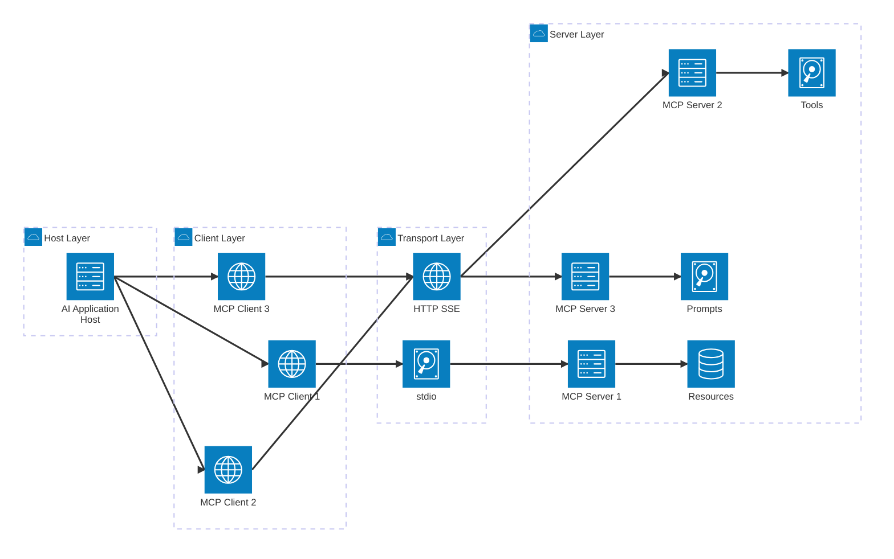
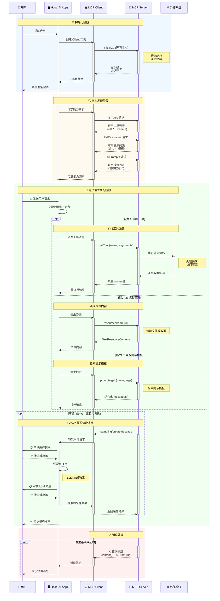

# Model Context Protocol（MCP）

## 为什么需要 MCP

- MCP 是一个开放协议，用来把"模型需要的上下文"和"可调用工具"标准化并与模型解耦。
- 可以把它理解为 LLM 的"USB-C 接口"：任何应用都能通过统一的协议，暴露数据源、工具和提示模板给模型或智能体。
- **解决 M×N 问题**：MCP 将传统的 M×N 集成问题简化为 M+N 问题。工具创建者只需构建 N 个 MCP 服务器，应用开发者只需构建 M 个 MCP 客户端，两者即可自由组合。
- **作用**：降低集成成本、提升可移植性与安全性，让不同模型或应用之间共享同一套上下文与工具能力。

## 三层架构模型

MCP 采用 Host-Client-Server 三层架构，理解这一架构是掌握 MCP 的关键：

### 架构层级

1. **Host（宿主）**
   - AI 应用容器，如 Claude Desktop、Cursor、Zed、Replit 等
   - 管理多个 MCP Client 实例
   - 负责生命周期管理和安全策略
   - 协调用户交互和授权流程

2. **Client（客户端）**
   - Host 内部的连接器组件
   - 每个 Client 与一个 Server 保持 1:1 关系
   - 处理协议通信、消息序列化和会话管理
   - 向 Host 暴露 Server 提供的能力

3. **Server（服务端）**
   - 提供具体能力的服务进程
   - 暴露 Tools（工具）、Resources（资源）、Prompts（提示）
   - 可以是本地进程、远程服务或云端 API



## 核心能力（Capabilities）

MCP 通过能力协商机制，允许 Client 和 Server 声明各自支持的功能模块：

### 1. Resources（资源）

**定义**：应用控制的数据源，类似 REST API 的 GET 端点，提供数据但不执行副作用操作。

**特性**：

- 通过 URI 标识（如 `file:///path/to/doc.txt` 或 `database://table/id`）
- 支持文本和二进制内容
- 可订阅更新（resources/subscribe）
- 支持资源模板（Resource Templates）用于动态生成 URI

**典型用法**：

- 读取文件内容
- 查询数据库记录
- 获取 API 响应数据

**数据结构**：

```json
{
  "uri": "file:///docs/report.md",
  "mimeType": "text/markdown",
  "text": "# Report Content...",
  "_meta": {
    "lastModified": "2025-11-12T10:00:00Z"
  }
}
```

### 2. Prompts（提示模板）

**定义**：用户控制的预定义模板，帮助用户以最优方式使用 Server 提供的工具或资源。

**特性**：

- 支持参数化（动态插值）
- 生成结构化消息数组供模型使用
- 可组合多个交互步骤
- 包含最佳实践和使用指南

**典型用法**：

- 数据分析工作流模板
- 代码生成脚手架
- 复杂查询构建器

**消息结构**：

```json
{
  "messages": [
    {
      "role": "user",
      "content": {
        "type": "text",
        "text": "Analyze sales data for Q4 using the database..."
      }
    }
  ],
  "description": "Quarterly sales analysis template"
}
```

### 3. Tools（工具）

**定义**：Server 提供的可执行函数，模型可调用以执行操作或计算。

**特性**：

- 声明输入 Schema（基于 JSON Schema）
- 返回结构化内容数组（content[]）
- 支持工具注解（annotations）标记行为特征（只读/破坏性）
- 可以有副作用（写文件、调用 API、修改状态）

**输入 Schema 约束**：

- 推荐使用扁平对象结构
- 支持基本类型：string、number、integer、boolean
- 支持基本校验：title、description、min、max、format、enum
- 可以使用嵌套结构，但建议保持简单以提高兼容性

**输出结构**：

```json
{
  "content": [
    {
      "type": "text",
      "text": "Operation completed successfully"
    },
    {
      "type": "image",
      "data": "base64...",
      "mimeType": "image/png"
    }
  ],
  "isError": false
}
```

### 4. Sampling（AI 辅助采样）

**定义**：Server 请求 AI 模型帮助的机制，允许 Server 在需要智能决策时调用模型。

**特性**：

- 需要人类审核（用户必须批准请求和响应）
- 双重审核流程：审核采样请求 → LLM 生成 → 审核 LLM 响应
- 支持多轮对话和上下文传递

**典型场景**：

- 自然语言转 SQL 查询
- 代码生成与优化
- 复杂决策支持

### 5. Roots（根目录）

**定义**：Client 向 Server 提供的文件系统根目录列表，帮助 Server 理解可访问的目录范围。

**用途**：

- 限制文件访问范围
- 提供工作区上下文
- 支持多项目管理

### 6. Elicitation（用户信息收集）

**定义**：表单式信息收集机制，Server 声明需要的用户输入字段，Client 引导用户填写。

**用途**：

- API 密钥收集
- 配置参数设置
- 交互式向导流程

## 协议通信

### 传输层（Transport）

**支持的传输方式**：

1. **Stdio（标准输入/输出）**
   - 用于本地进程间通信
   - 适合开发调试
   - Server 作为子进程运行

2. **HTTP + SSE（Server-Sent Events）**
   - 用于远程服务
   - 客户端发送 HTTP POST，服务端通过 SSE 推送事件
   - 适合云端部署

3. **WebSocket**
   - 双向实时通信
   - 适合长连接场景

**协议层**：

- 基于 JSON-RPC 2.0
- 双向消息模型（请求/响应/通知）
- 支持批量请求（Batch Requests）

### 通信流程



## 安全与权限

### 身份认证与授权

**推荐实践**：

- 遵循 OAuth 2.1 最佳实践
- 客户端使用 PKCE（Proof Key for Code Exchange）
- 实施令牌轮换与生命周期限制
- 支持细粒度的权限范围（Scopes）

### 服务端安全限制

**必须实施的保护**：

- 目录访问白名单（限制文件系统访问）
- 环境变量和 API 密钥隔离
- 外部 API 调用的速率限制
- 输入验证与消毒（防止注入攻击）
- 工具权限分离（只读 vs 写入）

### 已知安全风险（2025年4月披露）

**主要威胁**：

1. **提示注入攻击**：恶意输入可操纵模型行为
2. **工具权限组合**：多个工具组合可绕过单一工具限制
3. **伪装工具攻击**：恶意 Server 可伪装成可信工具
4. **数据泄露风险**：不当的资源访问控制

**缓解措施**：

- 实施严格的输入验证
- 使用工具注解标记危险操作
- 要求用户明确批准高风险操作
- 定期审计 Server 权限配置

## 运行与部署

### 本地开发模式

**Stdio 传输**：

- Client 和 Server 作为本地进程运行
- 通过标准输入/输出通信
- 便于快速开发和调试

**配置示例（Claude Desktop）**：

```json
{
  "mcpServers": {
    "filesystem": {
      "command": "npx",
      "args": ["-y", "@modelcontextprotocol/server-filesystem", "/Users/username/Documents"],
      "transport": "stdio"
    }
  }
}
```

### 远程服务模式

**HTTP + SSE 部署**：

- Server 作为独立服务运行
- 支持多个 Client 连接（需要会话管理）
- 可扩展为 API 网关架构

**企业集成模式**：

- 将内部 REST API、数据库通过 MCP 统一暴露
- 实施中心化的认证与授权
- 支持跨团队的工具共享

### 云端托管

**即将推出的官方注册表**：

- 托管公共 MCP Server
- 版本管理与依赖解析
- 安全审计与信任评级

## 生态系统与采用情况

### 已集成 MCP 的产品（截至 2025 年初）

**开发工具**：

- Zed（代码编辑器）
- Cursor（AI 编程助手）
- Replit（在线开发环境）
- Sourcegraph（代码搜索平台）

**AI 应用**：

- Claude Desktop（Anthropic）
- ChatGPT Desktop（OpenAI，2025年3月集成）
- Block（企业 AI 助手）
- Apollo（数据分析工具）

**社区资源**：

- 超过 1000 个开源 MCP Server 连接器
- 涵盖数据库、API、文件系统、开发工具等领域

### 与其他技术的对比

**vs OpenAI 函数调用 API**：

- MCP 是独立协议，不绑定特定模型
- 支持更丰富的能力（资源、提示、采样）
- 强调可移植性和生态互操作

**vs ChatGPT 插件框架**：

- MCP 是开放标准，任何应用可实施
- 更灵活的传输层选择
- 更强的安全与权限控制

**vs LangChain/LlamaIndex**：

- MCP 是协议层，框架是应用层
- 可以结合使用（框架可实现 MCP Client）
- MCP 专注标准化，框架专注快速开发

**灵感来源**：

- 受 Language Server Protocol (LSP) 启发
- 将 LSP 的"编辑器-语言服务器"模式应用到 AI 领域

## 协议版本与演进

### 当前版本

- **初始发布**：2024 年 11 月
- **稳定特性**：Tools、Resources、Prompts、Sampling 的核心功能
- **协议版本**：使用语义化版本控制

### 正在开发的功能

- 改进的批量请求支持
- 更灵活的 Streamable HTTP 传输
- 增强的工具注解系统
- 官方 Server 注册表
- 标准化的授权规范

### 向后兼容性

- 通过能力协商保证兼容性
- Client 和 Server 可独立升级
- 不支持的能力会被优雅降级

## 实际应用案例

### 案例 1：企业数据分析助手

- **Resources**：连接 SQL 数据库、数据仓库
- **Tools**：执行查询、生成报表、导出数据
- **Prompts**：预定义的分析模板（销售分析、用户画像等）
- **价值**：非技术用户通过自然语言访问企业数据

### 案例 2：AI 辅助编程（Claude Code）

- **Resources**：读取项目文件、Git 历史
- **Tools**：编辑代码、运行测试、调用 API
- **Sampling**：复杂重构时请求 AI 建议
- **价值**：从 Figma 设计直接生成完整 Web 应用

### 案例 3：个人助理集成

- **Resources**：Google Calendar、Notion 数据库
- **Tools**：创建事件、更新笔记、发送通知
- **Prompts**：日程安排模板、任务管理工作流
- **价值**：统一访问多个服务，提供上下文感知的智能建议

### 案例 4：创意工作流（3D 设计 + 打印）

- **Resources**：设计素材库、模型参数
- **Tools**：Blender 脚本执行、3D 打印机控制
- **Prompts**：设计风格模板、打印预设
- **价值**：AI 模型直接操控创意工具链

## 常见误区

### 误区 1：MCP 是 AI 模型

**纠正**：MCP 是协议，不是模型。它定义了 AI 应用如何与外部工具和数据交互。

### 误区 2：只有 Claude 能用 MCP

**纠正**：MCP 是开放标准，任何 AI 应用、模型或代理都可以实施。OpenAI、Anthropic 等都在采用。

### 误区 3：MCP 替代传统 API

**纠正**：MCP 是对传统 API 的补充，为 AI 优化的交互层。现有 API 可以包装成 MCP Server。

### 误区 4：Server 必须是独立服务

**纠正**：Server 可以是本地进程、库或远程服务，取决于部署需求。

### 误区 5：工具不能有副作用

**纠正**：Tools 可以有副作用（这是与 Resources 的主要区别）。应通过注解标记破坏性操作。

## 开发指南

### 创建 MCP Server

**基本步骤**：

1. 选择 SDK（TypeScript、Python 等）
2. 定义 Tools、Resources 或 Prompts
3. 实现处理逻辑
4. 配置传输层（Stdio/HTTP）
5. 测试与发布

**最佳实践**：

- 工具输入 Schema 保持简单
- 为破坏性操作添加确认机制
- 提供详细的工具描述和示例
- 实施错误处理和日志记录
- 遵循安全最佳实践

### 集成 MCP Client

**基本步骤**：

1. 选择或实现 MCP Client 库
2. 配置 Server 连接
3. 实现能力发现
4. 集成到 AI 应用工作流
5. 添加用户授权界面

**最佳实践**：

- 提供清晰的 Server 管理界面
- 实施细粒度的权限控制
- 支持 Server 配置导入/导出
- 提供调试和日志功能
- 优雅处理 Server 失败

## 参考链接

- **官方文档**：<https://modelcontextprotocol.io/docs/getting-started/intro>
- **开发指南**：<https://modelcontextprotocol.io/docs/develop/build-server>
- **GitHub 组织**：<https://github.com/modelcontextprotocol>
- **社区 Server 列表**：<https://github.com/modelcontextprotocol/servers>
- **规范文档**：<https://spec.modelcontextprotocol.io/>

---

*本文档基于 MCP 官方文档整理，最后更新于 2025 年 11 月*
