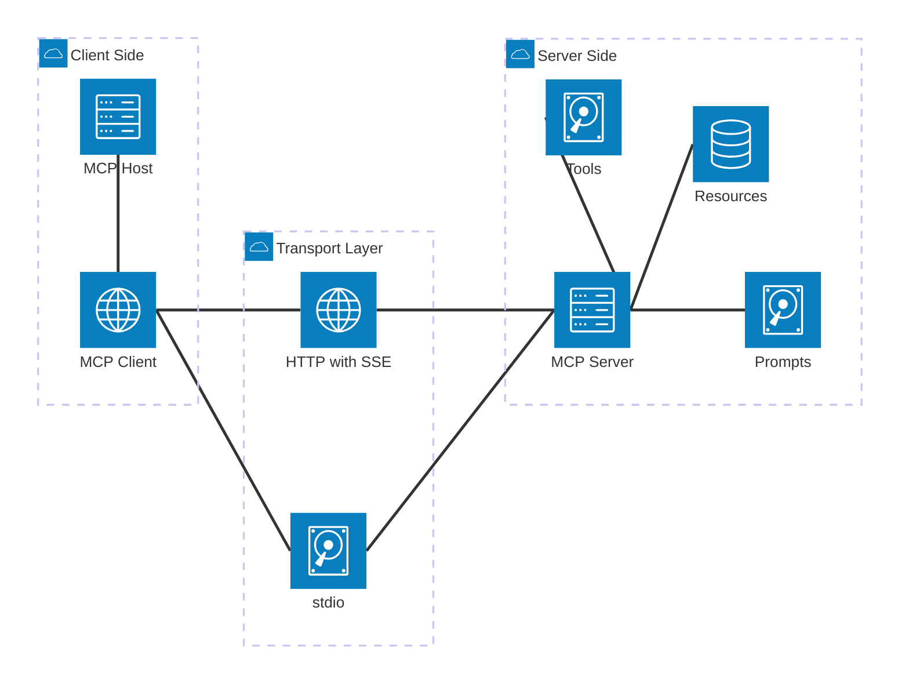
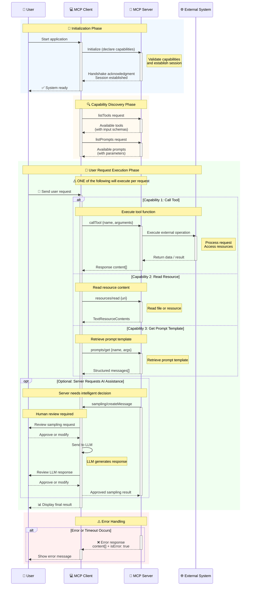

# Model Context Protocol（MCP）

## 为什么需要 MCP

- MCP 是一个开放协议，用来把“模型需要的上下文”和“可调用工具”标准化并与模型解耦。
- 可以把它理解为 LLM 的“USB-C 接口”：任何应用都能通过统一的协议，暴露数据源、工具和提示模板给模型或智能体。
- 作用：降低集成成本、提升可移植性与安全性，让不同模型或应用之间共享同一套上下文与工具能力。

## 核心组件与原理

- 客户端（Client）：运行 AI 应用或代理的一侧，负责初始化连接、声明自身能力（capabilities），并向服务端发起调用（例如工具、提示、资源读取、采样）。
- 服务端（Server）：提供上下文与能力的一侧，暴露资源（如文件/数据库）、提示库（prompts）、工具（tools）等。
- 传输（Transport）：常见为 Stdio（本地进程标准输入/输出）、HTTP+SSE、WebSocket 等。协议层采用 JSON-RPC 2.0 双向消息模型。
- 能力（Capabilities）：按模块声明与协作，主要包括：
  - tools：列出与调用工具，工具输入采用精简 JSON Schema（扁平对象+原始类型）。
  - resources：按 `uri` 读取资源内容，返回文本或其他类型。
  - prompts：列出/获取提示模板，生成结构化消息供模型使用。
  - sampling：客户端侧触发模型生成（“把模型调用抽象成能力”）。
  - elicitation：面向用户的表单式信息收集（声明期望字段，客户端引导用户填写）。

## 整体架构图

## 输入/输出与约束

- 工具输入 Schema：扁平对象、原始类型（string/number/integer/boolean），支持 title/description/min/max/format 等基本校验；不支持嵌套对象或数组。
- 工具输出内容：以 `content[]` 表示，每个 item 带类型（例如 `text`、`image`），文本项示例：`{ type: "text", text: "..." }`。
- 资源文本结构：包含 `uri`、可选 `mimeType`、`text` 字段及可选 `_meta` 元数据。

## 交互时序图

## 安全与权限

- 推荐遵循 OAuth 2.1 最佳实践，客户端应使用 PKCE；令牌轮换与生命周期限制为可取策略。
- 服务端应对访问范围进行显式限制（例如：允许目录白名单、限制环境变量/API Key、对外部 API 做速率与错误保护）。

## 运行与部署

- 本地调试：Stdio 传输，客户端与服务端均作为进程运行，便于快速开发工具与资源适配。
- 远程部署：HTTP+SSE 或 WebSocket 传输；可做服务端扩展为 API 网关，把内部 REST/数据库能力通过 MCP 暴露给多种客户端（包含桌面 App，如 Claude Desktop 的 `claude_desktop_config.json`）。

## 参考链接

- 官方介绍（Introduction）：(<https://modelcontextprotocol.io/docs/getting-started/intro>)
