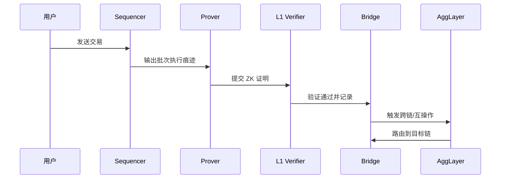

# Polygon CDK 架构概览

> 简述：“AggLayer Chain Development Kit（Polygon CDK）是一个模块化、多栈的工具包，旨在帮助快速构建以太坊兼容的 L2 链。CDK 支持多种执行栈（如 cdk-opgeth、cdk-erigon）与安全模式（Sovereign、Validium、zkRollup），并与 AggLayer 原生对接以提供统一的跨链互操作语义与共享流动性。具体的可用功能（如数据可用性方案、证明策略）取决于所选的执行栈与部署模式。”
> 术语索引：参见 [Glossary](Glossary.md)。

## 1. 架构总览

- 设计原则：
  - 模块化与可定制：按场景选择执行、证明、数据可用性与结算等组件。
  - EVM 兼容：沿用以太坊工具链（钱包、RPC、SDK），降低迁移成本。
  - 安全与扩展：通过 ZK 证明继承以太坊安全，支持外部 DA 与多栈互操作。
  - 原生`AggLayer`连接：Sovereign 模式通常不依赖 ZK prover 作为互操作安全的主要机制，而是通过与 AggLayer 的原生连接、链端提交与 AggLayer 的验证/路由机制（即文中所称的‘悲观证明’或 challenge/验证机制）来保障跨链交互的安全性。

**注意**：sequencer/排序器仍负责打包与提交批次；当需要更强的加密保障时，可选择结合 ZK 证明或外部 DA。若要深入理解‘悲观证明’，请参见 Glossary 中关于该术语的详细说明与参考链接。

## 2. 技术实现

### 2.1 模式

**模式**并非单纯的“部署方式”或“DA 层选择”，而是链的运行与安全语义组合，涵盖数据发布位置、证明策略、最终性来源与`AggLayer` 的互操作安全语义。

- Sovereign 模式
  - 运行语义：不依赖 ZK 证明；使用`AggLayer`的悲观证明与统一验证来保障互操作安全。
  - 数据发布：不强制将交易数据发布到以太坊 L1；可选外部 DA 或仅发布状态承诺。
  - 最终性来源：由排序器与链级共识决定；跨链最终性通过`AggLayer`路由与验证形成。
  - 互操作：与`AggLayer`原生连接，提供低成本统一互操作与状态同步。
  - 适用场景：成本敏感、强互操作需求、无需 L1 数据发布的业务。

- Validium 模式
  - 运行语义：链下数据存储 + ZK 证明；依赖 DAC 或外部 DA 提供数据可用性。
  - 数据发布：链上发布状态承诺（根哈希等），交易数据保存在 DAC/外部 DA。
  - 最终性来源：ZK 证明在 L1 验证后确认状态；互操作结合`AggLayer`路由与证明。
  - 风险与要求：DAC 需具备审计与纠错能力；需防数据缺失与拒绝服务。
  - 适用场景：高吞吐、低成本、合规控制数据可见性。

- zkRollup 模式
  - 运行语义：交易数据上链（calldata 或 blob/EIP-4844）；所有状态转换由 ZK 证明保障。
  - 数据发布：完整数据发布在以太坊 L1；支持批次聚合以降低成本。
  - 最终性来源：在 L1 验证证明后获得强最终性。
  - 互操作：`AggLayer`与 L1 证明共同提供跨链安全语义。
  - 适用场景：金融与高安全需求，需链上数据可审计与永久保存。

- 选择建议
  - 安全与成本权衡：zkRollup 安全最高、成本较高；Validium 成本最低但增加可用性假设；Sovereign 提供低成本互操作与快速启动。
  - 执行栈生态：`cdk-opgeth` 更贴近以太坊工具链与快速部署；`cdk-erigon` 适合企业级定制与生产的 ZK 路线。
  - 与`AggLayer`的关系：三种模式均支持`AggLayer`互操作；Sovereign 原生启用、成本最低；其它模式在 ZK 证明语义下获得更强的跨链安全。

### 2.2 技术栈

- cdk-opgeth：OP Stack 风格，基于 Geth，但是抛弃了原生的欺诈证明机制，转而依赖`AggLayer`的悲观证明机制，最终性决策机制从“事后挑战”变为“事前验证”。由 Conduit 维护 G2 排序器。

| 模式      | ZK 证明 | 最终性机制        | 数据可用性                         | 主要安全依赖                     | 数据发布位置                            | 当前可用性 | 适用场景               |
| --------- | ------- | ----------------- | ---------------------------------- | -------------------------------- | --------------------------------------- | ---------- | ---------------------- |
| Sovereign | 否      | AggLayer 风控机制 | 可选：外部 DA 或仅发布状态承诺     | AggLayer 验证/路由、桥合约       | 状态根/摘要（可选），交易数据不强制上链 | 生产可用   | 成本敏感、强互操作需求 |
| Validium  | 是      | L1 验证 ZK 证明后 | 链下 DA 或 DAC                     | ZK 证明 + DAC 信任模型 + L1 合约 | L1 发布状态承诺，交易数据链下           | 开发中     | 高吞吐、低成本、合规   |
| zkRollup  | 是      | L1 验证证明后     | 链上：calldata 或 blob（EIP-4844） | ZK 证明 + L1 数据可用性          | 完整交易数据上 L1                       | 开发中     | 金融与高安全审计       |

- cdk-erigon：基于高性能 Erigon，支持更深的定制（原生代币与 gas 策略等），企业级部署与 ZK 安全特性由 Gateway.fm 维护。

| 模式      | ZK 证明 | 最终性机制        | 数据可用性                         | 主要安全依赖                     | 数据发布位置                            | 当前可用性 | 适用场景               |
| --------- | ------- | ----------------- | ---------------------------------- | -------------------------------- | --------------------------------------- | ---------- | ---------------------- |
| Sovereign | 否      | AggLayer 风控机制 | 可选：外部 DA 或仅发布状态承诺     | AggLayer 验证/路由、桥合约       | 状态根/摘要（可选），交易数据不强制上链 | 生产可用   | 成本敏感、强互操作需求 |
| Validium  | 是      | L1 验证 ZK 证明后 | 链下 DA 或 DAC                     | ZK 证明 + DAC 信任模型 + L1 合约 | L1 发布状态承诺，交易数据链下           | 生产可用   | 高吞吐、低成本、合规   |
| zkRollup  | 是      | L1 验证证明后强   | 链上：calldata 或 blob（EIP-4844） | ZK 证明 + L1 数据可用性          | 完整交易数据上 L1                       | 生产可用   | 金融与高安全审计       |

## 3. 核心组件与职责

- 执行层（Sequencer / EVM / Mempool）
  - 职责：接收交易、排序并执行；维护区块与状态；对外提供标准 RPC。
  - 作用：作为链的运行时核心，保证交易吞吐与用户交互体验。

- 证明层（Prover / Proof Aggregator）
  - 职责：为批次或区块生成 ZK 证明，聚合多份证明以降低 L1 验证成本。
  - 作用：以加密证明保障状态转换正确性，继承以太坊安全。

- 数据可用性层（DA / DAC）
  - 职责：确保交易数据可重构、可验证；在 Validium 中由 DAC 维护链下数据的可用性与公信。
  - 作用：在安全与成本之间平衡，支持多种发布策略（calldata、blob、外部 DA）。

- 结算与互操作（L1 合约 / Bridge /`AggLayer`Connector）
  - 职责：在结算层验证证明并最终确认；通过桥接实现资产跨链；与`AggLayer`对接实现统一互操作。
  - 作用：提供强安全的最终性与一致的跨链语义，减少资产碎片化；Sovereign 模式通过悲观证明保障互操作，无需 prover；Validium/zkRollup 模式结合 ZK 证明与不同 DA 策略。

## 4. 关键流程

### 3.1 链上发布与最终确认（zk-Rollup）

1. Sequencer 执行并打包批次，生成状态差分与数据发布（calldata/blob）。
2. Prover 为批次生成 ZK 证明，Proof Aggregator 可进一步聚合。
3. 在以太坊 L1 验证证明并记录结果，获得最终性。

### 3.2 Validium 数据可用性（链下）

1. 交易数据由 DAC 维护与存储，链上仅发布状态承诺（hash）。
2. 有争议或审计需要时，DAC 提供数据以重构状态并验证。
3. 结合 ZK 证明与 DAC 监督，实现低成本运行与可验证性。

### 3.3 跨链桥接与`AggLayer`集成

1. 通过 Bridge 触发存款/提取或跨链消息；
2. 由`AggLayer`统一验证与路由，目标提供原子化跨链与统一资产视图；
3. 在目标链执行并回传必要证明或结果。

## 5. 参考资料

- `AggLayer`Docs — What is CDK: <https://docs.agglayer.dev/cdk/get-started/overview/>
- `AggLayer`Docs — `cdk-opgeth`Architecture: <https://docs.agglayer.dev/cdk/cdk-opgeth/architecture/>
- `AggLayer`Docs — `cdk-erigon`Architecture: <https://docs.agglayer.dev/cdk/cdk-erigon/architecture/>
- Polygon Docs — CDK Overview: <https://docs.polygon.technology/cdk/overview/>
- Polygon Docs — CDK Architecture: <https://docs.polygon.technology/cdk/concepts/architecture/>
- Polygon Docs — CDK Validium: <https://docs.polygon.technology/cdk/architecture/cdk-validium/>
- Polygon Wiki — What is Polygon CDK: <https://wiki.polygon.technology/docs/cdk/what-is-polygon-cdk/>
