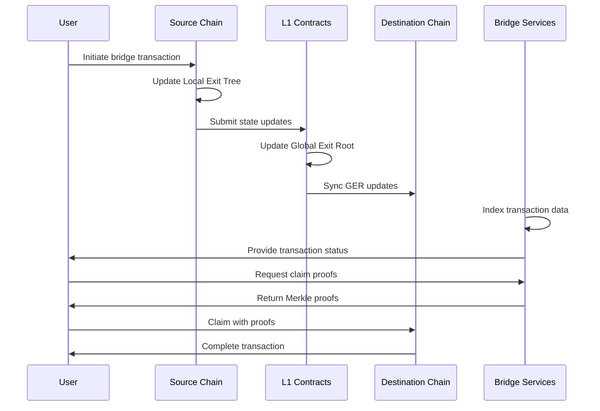
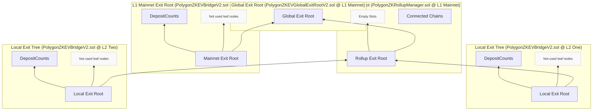
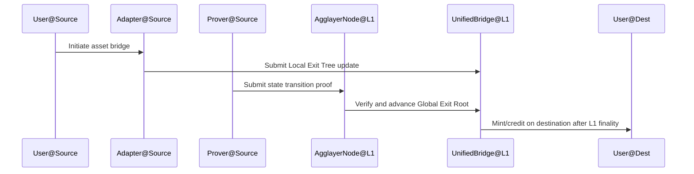
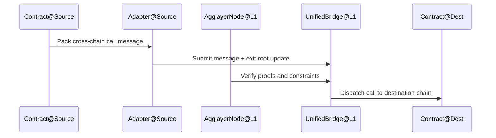
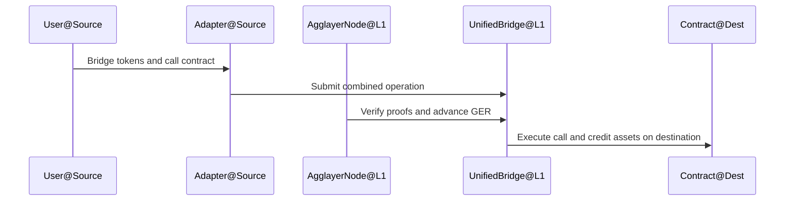

# Agglayer Unified Bridge

> 简述：Unified Bridge 是 Agglayer 的核心互操作层，为所有连接链提供统一的跨链接口（L1↔L2、L2↔L1、L2↔L2），在以太坊结算层上完成最终确认，确保跨链资产转移与消息调用的安全与一致性。
> 术语索引：参见 [Glossary](Glossary.md)。

## 1. 概览

- 统一体验：为多链提供单一桥接接口与通用 API，消除多桥碎片化。
- 信任最小化：所有跨链交易在以太坊（L1）完成结算后方可在目的链领取，避免错误领取与资金风险。
- 研发友好：提供标准化数据结构与工具，支持资产跨链与跨链合约调用的组合（Bridge-and-Call）。

## 2. 架构与组件

- 核心角色：
  - Unified Bridge（统一桥）：统一的跨链资产与消息通道，维护跨链会计与数据结构，并驱动目的链处理。
  - Agglayer Node（验证协作）：接收并验证来自链端的证明，推进全局根（Global Exit Root）。
  - L1 合约域：在以太坊上承载证明验证与结算逻辑，是跨链最终性的来源。

- 设计要点：
  - 以太坊结算先行：所有跨链操作在 L1 确认后才能被目的链领取与执行。
  - 加密验证：每个跨链操作都具备可验证的加密证明与不可篡改的交易数据记录。
  - 统一路由：通过统一桥将不同链的消息与资产跨链在同一接口下进行编排与核验。

跨链交易流程如下：

## 3. 数据结构

- Local Exit Tree（本地退出树）：源链维护的“退出/跨链消息”集合的 Merkle 树；其根参与全局聚合。
- Rollup Exit Root（Rollup 根）：某条连接链的退出树根，作为其跨链出口的汇总承诺。
- Mainnet Exit Root（主网根）：在 L1 域中维护的当前汇总根，反映跨链消息的结算状态。
- Global Exit Root（全局根）：对多链退出根进行聚合得到的全网统一根，用于统一验证与路由。

Unified Bridge 的树形结构示意：

请参考官方的 [Unified Bridge 树形结构图](https://github.com/agglayer/agglayer-docs/blob/main/docs/img/agglayer/UnifiedBridgeTree.png)。

## 4. 跨链操作类型

- Asset Bridging（资产跨链）：在源链锁定/销毁，在目的链铸造/释放，受 L1 最终性与统一桥结算约束。
- Message Bridging（消息跨链）：在源链构造跨链调用消息，经统一桥验证后路由至目的链执行。
- Bridge-and-Call（桥接并调用）：将资产转移与跨链合约调用组合为一次原子性跨链操作。

## 5. 关键流程示例

### 5.1 L2 → L2 资产跨链

1. 源链发起资产跨链（锁定/销毁源链资产）。
2. 链端适配器将事件写入 Local Exit Tree 并上报统一桥。
3. Prover 生成状态转换证明，Agglayer Node 验证并推进 Global Exit Root。
4. 在 L1 最终确认后，Unified Bridge 于目的链铸造/记账对应资产。
5. 用户在目的链领取资产，跨链完成。

### 5.2 L2 → L2 跨链消息调用

1. 源链打包跨链调用消息并提交证明。
2. Agglayer Node 验证消息与证明后，统一桥路由至目的链处理。
3. 目的链接收并执行调用；必要时回传执行结果或证明。

### 5.3 Bridge-and-Call（组合操作）

1. 同一交易内同时完成资产跨链与目的链合约调用的链上编排。
2. 统一桥在结算后确保两者原子性生效，避免半途失败的状态不一致。

## 6. 安全模型与最终性

- 以太坊结算保障：所有跨链操作在 L1 完成确认后方可被目的链领取；错误或未结算的领取将被拒绝。
- 加密证明约束：每个跨链操作都需提供可验证的证明，确保合法性与原子性。
- 数据不可篡改：跨链记录不可变更，防止错误声明导致的资金或状态偏差。

## 7. 与其他模块的关系

- Pessimistic Proof：在极端场景下限制受损链的影响半径，确保最多仅损失其自身押金规模（参见对应专题）。
- State Transition Proof：在 v0.3 引入的双重验证体系，既验证链内状态转换，也验证跨链桥操作的有效性（参见对应专题）。
- AggKit：连接各链与 Agglayer 的同步工具集，提供模块化组件与安全改进（多方委员会），便于规范集成（参见对应专题）。

## 8. 参考资料

- Unified Bridge — Agglayer Docs: <https://docs.agglayer.dev/agglayer/core-concepts/unified-bridge/>
