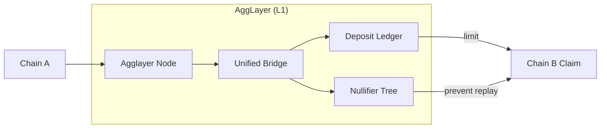
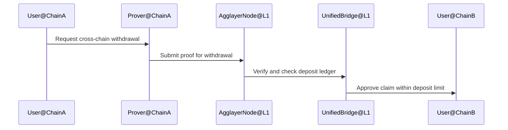
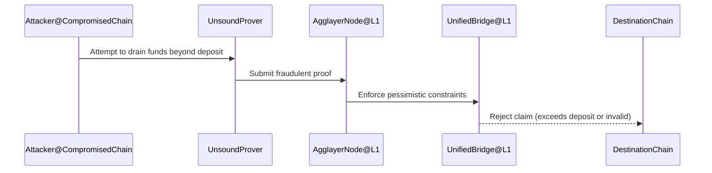

# Agglayer Pessimistic Proof

> 简述：Pessimistic Proof 是 Agglayer 的高级安全机制，用于在连接链出现问题时，将影响范围限制在该链的存款规模之内，构建跨链互操作的“防火墙”，保护整个平台的资金安全。
> 术语索引：参见 [Glossary](Glossary.md)。

## 1. 背景与目标

- 统一互操作带来的挑战：当多条独立链通过 Agglayer 共享流动性与互操作时，单链问题可能扩散至全局。
- 机制目标：即使某条链的 Prover 不可靠，也无法从统一桥中提走超过该链自身存款的资金，避免系统性风险。
- 效果：将每条链的“爆炸半径”限制为其本链的押金规模，形成跨链互操作的隔离边界。

## 2. 安全模型与约束

- 假设：Agglayer Node 假定“每个 prover 都可能不可靠”，通过悲观证明构建保守安全边界。
- 约束：
  - 资金隔离：目的链的领取额度不可超过源链在统一桥的存款总额（按账户/资产维度约束）。
  - 状态验证：跨链领取前需对跨链操作进行数学约束验证，防止未经授权的资金提取。
- 效用：
  - 生态保护：防止单链问题蔓延至全局。
  - 财务隔离：建立跨链的防火墙边界，控制最终风险敞口。

## 3. 数据结构（核心）

- Local Balance Tree：维护链侧或账户的余额/押金数据的树形结构，用于快速验证额度与变更。
- Nullifier Tree：记录已消费/已领取的操作标识，防止二次领取与重放攻击。
- Deposit Ledger：统一桥的存款账本，用于在 L1 域上核验跨链领取的额度约束与一致性。

## 4. 工作原理

- 存款约束：每条连接链需要在统一桥维护存款（保证金/资产），作为跨链提款的上限来源。
- 验证过程：
  1. 源链提交跨链事件与证明至 Agglayer。
  2. Agglayer Node 在 L1 域对操作进行验证（含额度约束与防重放）。
  3. 通过验证后，统一桥允许目的链按额度领取；若超额或异常，拒绝执行。
- 防重放与冲突检测：通过 Nullifier Tree 确保同一操作不会被重复领取。

## 5. 流程示例

### 5.1 正常提款（额度内）

### 5.2 攻击场景（超额提款）

## 6. 与其他模块的关系

- Unified Bridge：作为跨链会计与路由核心，执行额度约束与防重放检查。
- State Transition Proof：链内与跨链的双重验证体系可与悲观证明协同，提升端到端安全性。
- AggKit：在连接链的集成过程中，可通过组件化方式实现存款管理、证明提交与防重放逻辑的标准接入。

## 7. 性能与参考

- Benchmarks：官方文档提供不同 zkVM 的性能实验与对比，便于选择工程实现方案与资源配比（参见文档“Benchmarks”）。

## 8. 参考资料

- Pessimistic Proof — Agglayer Docs: <https://docs.agglayer.dev/agglayer/core-concepts/pessimistic-proof/>
- Architecture / Data Structures / Proof Generation：见官方文档分栏页。
