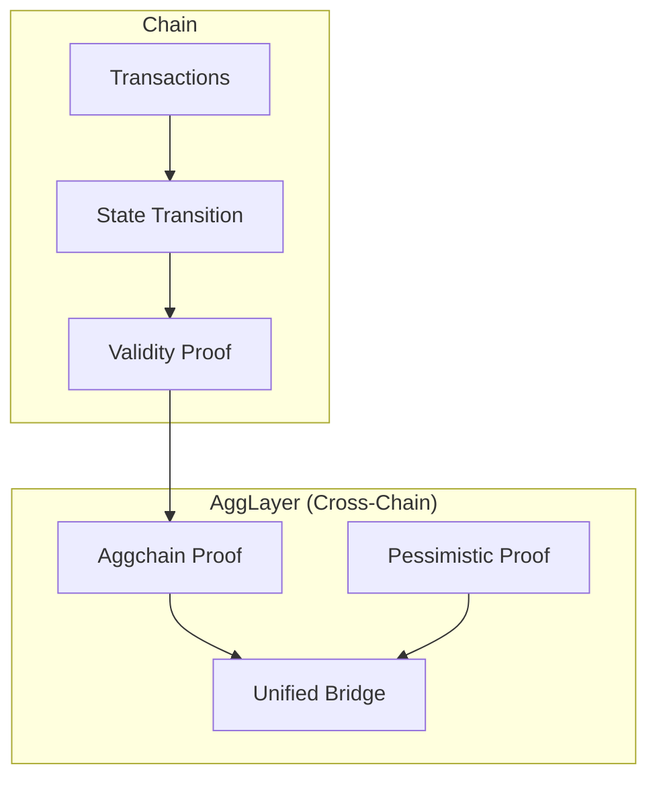
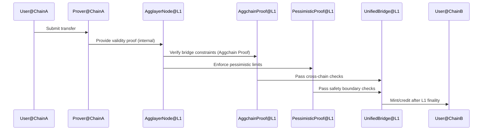
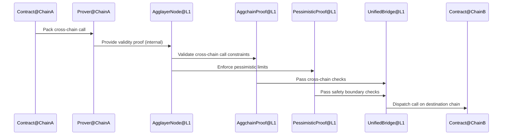

# Agglayer State Transition Proof

> 简述：State Transition Proof（STP）是 Agglayer v0.3 引入的“全面信任验证”机制，通过双重验证体系同时保障“链内状态转换正确性”和“跨链桥操作的安全与原子性”。
> 术语索引：参见 [Glossary](Glossary.md)。

## 1. 背景与演进

- 早期方案：主要集中在跨链桥操作的验证，未能覆盖链内运行的全面正确性。
- v0.3 方案：引入双重验证体系，如同“楼宇安保 + 门禁检查”同时工作，既验证内部系统，也验证跨链入口。

## 2. 总览与目标

- 双重验证系统（Dual Proof System）：
  - Internal Chain Validation（链内验证）：验证单链内的状态转换正确性与一致性（Validity Proof / 其他机制）。
  - Cross-Chain Validation（跨链验证）：对桥操作进行验证，保障跨链转移与调用的安全与原子性（Aggchain Proof + Pessimistic Proof）。
- 目标：在互操作场景中提供端到端安全覆盖，并兼容不同类型的链与验证机制。

## 3. 架构与组件

- Aggchain Proof：
  - 定义：是 Agglayer 中一个灵活的验证系统，支持多种共识机制来证明链的状态转换。它作为一个通用适配器，可以与各种类型的链配合使用，无论这些链使用简单的基于签名的验证，还是更复杂的证明系统。
  - 作用：将不同证明类型与桥梁验证相结合的能力，确保链的内部操作和跨链传输都是安全的。。
- Pessimistic Proof：
  - 定义：防止受损链超额提取，限制风险至该链存款范围内。
  - 作用：作为跨链验证的安全边界，与 Aggchain Proof 共同形成跨链侧的完整验证。
- Validity Proof（或其他机制）：
  - 定义：在链内对状态转换正确性进行数学证明（例如 ZK 证明）。
  - 作用：保证单链内部运行的数学正确性与一致性。

## 4. 工作机制（两步验证）

1. 链内验证（Internal Validation）：
   - 为区块/批次生成有效性证明（或采用兼容方案），验证状态转换正确性。
   - 输出可验证的状态承诺与证明给跨链层使用。
2. 跨链验证（Cross-Chain Validation）：
   - Aggchain Proof：对桥操作进行签名/证明验证与约束检查。
   - Pessimistic Proof：在额度与防火墙约束下再次收敛风险，防止超额资金外流。
   - Unified Bridge：在完成验证后进行路由与目的链处理，保证原子性与最终性。

## 5. 流程示例

### 5.1 资产跨链（双重验证）

### 5.2 跨链合约调用（双重验证）

## 6. 集成与兼容

- 多链类型兼容：支持不同的共识机制与执行栈；Aggchain Proof 可灵活选择 ECDSA 或有效性证明。
- 开发与部署：可根据场景选择更强的链内证明或更保守的跨链约束，以平衡性能与安全性。

## 7. 参考资料

- State Transition Proof — Agglayer Docs: <https://docs.agglayer.dev/agglayer/core-concepts/state-transition-proof/>
