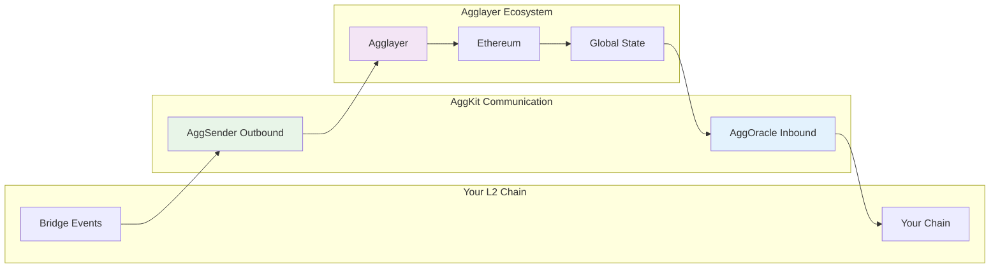
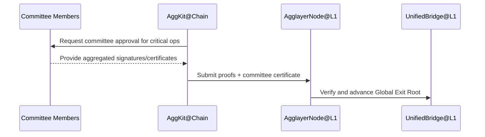

# Agglayer AggKit

> 简述：AggKit 是连接各条链至统一 Agglayer 生态的同步工具集，提供模块化组件以实现跨链通信、证明提交与会计同步，同时在 v0.3.5 引入“多方委员会系统”增强生产级安全性。
> 术语索引：参见 [Glossary](Glossary.md)。

## 1. 概览

- 通用兼容：以模块化方式适配不同的链架构，无需大改现有基础设施。
- 按需部署：仅部署链端所需组件，降低集成成本。
- 强化安全：v0.3.5 引入多方委员会系统，消除单地址风险，适配高价值与企业级部署。
- 标准化接入：提供规范化的“连接流程”，便于重复实施与维护。

## 2. 架构与通信模式

- 双向通信：
  - 链 → Agglayer：提交状态证明、退出树更新与桥操作相关信息。
  - Agglayer → 链：在 L1 结算后下发目的链处理指令（资产铸造/消息调用）。
- 组件协同：
  - 证明提交：与 Prover/Agglayer Node 协同推进全局根与最终性。
  - 桥接路由：与 Unified Bridge 协同执行跨链资产与消息的标准流程。

## 3. 组件

- AggSender（链端出站）：封装桥接事件与状态更新为签名证书并提交 Agglayer，是链参与 Agglayer 安全与协调的必备通道，确保跨链操作具备可验证的链端来源与合规性。
- AggOracle（链端入站）：从 Agglayer 拉取全局状态（Global Exit Root）更新，支持 v0.3.5 的“委员会式共识”校验，供目的链验证入站桥交易与结算信息，避免单地址风险、提升生产安全性。
- L1InfoTreeSync（L1 情报同步）：持续监控以太坊 L1，维护用于生成/验证跨链与状态证明的 L1 数据结构（如 Merkle/信息树），为 AggSender 证书与证明生成提供可引用的基础数据。
- BridgeSync（桥接状态同步）：对接统一桥（Unified Bridge）与相关流程，协调跨链资产与消息的标准路由，保证在 L1 结算后铸造/消息调用按序落地，维持跨链会计一致性。
- L2GERSync（全局退出根同步）：跟踪本链退出树与全局退出根（GER）的更新，确保本链退出信息可被他链验证，并与 Agglayer 的全局根推进逻辑保持一致。
- AggchainProofGen（证明生成）：与 Prover 协作产出链批次的 ZK 证明及必要的悲观证明（Pessimistic Proof）工件，推动全局状态前进、为跨链操作提供安全保障。

## 4. v0.3.5 安全改进：多方委员会系统

- 背景：之前的单地址模型存在单点风险，不适合生产环境。
- 改进：
  - 多方委员会：关键操作需多方共识签名或证书背书，避免单一主体操控。
  - 分布式信任：降低单点失效风险，提升桥接与状态同步的鲁棒性。
- 适用：高价值部署、企业场景与合规要求更高的系统。

## 5. 集成流程

1. 部署 AggKit 组件，配置与链端适配器的接口。
2. 启用多方委员会（可选，建议生产），配置门槛与成员列表。
3. 与 Prover 协作生成链内/批次证明，接入 Agglayer Node 验证与推进全局根。
4. 统一桥在 L1 结算后路由指令至目的链；链端组件处理资产铸造/消息调用。

## 6. 能力与边界

- 保持主权：各链保持经济与架构主权，AggKit 仅作为互操作的同步与接入工具。
- 统一流动性：通过统一桥访问全网资产与消息互操作能力。
- 安全与性能平衡：可根据场景选择更强的委员会约束或更轻量的部署模式。

## 7. 参考资料

- AggKit — Agglayer Docs: <https://docs.agglayer.dev/agglayer/core-concepts/aggkit/>
- Architecture / Components / Security Improvements：见官方文档分栏页。
