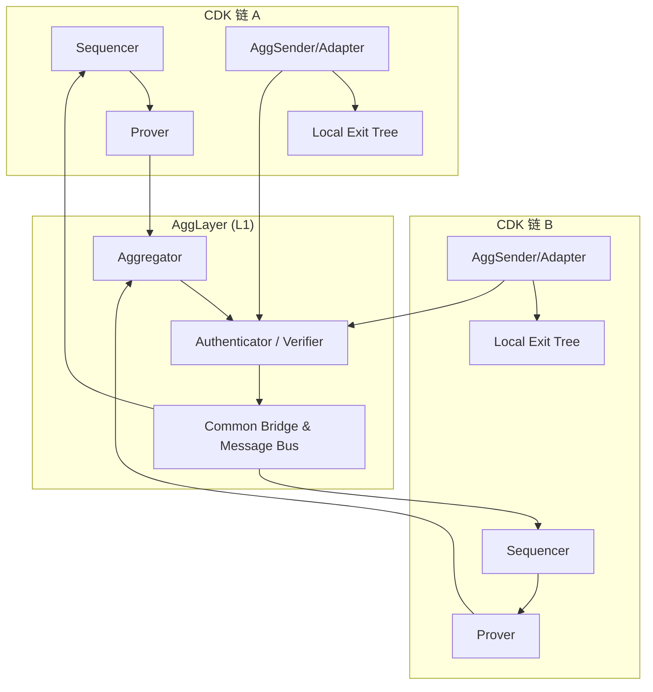
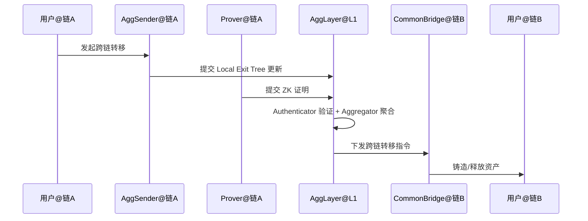

# Polygon AggLayer 架构概览

> 简述：AggLayer 是 Polygon 生态的聚合互操作层，面向由 Polygon CDK 构建的多条 L2（以及后续的多栈与非 EVM 系统），提供统一的跨链安全语义与通用桥接，目标实现像单链一样顺畅的跨链体验。
> 术语索引：参见 [Glossary](Glossary.md)。

## 1. 架构概览

- 设计目标：
  - 统一互操作：为异构链提供共同语言与消息格式，支持安全的跨链调用与资产流转。
  - 加密安全：以 ZK 证明为核心的安全保证，减少中间人信任与费用抽取。
  - 可扩展互联：当前主要连接 CDK 链，规划面向多栈（共享排序器、第三方 DA 等）与非 EVM 系统。

- 架构要点：
  - L1 合约端的聚合与验证：在以太坊等结算层上验证来自多链的证明与跨链消息。
  - 链端适配与标准化数据结构：使用标准的本地退出树（Local Exit Tree）与全局根（Global Exit Root / Interop Root）表达跨链消息与资产状态。
  - 通用桥接：在互操作层提供“公共桥（Common Bridge）”，统一本地/跨链资产的铸造、销毁与移动流程。

## 2. 核心组件与职责

- Authenticator（认证器/验证器）
  - 职责：验证链端提交的“悲观证明（Pessimistic Proof）”或其他互操作安全证明，判定跨链消息是否可接受。
  - 作用：为 AggLayer 判断消息的安全性边界，确保跨链调用与资产移动不会破坏整体安全。

- Aggregator（证明聚合器）
  - 职责：聚合多条链提交的 ZK 证明，生成可统一验证的聚合证明，降低整体验证成本。
  - 作用：摊平 L1 上的验证费用，提升多链互操作的吞吐。

- Common Bridge（通用桥）与 Message Bus（消息总线）
  - 职责：提供跨链资产的标准桥接接口与消息传递通道，统一代币铸造/销毁与跨链调用流程。
  - 作用：避免多桥并存的资产碎片化，提升用户体验与安全一致性。

- AggSender / 链端适配器（Connector）
  - 职责：在各条 CDK 链上采集与整理需要跨链的事件/更新，将其以标准格式上报 AggLayer。
  - 作用：实现与 AggLayer 的数据结构与消息格式兼容（如本地退出树 LxLy），兼顾非 EVM 系统的定制适配。

- 数据结构：Local Exit Tree / Global Exit Root（或 Interop Root）
  - 职责：表达链端待处理的退出/跨链消息集合及其全局可验证根。
  - 作用：为跨链验证提供可组合、可证明的结构化依据。

- L1 合约与系统组件
  - 职责：在以太坊等结算层验证证明、维护状态根与全局互操作信息，并驱动跨链资产与消息的最终处理。
  - 作用：提供强安全的最终性保障与可审计的互操作记录。

## 3. 关键流程（示例）

### 3.1 跨链资产转移（Chain A → Chain B）

1. 用户在链 A 发起转移（锁定/销毁链 A 资产）。
2. 链端适配器将该跨链事件写入本地退出树并上报 AggLayer。
3. Prover 生成链 A 批次证明，Aggregator 聚合为共享验证的证明。
4. AggLayer 在 L1 验证通过后，Common Bridge 在链 B 铸造对应资产或完成记账调整。
5. 用户在链 B 获得资产，完成跨链转移。

### 3.2 跨链合约调用（安全互操作）

1. 在源链打包跨链调用消息并提交互操作证明。
2. AggLayer 验证消息与证明后，将调用路由至目标链。
3. 目标链执行调用并在本地记录结果；必要时回传执行证明或结果。

## 4. 安全模型与信任边界

- ZK 证明与悲观证明：以 ZK 为主的加密保证，辅以悲观证明等方案在更广泛架构中确保互操作安全。
- 无中间费用抽取：通过聚合验证与统一桥接降低成本，无需中心化中间人。
- 多栈兼容：兼容共享排序器与第三方 DA；非 EVM 系统可实现自定义适配与认证方案（如 JTMB）。

## 5. 与传统跨链桥的差异

- 统一且安全的资产与消息通道，减少合成资产与多桥碎片化问题。
- 以证明驱动的互操作安全语义，简化信任假设并提升最终性。
- 面向多栈与异构链的扩展路线，目标实现原子级跨链体验。

## 6. 参考资料

- Polygon Docs — AggLayer Overview: <https://docs.polygon.technology/learn/agglayer/overview/>
- Polygon Technology — AggLayer: <https://polygon.technology/agglayer>
- Polygon Blog — AggLayer 标签页: <https://polygon.technology/blog-tags/agglayer>
