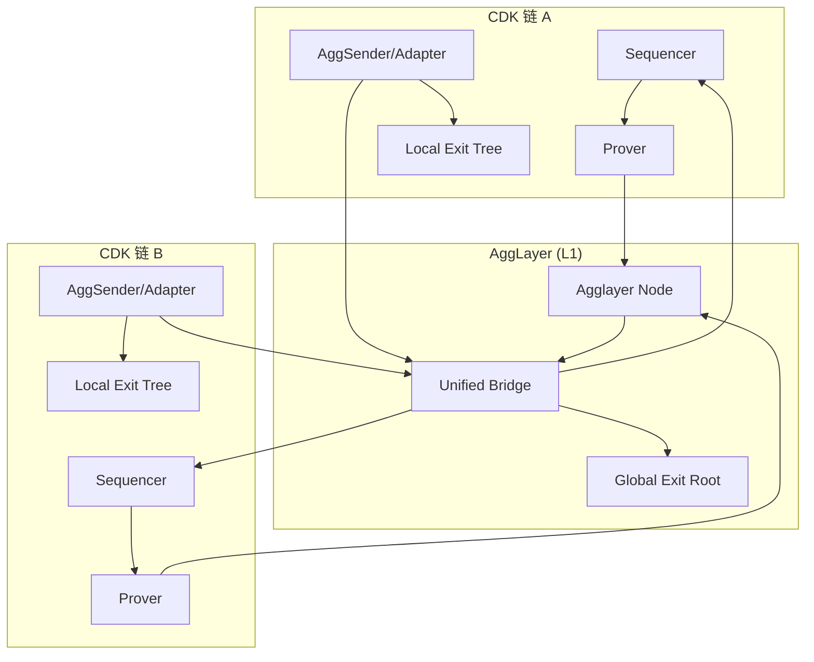
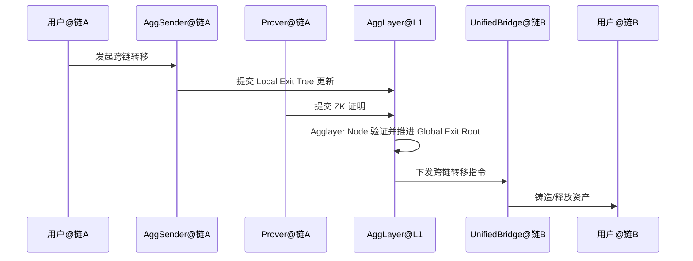

# Polygon AggLayer 架构概览

> 简述：AggLayer 是 Polygon 生态的聚合互操作层，面向由 Polygon CDK 构建的多条 L2（以及后续的多栈与非 EVM 系统），提供统一的跨链安全语义与通用桥接，目标实现像单链一样顺畅的跨链体验。
> 模块化专题文档：
>
> - [Unified Bridge（统一桥）](./Agglayer-UnifiedBridge.md)
> - [Pessimistic Proof（悲观证明）](./Agglayer-PessimisticProof.md)
> - [State Transition Proof（状态转换证明）](./Agglayer-StateTransitionProof.md)
> - [AggKit（连接工具集）](./Agglayer-AggKit.md)

## 1. 架构概览

- 设计目标：
  - 统一互操作：为异构链提供共同语言与消息格式，支持安全的跨链调用与资产流转。
  - 加密安全：以 ZK 证明为核心的安全保证，减少中间人信任与费用抽取。
  - 可扩展互联：当前主要连接 CDK 链，规划面向多栈（共享排序器、第三方 DA 等）与非 EVM 系统。

- 架构要点：
  - L1 合约端的聚合与验证：在以太坊等结算层上验证来自多链的证明与跨链消息。
  - 链端适配与标准化数据结构：使用标准的本地退出树（Local Exit Tree）与全局根（Global Exit Root / Interop Root）表达跨链消息与资产状态。
  - 统一桥接：在互操作层提供“统一桥（Unified Bridge）”，统一本地/跨链资产的铸造、销毁与移动流程，并作为统一的消息通道与路由入口。

## 2. 核心组件与职责

- Agglayer Node（节点服务）
  - 职责：接收并验证连接链提交的零知识证明（ZK proofs），在验证后向 L1 提交所需信息；管理状态过渡相关的证书与 epoch 编排。
  - 特性：Rust 实现的服务，负责跨链证明处理的核心逻辑与时序管理。

- Pessimistic Proof（悲观证明）
  - 职责：确保任意提现请求均由统一桥（Unified Bridge）中的合法存款支撑；提供跨链安全验证与全局一致性视图，防止超额提现与欺诈。
  - 技术：采用 Rust 实现的零知识证明机制，基于 SP1 zkVM 与 Plonky3 证明系统。

- Unified Bridge（统一桥）
  - 职责：维护跨链资产与消息的会计与数据结构（含 Global Exit Root），确保跨链交易在 L1 完成最终确认后方可在目的链领取与处理；支持资产跨链与消息传递。
  - 机制：维护可验证的 Merkle 证明链，保证目的链处理前已满足最终性约束。

- State Transition Proof（状态转换证明）
  - 职责：提供“两层验证”模型：
    - 链内有效性证明（Validity Proof）：验证本地链的内部状态转换正确性与一致性。
    - 跨链验证（Aggchain Proof & Pessimistic Proof）：验证跨链操作（资产/消息）的有效性与原子性。
  - 特性：端到端安全（需链内与跨链两类证明均通过）、原子跨链执行、模块化可扩展（可集成新的证明机制如乐观/欺诈等）。

> 参考：Agglayer Docs — Architecture（High-Level Architecture）: <https://docs.agglayer.dev/agglayer/core-concepts/architecture/#high-level-architecture>

## 3. 关键流程（示例）

### 3.1 跨链资产转移（Chain A → Chain B）

1. 用户在链 A 发起转移（锁定/销毁链 A 资产）。
2. 链端适配器将该跨链事件写入本地退出树并上报 AggLayer。
3. Prover 生成链 A 批次证明，Agglayer Node 验证并推进全局根（Global Exit Root）。
4. 在 L1 最终确认后，Unified Bridge 在链 B 铸造对应资产或完成记账调整。
5. 用户在链 B 获得资产，完成跨链转移。

### 3.2 跨链合约调用（安全互操作）

1. 在源链打包跨链调用消息并提交互操作证明。
2. AggLayer 验证消息与证明后，将调用路由至目标链。
3. 目标链执行调用并在本地记录结果；必要时回传执行证明或结果。

## 4. 安全模型与信任边界

- ZK 证明与悲观证明：以 ZK 为主的加密保证，辅以悲观证明等方案在更广泛架构中确保互操作安全。
- 无中间费用抽取：通过聚合验证与统一桥接降低成本，无需中心化中间人。
- 多栈兼容：兼容共享排序器与第三方 DA；非 EVM 系统可实现自定义适配与认证方案（如 JTMB）。

## 5. 与传统跨链桥的差异

- 统一且安全的资产与消息通道，减少合成资产与多桥碎片化问题。
- 以证明驱动的互操作安全语义，简化信任假设并提升最终性。
- 面向多栈与异构链的扩展路线，目标实现原子级跨链体验。

## 6. 参考资料

- Polygon Docs — AggLayer Overview: <https://docs.agglayer.dev/agglayer/core-concepts/architecture/#overview>
- Polygon Blog — AggLayer 标签页: <https://polygon.technology/blog-tags/agglayer>
