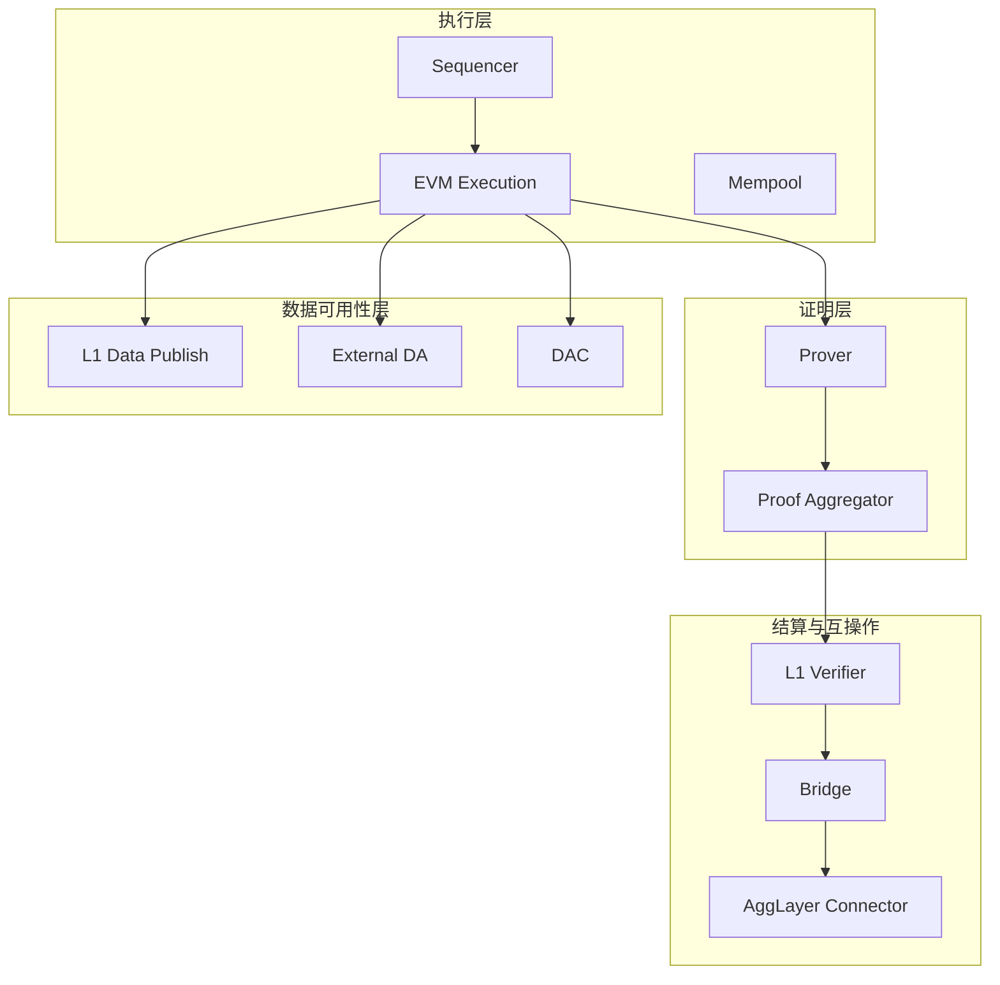
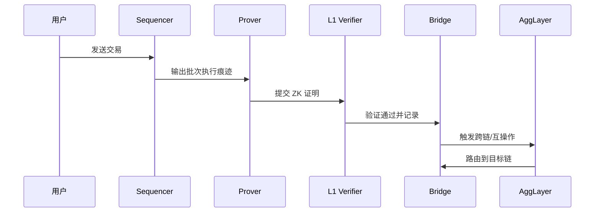

# Polygon CDK 架构概览

> 简述：Agglayer Chain Development Kit（CDK）是一个多栈（multistack）工具包，用于快速构建以太坊兼容的 L2。每条 CDK 链原生连接 Agglayer，具备跨链互操作、共享流动性与统一状态；CDK 支持 Sovereign、Validium、zkRollup 等模式，具体可用性取决于所选执行栈。
> 术语索引：参见 [Glossary](Glossary.md)。

## 1. 架构总览

- 设计原则：
  - 模块化与可定制：按场景选择执行、证明、数据可用性与结算等组件。
  - EVM 兼容：沿用以太坊工具链（钱包、RPC、SDK），降低迁移成本。
  - 安全与扩展：通过 ZK 证明继承以太坊安全，支持外部 DA 与多栈互操作。
  - 原生`AggLayer`连接：Sovereign 模式默认启用，采用悲观证明（无需 prover），提供低成本互操作；其它模式结合 ZK 证明与不同 DA 策略。

- 执行栈（Stacks）：
  - cdk-opgeth：OP Stack 风格，基于 Geth，原生`AggLayer`连接，适合快速上线与以太坊原生工具链；由 Conduit 维护 G2 排序器。
  - cdk-erigon：基于高性能 Erigon，支持更深的定制（原生代币与 gas 策略等），企业级部署与 ZK 安全特性由 Gateway.fm 维护。

## 2. 支持模式

### 2.1 定义

**模式**并非单纯的“部署方式”或“DA 层选择”，而是链的运行与安全语义组合，涵盖数据发布位置、证明策略、最终性来源与`AggLayer` 的互操作安全语义。

- Sovereign 模式
  - 运行语义：不依赖 ZK 证明；使用`AggLayer`的悲观证明与统一验证来保障互操作安全。
  - 数据发布：不强制将交易数据发布到以太坊 L1；可选外部 DA 或仅发布状态承诺。
  - 最终性来源：由排序器与链级共识决定；跨链最终性通过`AggLayer`路由与验证形成。
  - 互操作：与`AggLayer`原生连接，提供低成本统一互操作与状态同步。
  - 可用性：`cdk-opgeth`生产可用；`cdk-erigon`生产可用。
  - 适用场景：成本敏感、强互操作需求、无需 L1 数据发布的业务。

- Validium 模式
  - 运行语义：链下数据存储 + ZK 证明；依赖 DAC 或外部 DA 提供数据可用性。
  - 数据发布：链上发布状态承诺（根哈希等），交易数据保存在 DAC/外部 DA。
  - 最终性来源：ZK 证明在 L1 验证后确认状态；互操作结合`AggLayer`路由与证明。
  - 风险与要求：DAC 需具备审计与纠错能力；需防数据缺失与拒绝服务。
  - 可用性：`cdk-erigon`生产可用；`cdk-opgeth`开发中。
  - 适用场景：高吞吐、低成本、合规控制数据可见性。

- zkRollup 模式
  - 运行语义：交易数据上链（calldata 或 blob/EIP-4844）；所有状态转换由 ZK 证明保障。
  - 数据发布：完整数据发布在以太坊 L1；支持批次聚合以降低成本。
  - 最终性来源：在 L1 验证证明后获得强最终性。
  - 互操作：`AggLayer`与 L1 证明共同提供跨链安全语义。
  - 可用性：`cdk-erigon`生产可用；`cdk-opgeth`开发中。
  - 适用场景：金融与高安全需求，需链上数据可审计与永久保存。

- 选择建议
  - 安全与成本权衡：zkRollup 安全最高、成本较高；Validium 成本最低但增加可用性假设；Sovereign 提供低成本互操作与快速启动。
  - 执行栈生态：`cdk-opgeth` 更贴近以太坊工具链与快速部署；`cdk-erigon` 适合企业级定制与生产的 ZK 路线。
  - 与`AggLayer`的关系：三种模式均支持`AggLayer`互操作；Sovereign 原生启用、成本最低；其它模式在 ZK 证明语义下获得更强的跨链安全。

### 2.2 支持的模式

- cdk-opgeth：Sovereign（生产可用，默认，悲观证明，无需 prover）；Validium（开发中）；zkRollup（开发中）。
- cdk-erigon：Sovereign（生产可用）；Validium（生产可用，链下 DA + ZK 保障）；zkRollup（生产可用，数据上链与 ZK 证明）。

## 3. 核心组件与职责

- 执行层（Sequencer / EVM / Mempool）
  - 职责：接收交易、排序并执行；维护区块与状态；对外提供标准 RPC。
  - 作用：作为链的运行时核心，保证交易吞吐与用户交互体验。

- 证明层（Prover / Proof Aggregator）
  - 职责：为批次或区块生成 ZK 证明，聚合多份证明以降低 L1 验证成本。
  - 作用：以加密证明保障状态转换正确性，继承以太坊安全。

- 数据可用性层（DA / DAC）
  - 职责：确保交易数据可重构、可验证；在 Validium 中由 DAC 维护链下数据的可用性与公信。
  - 作用：在安全与成本之间平衡，支持多种发布策略（calldata、blob、外部 DA）。

- 结算与互操作（L1 合约 / Bridge /`AggLayer`Connector）
  - 职责：在结算层验证证明并最终确认；通过桥接实现资产跨链；与`AggLayer`对接实现统一互操作。
  - 作用：提供强安全的最终性与一致的跨链语义，减少资产碎片化；Sovereign 模式通过悲观证明保障互操作，无需 prover；Validium/zkRollup 模式结合 ZK 证明与不同 DA 策略。

## 4. 关键流程

### 3.1 链上发布与最终确认（zk-Rollup）

1. Sequencer 执行并打包批次，生成状态差分与数据发布（calldata/blob）。
2. Prover 为批次生成 ZK 证明，Proof Aggregator 可进一步聚合。
3. 在以太坊 L1 验证证明并记录结果，获得最终性。

### 3.2 Validium 数据可用性（链下）

1. 交易数据由 DAC 维护与存储，链上仅发布状态承诺（hash）。
2. 有争议或审计需要时，DAC 提供数据以重构状态并验证。
3. 结合 ZK 证明与 DAC 监督，实现低成本运行与可验证性。

### 3.3 跨链桥接与`AggLayer`集成

1. 通过 Bridge 触发存款/提取或跨链消息；
2. 由`AggLayer`统一验证与路由，目标提供原子化跨链与统一资产视图；
3. 在目标链执行并回传必要证明或结果。

## 5. 安全模型与可定制项

- 安全性：以 ZK 证明保证状态转换正确性；zk-Rollup 通过数据上链提供最高安全；Validium 由 DAC 提供数据可用性保证。
- 可定制：可选择 DA 方式（L1、外部 DA、DAC）、桥接策略与互操作方案（AggLayer）、排序器架构与 gas 代币等。

## 7. 参考资料

- `AggLayer`Docs — What is CDK: <https://docs.agglayer.dev/cdk/get-started/overview/>
- `AggLayer`Docs — `cdk-opgeth`Architecture: <https://docs.agglayer.dev/cdk/cdk-opgeth/architecture/>
- `AggLayer`Docs — `cdk-erigon`Architecture: <https://docs.agglayer.dev/cdk/cdk-erigon/architecture/>
- Polygon Docs — CDK Overview: <https://docs.polygon.technology/cdk/overview/>
- Polygon Docs — CDK Architecture: <https://docs.polygon.technology/cdk/concepts/architecture/>
- Polygon Docs — CDK Validium: <https://docs.polygon.technology/cdk/architecture/cdk-validium/>
- Polygon Wiki — What is Polygon CDK: <https://wiki.polygon.technology/docs/cdk/what-is-polygon-cdk/>
