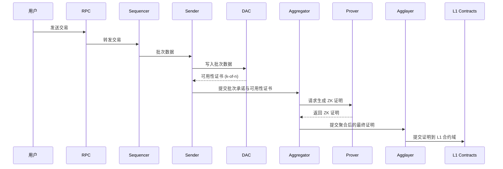

# Polygon CDK / AggLayer 术语表（Glossary）

> 说明：本术语表汇总并统一解释在《CDK.md》与《Agglayer.md》中出现但不属于正文展开的相关概念，便于跨文档查阅与保持术语一致性。
> 参见：
>
> - CDK 总览与模式详解：`01-Notes/blockchain/L2/polygon/CDK.md`
> - AggLayer 架构与流程：`01-Notes/blockchain/L2/polygon/Agglayer.md`

## 核心概念

- `Polygon CDK`（Chain Development Kit）
  - 定义：用于构建以太坊兼容 L2 的模块化工具包，支持多种执行栈与安全模式，并原生连接 AggLayer。

- `AggLayer`
  - 定义：Polygon 生态的互操作与聚合层，在 L1 验证多链证明与路由跨链消息，提供统一桥接与共享流动性。

- `L2`（Layer 2）
  - 定义：构建在以太坊等结算层之上的扩容网络，通常以证明驱动的方式将状态更新与安全性回落到 L1。

## 模式（安全与可用性）

- `Sovereign`
  - 定义：不依赖 ZK 证明的运行模式，以 AggLayer 的悲观证明保障互操作安全；可选数据发布策略。

- `Validium`
  - 定义：交易数据链下存储（依赖 DAC/外部 DA），链上发布状态承诺并通过 ZK 证明在 L1 验证正确性。

- `zkRollup`
  - 定义：完整交易数据发布到 L1（calldata/blob），所有状态转换由 ZK 证明保障，安全性最高。

## 组件与角色

- `Sequencer`
  - 定义：负责接收与排序交易，打包批次并驱动执行层产出区块与状态更新。

- `Prover`
  - 定义：为批次或区块生成零知识证明（ZK proof），可与聚合器协同降低 L1 验证成本。

- `Proof Aggregator` / `Aggregator`
  - 定义：聚合来自多链或多批次的证明，形成统一可验证的聚合证明并提交至 AggLayer/L1。

- `Authenticator` / `Verifier`（AggLayer 侧）
  - 定义：在 L1 验证来自链端的互操作安全证明（如悲观证明、ZK 证明），决定跨链消息能否被接受与执行。

- `Common Bridge` / `Message Bus`
  - 定义：AggLayer 提供的标准桥接与消息通道，统一资产铸造/销毁与跨链调用流程。

- `AggSender` / `Adapter` / `Connector`
  - 定义：链端适配器，采集需跨链的事件/更新并以标准数据结构（如本地退出树）上报 AggLayer。

## 数据结构与承诺

- `Local Exit Tree`（本地退出树）
  - 定义：链端为“退出/跨链消息”维护的树形结构，便于证明与聚合；其根可被 AggLayer 聚合。

- `Global Exit Root` / `Interop Root`（全局根）
  - 定义：对多链退出树根进行聚合得到的全局可验证根，用于统一跨链验证与路由。

- `State Commitment`（状态承诺）
  - 定义：对批次或状态的哈希承诺，常用于 Validium/Alt-DA 路径在链上发布可验证摘要。

## 数据可用性（DA）相关

- `DA`（Data Availability，数据可用性）
  - 定义：确保交易数据可被检索与重构的能力，可依赖 L1（calldata/blob）或外部网络/DAC。

- `DAC`（Data Availability Committee）
  - 定义：在 Validium 等模式下链下存储批次数据的委员会，以门槛签名出具可用性证书。

- `External DA`（外部 DA，例如 Celestia、Avail）
  - 定义：独立数据可用性网络，基于去中心化采样/链上证明提供可用性；成本与复杂度更高但信任假设更弱。

## 技术术语

- `ZK Proof`（零知识证明）
  - 定义：对状态转换正确性的加密证明，可在 L1 验证并获得强最终性。

- `Pessimistic Proof`（悲观证明）
  - 定义：在无需生成 ZK 证明的场景下用于互操作安全的证明/约束机制，常见于 Sovereign 与 AggLayer 路线。

- `calldata`
  - 定义：以太坊交易的调用数据区域，可用于发布 Rollup 数据（成本较高）。

- `blob`（EIP-4844）
  - 定义：携带临时数据的交易类型，降低数据发布成本；常用于 zkRollup/Alt-DA 路线。

- `EIP-4844`（Proto-Danksharding）
  - 定义：引入 blob 交易的以太坊升级，为数据可用性提供更经济的路径。

## 执行栈与生态伙伴

- `cdk-opgeth`
  - 定义：以 Geth/OP Stack 风格实现的 CDK 执行栈，原生连接 AggLayer，适合快速上线与以太坊原生工具链。

- `cdk-erigon`
  - 定义：基于高性能 Erigon 的执行栈，支持更深定制与企业级 ZK 路线。

- `OP Stack`
  - 定义：Optimism 的模块化 L2 技术栈，提供兼容以太坊的执行与基础设施组件。

- `Geth`
  - 定义：以太坊 Go 客户端实现，广泛用于主网与 L2 执行层。

- `Erigon`
  - 定义：高性能以太坊客户端，侧重存取优化与模块化，适配企业级场景。

- `Conduit`（G2 Sequencer）
  - 定义：生态服务方，维护/提供排序器等基础设施（如 G2 Sequencer），支持快速部署。

- `Gateway.fm`
  - 定义：生态服务方，为 cdk-erigon 路线提供运维与 ZK 安全特性支持。

## 其他术语与缩写

- `Alt-DA`
  - 定义：替代性数据可用性策略（外部 DA 或 DAC），用于降低成本或实现合规要求。

- `Custom DAC`
  - 定义：自定义的 DAC 委员会实施方式，通常用于企业/合规场景的链下数据维护。

## 专题：DAC 详解与应急策略

### 概念与角色

- 定义：DAC（Data Availability Committee，数据可用性委员会）用于在 Validium 等模式下链下保存交易批次数据，并为“该批次数据可被检索”出具可用性证书（availability certificate）。
- 组成：若干受治理的节点组成，通常通过门槛签名（k-of-n）对批次数据根（hash/commitment）进行背书。

### 职责与产出

- 存储与复制：对交易批次进行持久化与多副本存储，提供稳定读取接口。
- 可用性证书：对每个批次的数据根生成门槛/聚合签名，形成可用性证书，作为“数据可重构”的承诺。
- 数据提供：在审计、纠纷或重构需要时，向验证方/观察者提供完整数据以复核状态与证明。

### 与外部 DA 的区别

- 外部 DA（如 Celestia、Avail）：去中心化采样与链上证明，信任假设更弱但成本与复杂度更高。
- DAC：许可制/治理型委员会，成本与性能可控，但增加“委员会诚实与在线”的信任假设，适配高吞吐与合规场景。

### 适用场景与模式/栈适配

- 适用场景：高吞吐、成本敏感、对数据可见性/合规有特殊要求的业务。
- 模式适配：
  - Validium：核心依赖 DAC 或外部 DA；链上仅发布状态承诺，ZK 证明在 L1 验证状态正确性。
  - Sovereign：可选使用 DAC 进一步降本或做合规存储，并非必需。
  - zkRollup：通常不使用 DAC，完整数据上链（calldata/blob），安全性更强但成本更高。
- 栈适配：
  - cdk-opgeth（Validium）：Alt-DA 路线（TBD）可对应外部 DA 或委员会方案，细节参考官方架构文档。
  - cdk-erigon（Validium）：使用 Custom DAC，官方文档提供顺序交互示例与组件职责。

### 参考

- `cdk-opgeth`架构：<https://docs.agglayer.dev/cdk/cdk-opgeth/architecture/>
- `cdk-erigon`架构：<https://docs.agglayer.dev/cdk/cdk-erigon/architecture/>

---

使用说明：如在《CDK.md》或《Agglayer.md》中新增/引用了未展开的术语，请将简要定义补充至本文件，以保持术语一致性与跨文档可读性。
