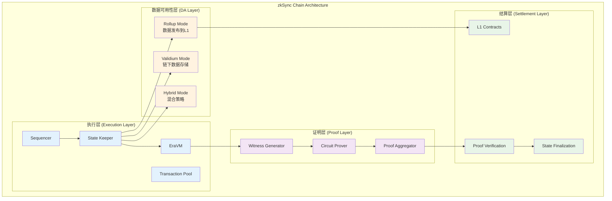
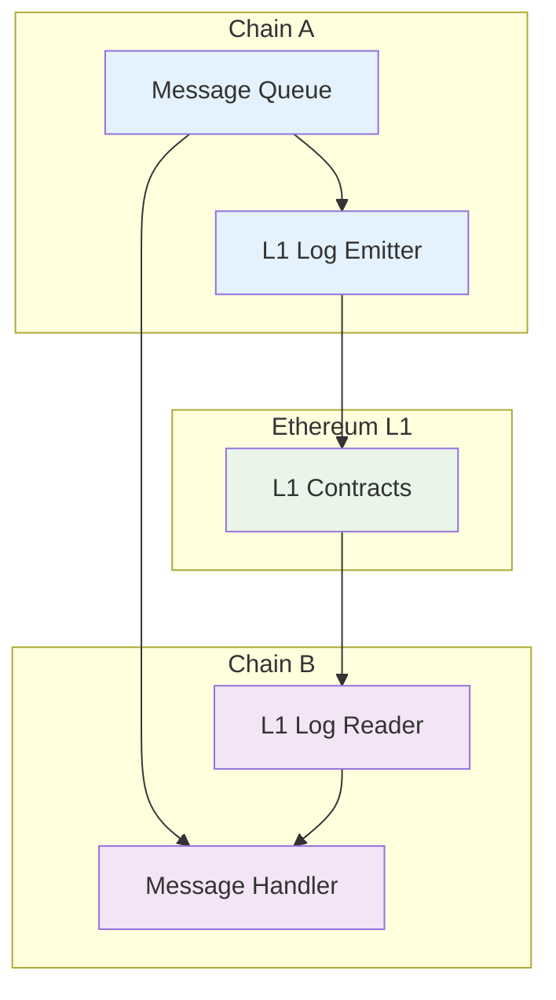
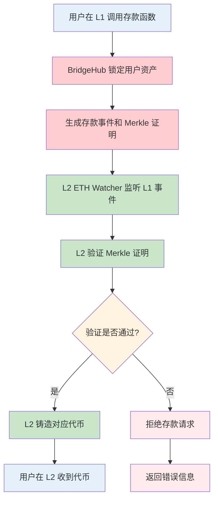
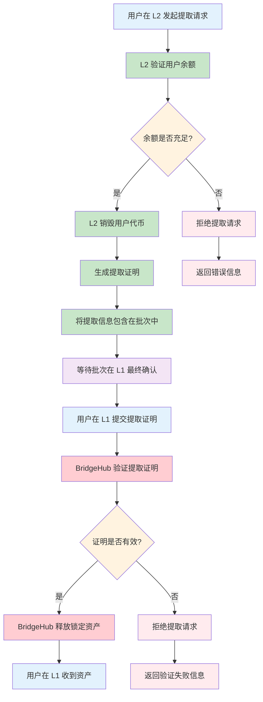
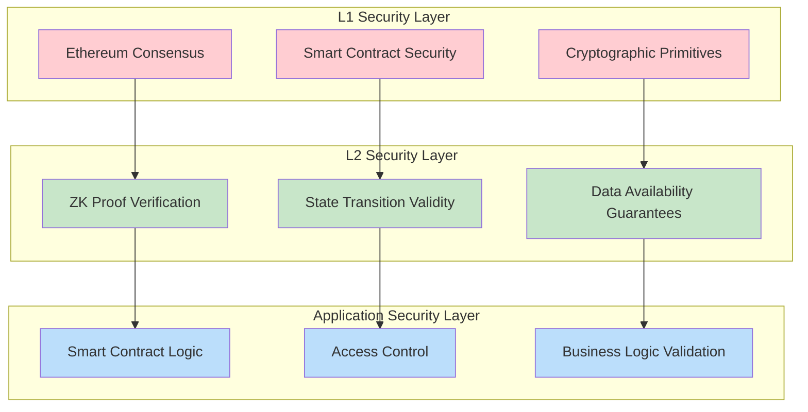

# zkSync Era 总体架构

> 本文档是 zkSync Era Core 技术分享报告的第一部分，提供系统的整体架构概览。
>
> 建议阅读顺序：
>
> 1. **总体架构**（本文档）- 了解整体设计理念和架构
> 2. [核心模块分析](./02_核心模块分析.md) - 掌握重点模块和关联关系
> 3. [核心组件详解](./03_核心组件.md) - 深入理解技术实现
> 4. [Prividium 企业级隐私区块链](./04_Prividium.md) - 企业应用案例
> 5. [05_Prividium 私有链搭建](./05_Prividium私有链搭建.md) - 企业应用案例

## 1. 架构概览

zkSync Era 是一个基于零知识证明的以太坊 Layer 2 扩容解决方案，采用了创新的Elastic Network架构。其设计目标是在保持以太坊安全性的同时，提供高吞吐量、低成本的交易处理能力。

### 1.1 架构设计原则

- **安全第一**: 继承以太坊 L1 的安全性
- **模块化设计**: 支持灵活的组件配置
- **可扩展性**: 支持多链并行运行
- **互操作性**: 链间无缝资产和数据流转
- **开发者友好**: 目标实现与以太坊 EVM 高度等效，以尽量减少迁移成本

## 2. Elastic Network

### 2.1 核心概念

zkSync Stack 的可扩展理念，目标支持多条 ZK rollup 并行运行并共享基础设施。注意：这是体系设计目标之一；实际部署方式（是否共享安全）取决于每条链选择的 settlement 层（直接 L1 或通过 Gateway）。当前 Era 的主网以 rollup 模式为主，多链/共享安全为后续能力。

```text
┌─────────────────────────────────────────────────────────┐
│                 Elastic Network                         │
├─────────────────────────────────────────────────────────┤
│  ┌─────────────┐  ┌─────────────┐  ┌─────────────┐      │
│  │   Chain A   │  │   Chain B   │  │   Chain C   │      │
│  │             │  │             │  │             │      │
│  │ ┌─────────┐ │  │ ┌─────────┐ │  │ ┌─────────┐ │      │
│  │ │ EraVM   │ │  │ │ EraVM   │ │  │ │ EraVM   │ │      │
│  │ └─────────┘ │  │ └─────────┘ │  │ └─────────┘ │      │
│  │ ┌─────────┐ │  │ ┌─────────┐ │  │ ┌─────────┐ │      │
│  │ │Sequencer│ │  │ │Sequencer│ │  │ │Sequencer│ │      │
│  │ └─────────┘ │  │ └─────────┘ │  │ └─────────┘ │      │
│  └─────────────┘  └─────────────┘  └─────────────┘      │
├─────────────────────────────────────────────────────────┤
│              Shared Infrastructure                      │
│  ┌─────────────┐  ┌─────────────┐  ┌─────────────┐      │
│  │   Prover    │  │ BridgeHub   │  │ Governance  │      │
│  │   System    │  │             │  │             │      │
│  └─────────────┘  └─────────────┘  └─────────────┘      │
├─────────────────────────────────────────────────────────┤
│                 Ethereum L1                             │
└─────────────────────────────────────────────────────────┘
```

### 2.2 Elastic Network特性

#### A. 多链并行

- **独立执行**: 每个链独立处理交易
- **并行证明**: 多个链的证明可以并行生成
- **资源隔离**: 链间不会相互影响性能

#### B. 共享安全

- **统一验证**: 所有链共享同一套证明验证逻辑
- **L1 最终性**: 所有链都依赖以太坊 L1 的最终性
- **集体安全**: 网络整体安全性不依赖单个链

## 3. ZKsync Chains / Rollup Cluster

### 3.1 链架构设计

每个 ZKsync 链都是一个完整的 ZK rollup，采用四层架构设计：



每个 ZKsync 链都是一个完整的 ZK rollup，具有以下组件：

#### A. 执行层

- **EraVM**: 兼容以太坊的虚拟机
- **State Keeper**: 状态管理器，协调交易执行
- **Sequencer**: 交易排序器，负责交易验证、排序和批处理
- **Transaction Pool**: 交易池

#### B. 证明层

Prover 是独立子系统。通常的工作流程是 sequencer 在 L2 上执行（按块产生 traces），但 Prover 在batch 级别接收多个块的 traces（batch 封闭后）进行 witness 生成与电路证明，最终输出覆盖整个 batch 的 ZK-proof（可选的递归/聚合步骤会进一步压缩多个 batch 的证明以减少 L1 提交次数）。

- **Witness Generator**: 见证生成器
- **Circuit Prover**: 电路证明器
- **Proof Aggregator**: 证明聚合器

#### C. 数据可用性层 (DA Layer)

DA 层是 zkSync Era 架构中的关键组件，负责确保交易数据的可用性和可验证性：

- **Rollup 模式**: 在 L1 发布用于重构状态的 pubdata（状态差分），可使用 calldata 或 EIP‑4844 blob；提供最高安全保证。
- **Validium 模式**: 交易数据存储在链下，通过数据可用性委员会保证
- **混合模式**: 根据交易类型和用户需求灵活选择数据存储策略

**DA 层的重要性**：

- **安全保证**: 确保任何人都能重构链状态
- **审计能力**: 支持独立验证和审计
- **抗审查性**: 防止数据被恶意隐藏或篡改
- **成本优化**: 通过不同 DA 策略平衡安全性和成本

### 3.2 链间通信机制



#### A. 消息传递

链间消息通过 L1（或 Gateway）进行异步传递：发送侧将消息/事件记录到中继层，接收侧通过 inclusion proof（或 Gateway 的 interop root）验证消息并执行。默认模型是异步最终一致，而非跨链原子性；顺序性在单个源链内通常由其 sequencer 保证，跨链顺序语义需明确协议约束。

#### B. 状态同步

- **Merkle 证明**: 使用 Merkle 证明验证状态
- **检查点机制**: 定期同步状态检查点
- **冲突解决**: 处理状态冲突的机制

## 4. Shared Bridge (BridgeHub)

### 4.1 桥接架构

BridgeHub 是连接 L1 和多个 L2 链的核心组件，负责资产的安全转移和管理。

```text
┌─────────────────────────────────────────────────────────┐
│                    Ethereum L1                          │
│  ┌─────────────┐  ┌─────────────┐  ┌─────────────┐      │
│  │ BridgeHub   │  │ Shared      │  │ Chain       │      │
│  │ Contract    │  │ Bridge      │  │ Contracts   │      │
│  └─────────────┘  └─────────────┘  └─────────────┘      │
└─────────────────────────────────────────────────────────┘
         │                  │                  │
         ▼                  ▼                  ▼
┌─────────────────────────────────────────────────────────┐
│                    L2 Chains                            │
│  ┌─────────────┐  ┌─────────────┐  ┌─────────────┐      │
│  │   Chain A   │  │   Chain B   │  │   Chain C   │      │
│  │   Bridge    │  │   Bridge    │  │   Bridge    │      │
│  └─────────────┘  └─────────────┘  └─────────────┘      │
└─────────────────────────────────────────────────────────┘
```

### 4.2 桥接功能

#### A. 资产管理

- **代币锁定**: 在 L1 锁定原生代币
- **代币铸造**: 在 L2 铸造对应代币
- **余额跟踪**: 跟踪跨链资产余额

#### B. 安全机制

BridgeHub 在 Rollup 模式下以 L1 合约为资金托管中心，L2 的提取/存款流程以提交/验证 ZK proof（或基于 L1 事件的 inclusion proof）为主。多重签名/委员会或 time-lock 机制可能是某些非-rollup 或 Validium 化桥接方案的补充，但不是 Rollup-style BridgeHub 的核心保证。

#### C. 互操作性

- **标准接口**: 提供标准的桥接接口
- **协议兼容**: 兼容其他桥接协议
- **跨链语义**: 默认异步最终一致；原子跨链交换需额外协议与合约支持

### 4.3 桥接流程

#### A. L1 到 L2 存款流程



**存款流程说明**：

1. **用户发起**: 用户在 L1 调用 BridgeHub 的存款函数。
2. **资产锁定**: BridgeHub 将资金托管并转发至 SharedBridge。
3. **请求入队**: BridgeHub 将 L1→L2 事务请求追加到指定 ZK Chain 合约的优先队列。
4. **排序与执行**: L2 排序器从优先队列取出请求并在 L2 执行。
5. **代币铸造**: 执行成功后，在 L2 铸造对应数量的代币。
6. **结果记录**: 记录优先事务处理结果并在批次结束时通过 L2→L1 日志 Merkle 化。
7. **完成存款**: 用户在 L2 账户中收到代币

#### B. L2 到 L1 提取流程



**提取流程说明**：

1. **发起提取**: 用户在 L2 发起提取资产到 L1 的请求
2. **余额验证**: L2 验证用户是否有足够的代币余额
3. **代币销毁**: 验证通过后，L2 销毁相应数量的用户代币
4. **证明生成**: 生成提取操作的零知识证明
5. **批次包含**: 将提取信息包含在下一个提交到 L1 的批次中
6. **等待确认**: 默认约 3 小时安全延迟；最终耗时取决于证明生成与聚合提交频率。
7. **提交证明**: 由链的 prover / aggregator 或 relayer 将批次证明提交到 L1。
8. **验证释放**: BridgeHub 验证证明有效性并释放锁定的资产
9. **完成提取**: 用户在 L1 账户中收到资产

## 5. 模块化设计 (Modular Design)

### 5.1 可定制组件

zkSync Era 采用模块化设计，允许运营者根据需求定制以下组件：

#### A. Sequencer (排序器)

- **中心化排序**: 单一排序器，高性能
- **去中心化排序**: 多个排序器，高去中心化
- **混合排序**: 结合两种模式的优势

注：上述为 ZK Stack 的可选架构；ZKsync Era 主网当前采用中心化排序器，去中心化排序为路线图方向。

#### B. Data Availability (数据可用性)

- **Rollup 模式**: 数据发布到 L1
- **Validium 模式**: 数据存储在链下
- **混合模式**: 根据交易类型选择

#### C. Gas Token (燃料代币)

- **ETH**: 使用以太坊原生代币
- **自定义代币**: 使用项目自己的代币
- **稳定币**: 使用 USDC 等稳定币

#### D. Base Token (基础代币)

- **ETH**: 以太坊作为基础代币
- **ERC20**: 任何 ERC20 代币
- **原生代币**: 链的原生代币

注意：自定义 ERC20 作为基础代币需在 L1 BridgeHub 的 allowlist 中登记，并在链配置指向该地址。

### 5.2 核心不变组件

以下组件是 zkSync Era 的核心，不可定制：

#### A. EraVM 执行环境

- **EVM 字节码支持**: 通过 EVM Interpreter（v27）在 EraVM 上解释执行未修改的 EVM 字节码。
- **差异与限制**: 仍存在少量不支持/差异操作码（如 `CALLCODE`、`SELFDESTRUCT`、`BLOBHASH`、`BLOBBASEFEE`），EVM 与 EraVM 间禁止 `delegatecall`，字节码不可直接读取（`EXTCODEHASH` 为版本化哈希），Gas 计费采用 EraVM 的 `ergs` 并与 EVM Gas 存在转换。
- **预编译与系统合约**: 保留标准预编译与系统合约能力（如 Bootloader、AccountCodeStorage 等）。

#### B. 证明验证逻辑

电路与验证逻辑为系统核心，具有稳定的设计目标与安全参数；但电路结构与验证实现会随实现优化、升级与审计而演进，相关升级应通过治理/升级流程进行。

#### C. 安全模型基础

- **L1 最终性**: 依赖以太坊最终性
- **密码学原语**: 使用标准密码学
- **共识机制**: 统一的共识规则

## 6. 安全模型与信任边界

### 6.1 安全层次结构



### 6.2 信任边界分析

#### A. L1 依赖的安全性

**完全信任**:

- 以太坊共识机制
- L1 智能合约正确性
- 密码学原语安全性

**风险缓解**:

- 多重审计
- 形式化验证
- 渐进式去中心化

#### B. L2 层面的信任假设

**最小信任**:

- Sequencer 活跃性（存在 L1 优先队列提高抗审查，但无法强制处理）
- Prover 可用性（可通过多个 Prover 解决）

**无需信任**:

- 状态转换正确性（ZK 证明保证）
- 资金安全性（L1 合约保护）

#### C. DA 模型的信任差异

**Rollup 模式**:

- 信任假设：以太坊数据可用性
- 安全级别：最高
- 成本：较高

**Validium 模式**:

- 信任假设：DA 委员会诚实
- 安全级别：中等
- 成本：较低

**混合模式**:

- 信任假设：根据交易类型变化
- 安全级别：可配置
- 成本：平衡
