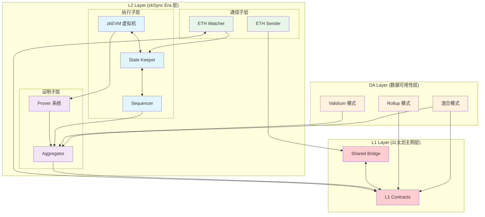

# zkSync Era Core 核心模块分析

> 本文档是 zkSync Era Core 技术分享报告的第二部分，在了解总体架构后，重点分析核心模块及其关联关系。
> 
> **前置阅读**: [总体架构](./02_总体架构.md) - 建议先了解整体架构设计
> 
> **后续阅读**: 
> - [核心组件详解](./03_核心组件.md) - 深入技术实现细节
> - [Prividium 企业级隐私区块链](./04_Prividium.md) - 企业应用案例

## 概述

基于对 zkSync Era Core 文档的深入研究，本文档分析了需要重点理解和掌握的核心模块、概念以及它们之间的关系。这些模块构成了 zkSync Era 作为以太坊 Layer 2 扩容解决方案的技术基础。

本文档重点关注：

- **模块识别**: 哪些是核心模块，为什么重要
- **关联关系**: 模块间的数据流和依赖关系
- **上下游系统**: 每个模块处理的输入和输出数据
- **技术要点**: 需要深入理解的关键概念

## 1. 核心模块架构图

```text
┌─────────────────────────────────────────────────────────────┐
│                    zkSync Era Core                          │
├─────────────────────────────────────────────────────────────┤
│  总体架构层 (Architecture Layer)                              │
│  ├── Elastic Network                                        │
│  ├── ZKsync Chains / Rollup Cluster                         │
│  ├── Shared Bridge (BridgeHub)                              │
│  └── 模块化设计 (Modular Design)                              │
├─────────────────────────────────────────────────────────────┤
│  核心组件层 (Core Components Layer)                           │
│  ├── zkEVM                                                  │
│  ├── Prover                                                 │
│  ├── Node/Server                                            │
│  └── 数据可用性 (Data Availability)                           │
├─────────────────────────────────────────────────────────────┤
│  安全与信任层 (Security & Trust Layer)                        │
│  ├── L1 安全依赖                                             │
│  ├── 信任边界                                                │
│  └── DA 模型风险                                             │
└─────────────────────────────────────────────────────────────┘
```

## 2. 需要重点理解的核心模块

### 2.1 总体架构模块

#### A. Elastic Network

- **定义**: zkSync Era 的弹性网络架构，支持多链扩展
- **核心特性**:
  - 支持多个 ZK rollup 链的并行运行
  - 链间互操作性
  - 动态扩展能力
- **关键概念**: 网络弹性、链间通信、资源共享

#### B. ZKsync Chains / Rollup Cluster

- **定义**: 多个 ZK rollup 链组成的集群
- **核心特性**:
  - 每个链独立运行
  - 共享安全模型
  - 统一的证明系统
- **关键概念**: 链集群、独立性、共享安全

#### C. Shared Bridge (BridgeHub)

- **定义**: 连接 L1 和多个 L2 链的共享桥接系统
- **核心特性**:
  - 统一的资产管理
  - 跨链资产转移
  - 安全的资金托管
- **关键概念**: 桥接安全、资产托管、跨链互操作

#### D. 模块化设计 (Modular Design)

- **可定制部分**:
  - Sequencer (排序器)
  - Data Availability (数据可用性)
  - Gas Token (燃料代币)
  - Base Token (基础代币)
- **核心不变部分**:
  - zkEVM 执行环境
  - 证明验证逻辑
  - 安全模型基础

### 2.2 核心组件模块

#### A. zkEVM 虚拟机

- **执行环境**:
  - EVM 兼容性
  - 字节码执行
  - 状态管理
- **系统合约**:
  - Bootloader
  - Account Abstraction
  - L1Messenger
- **关键特性**:
  - 完全的 EVM 兼容
  - 高效的证明生成
  - 系统级优化

#### B. Prover 系统

- **Circuits (电路)**:
  - VM Main Circuit
  - Storage Circuit
  - Keccak Circuit
  - SHA256 Circuit
- **Witness Generation (见证生成)**:
  - 执行轨迹记录
  - 状态转换见证
  - 辅助数据生成
- **Boojum 证明系统**:
  - FRI 压缩技术
  - 递归证明
  - 批量验证
- **Proof Verifier (验证器)**:
  - L1 合约验证
  - 证明聚合
  - 最终性确认

#### C. Node/Server 架构

- **Sequencer (排序器)**:
  - 交易排序
  - 批次构建
  - MEV 保护
- **State Keeper (状态保持器)**:
  - 状态管理
  - 执行协调
  - 一致性维护
- **ETH Watcher (以太坊监听器)**:
  - L1 事件监听
  - 存款处理
  - 优先队列管理
- **RPC API**:
  - 标准 JSON-RPC
  - zkSync 特定 API
  - 兼容性接口

#### D. 数据可用性 (Data Availability)

- **Rollup 模式**:
  - 数据发布到 L1
  - 完全的数据可用性保证
  - 高安全性，高成本
- **Validium 模式**:
  - 数据存储在链下
  - 数据可用性委员会
  - 低成本，信任假设
- **混合模式**:
  - 灵活的 DA 策略
  - 根据需求选择
  - 平衡成本和安全

## 3. 模块间关系图



**分层架构关系说明**：

**L1 Layer (以太坊主网层)** - 红色：

- 提供最终的安全保证和资金托管
- 验证 L2 提交的证明和状态

**L2 Layer (zkSync Era 层)**：

- **执行子层** (蓝色): 处理用户交易和智能合约执行
- **证明子层** (紫色): 生成零知识证明确保执行正确性
- **通信子层** (绿色): 处理与 L1 和外部的通信

**DA Layer (数据可用性层)** - 橙色：

- 确保交易数据的可用性和可验证性
- 支持多种存储策略以平衡安全性和成本
