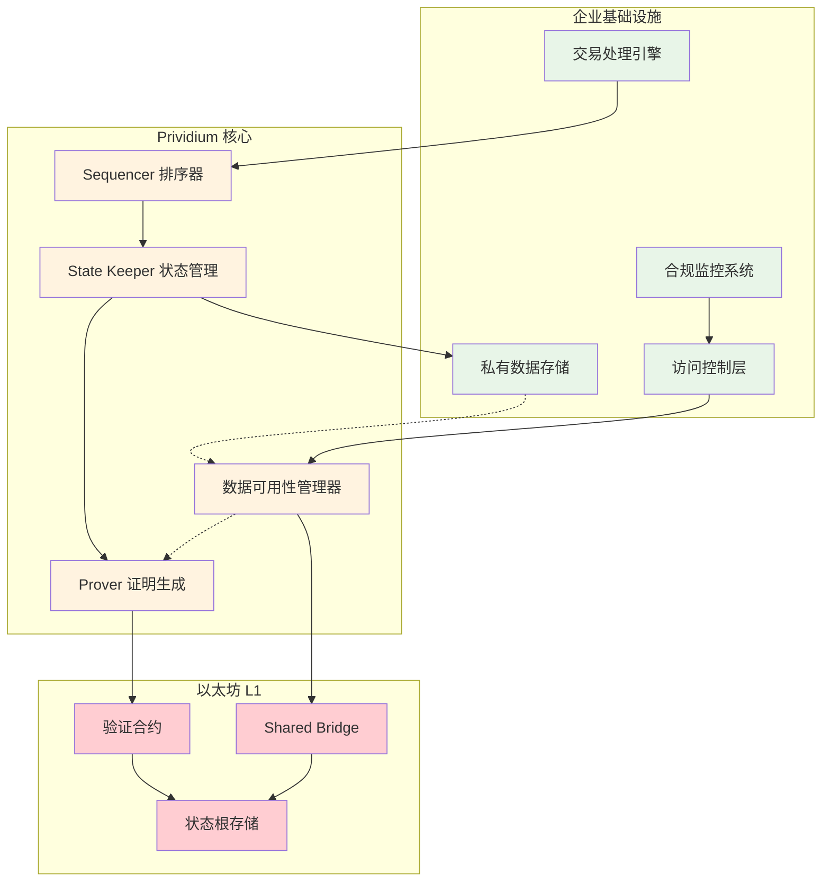
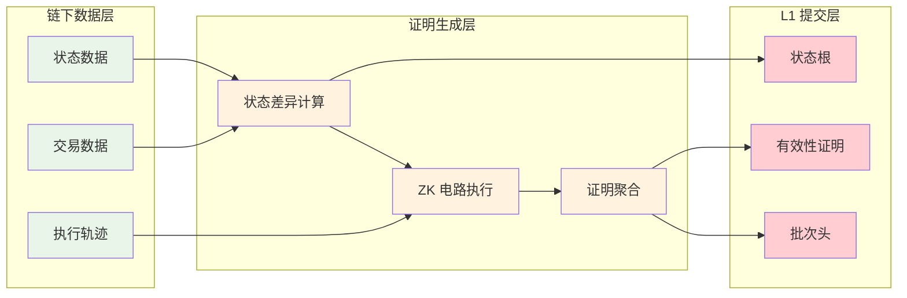

# zkSync Prividium 企业级隐私区块链

> 本文档是 zkSync Era Core 技术分享报告的第四部分，展示 zkSync Stack 在企业级隐私区块链场景中的具体应用。
> 
> **前置阅读**:
> - [总体架构](./02_总体架构.md) - 了解 zkSync Stack 的整体设计
> - [核心模块分析](./01_核心模块分析.md) - 掌握模块化设计理念
> - [核心组件详解](./03_核心组件.md) - 理解技术实现基础
> 
> **文档定位**: 企业应用案例，展示如何基于 zkSync Stack 构建定制化的隐私区块链解决方案

## 概述

zkSync Prividium 是 zkSync 推出的企业级隐私区块链解决方案，专为需要隐私保护、合规性和完全数据控制的机构而设计。作为基于 zkSync Stack 构建的 Validium 链，Prividium 提供了企业级隐私、内置合规性和与以太坊的无缝连接，同时保持完全可定制的生产就绪技术栈。

**核心价值主张**:

- **数据主权**: 机构完全控制数据的存储和访问
- **隐私保护**: 交易详情保留在企业防火墙内
- **合规性**: 内置企业级合规框架
- **互操作性**: 与以太坊生态无缝连接

---

## 1. 核心特性分析

### 1.1 企业级隐私保护

#### 数据隔离架构

Prividium 采用独特的数据隔离设计，确保敏感数据完全保留在企业内部基础设施中：

- **链下数据存储**: 所有交易数据保存在机构自有的基础设施或云环境中 [3]
- **零知识证明验证**: 仅将 ZK 证明提交到以太坊，确保状态更新的有效性
- **防火墙保护**: 只有证明数据离开企业防火墙，交易详情完全私密 [3]

#### 用户级隐私控制

- **选择性披露**: 应用程序可以完全控制数据和逻辑，确保隐私和控制权始终掌握在机构手中 [5]
- **操作员可见性**: 链操作员拥有完全可见性，同时为用户提供隐私保护 [4]
- **访问控制**: 由于主办机构控制数据可用性，具有限制访问的权力

### 1.2 Validium 架构优势

#### 高性能与低成本

作为 Validium 链，Prividium 具备以下技术优势：

- **链下状态存储**: 状态数据存储在链下，实现高吞吐量和低交易成本 [2]
- **成本摊销**: 净值为零的变更不会发布，减少不必要的数据并节省成本 [4]
- **计算开销优化**: 通过消除逐个验证交易的需要，减少计算开销并降低 Gas 费用 [6]

#### 数据可用性策略

### 1.3 合规性与安全保障

#### 内置合规框架

- **内置合规性**: 提供企业级合规性功能，满足监管要求 [2]
- **审计友好**: 支持必要的审计和监管检查，同时保护敏感数据
- **监管透明**: 在保持隐私的同时，为监管机构提供必要的透明度 [5]
- **数据主权**: 机构完全控制数据的存储、访问和处理

#### 安全模型

- **以太坊安全继承**: 通过 ZK 证明在以太坊上验证状态转换，继承以太坊的安全性 [7]
- **防篡改完整性**: 每笔交易都通过 ZK 证明验证并在以太坊上最终确认 [1]
- **资金安全**: 虽然数据可能不可用时资金会被冻结，但资金本身是安全的，不会被盗 [4]

---

## 2. 技术架构深度解析

### 2.1 Validium 核心机制

#### 状态管理与证明生成

Prividium 作为 Validium 实现，其核心技术机制包括：

**状态差异提交**:

- 不提交详细的交易数据，而是专注于向 L1 提交状态差异 [2]
- 对同一存储槽的多次交易变更可以分组，减少需要发送到 L1 的数据量
- 通过压缩技术进一步降低成本

**存储优化**:

- 高效使用存储槽：跨多个交易对相同存储槽的变更可以分组
- 压缩和枚举：初始发布后，derived_key 可以用枚举索引替换以优化数据大小
- 枚举键实际上是存储 Merkle 树中的叶子索引 [2]

#### 数据可用性管理

### 2.2 企业级定制化能力

#### 模块化配置选项

基于 zkSync Stack 的模块化设计，Prividium 支持以下定制化配置：

**治理模型定制**:

- 自定义治理机制和决策流程
- 灵活的权限管理和角色分配
- 企业级多签和审批流程

**Gas 代币选择**:

- 支持使用 ERC20 代币作为链费用的基础代币 [4]
- 可使用 USDC 或自定义社区代币作为交易的基础货币
- 稳定的定价模型，降低波动性风险

**用户体验优化**:

- 完全可配置的用户界面和交互流程
- 企业级身份认证和访问控制
- 定制化的 API 接口和集成方案

### 2.3 互操作性设计

#### 跨链资产流动

Prividium 实现了与以太坊生态的无缝互操作：

- **无需第三方桥接**: 直接与以太坊和其他 zkSync 链进行资产转移，无需依赖第三方桥接 [3]
- **隐私保护转移**: 在不牺牲隐私的情况下将资产转移到以太坊和其他 zkSync 链 [3]
- **统一流动性**: 与更广泛的以太坊生态系统保持互操作性，避免孤立

#### 提取和存款机制

**资金提取流程**:

1. 用户发起提取交易并提交给操作员
2. 操作员验证提取请求并将其包含在批次中
3. 用户在 Validium 链上的资产在退出系统前被销毁 [5]
4. 通过智能合约在以太坊主网上处理最终提取

**存款处理**:

- 通过主合约处理存款到 Validium 链的操作
- 存储状态承诺（Merkle 根）并在验证有效性证明后更新 Validium 状态 [5]

---

## 3. 实际应用案例

### 3.1 Memento ZK Chain

#### 项目背景

Memento ZK Chain 是 Prividium 的首个生产部署案例，与德意志银行合作构建，专注于合规性的链，旨在将基金服务完全上链。[1]

#### 技术实现特点

- **合规优先设计**: 专门为金融服务行业的监管要求而设计
- **机构级安全**: 满足银行级别的安全和隐私要求
- **链上基金服务**: 实现传统基金服务的完全区块链化

### 3.2 企业应用场景

#### 金融服务领域

**私人银行业务**:

- 高净值客户的资产管理和交易
- 保护客户隐私的同时满足监管要求
- 实现跨境资产转移的合规性

**机构交易**:

- 大宗交易的隐私保护
- 降低交易成本和结算时间
- 提供审计透明性而不暴露敏感信息

#### 供应链金融

**贸易融资**:

- 保护商业敏感信息的同时提供融资服务
- 实现多方协作的透明度和信任
- 降低跨境贸易的成本和风险

**资产代币化**:

- 实物资产的数字化表示
- 保护资产持有者的隐私
- 提供流动性的同时维护合规性

---

## 4. 技术优势与挑战

### 4.1 核心技术优势

#### 性能与成本优化

- **高吞吐量**: 链下数据存储实现更高的交易处理能力
- **低成本运营**: 减少对以太坊主网的数据发布需求
- **快速确认**: 用户在转移大量资产时享受更快的确认时间 [6]

#### 企业级特性

- **完全可定制**: 从治理到 Gas 代币到用户体验，一切都可配置 [1]
- **开源模型**: 使用开源核心模型，核心组件在 MIT 许可证下发布 [3]
- **生产就绪**: 经过充分测试和验证的企业级解决方案

### 4.2 潜在挑战与风险

#### 数据可用性风险

- **资金冻结风险**: 如果数据变得不可用，资金可能被冻结 [1]
- **运营风险**: 数据不可用不仅会锁定用户资产，还可能损害主办机构的声誉和运营状态
- **依赖性风险**: 对数据可用性提供商的依赖可能带来单点故障

#### 信任模型考量

- **操作员信任**: 需要信任链操作员正确维护数据可用性
- **中心化程度**: 相比完全去中心化的 Rollup，存在一定程度的中心化
- **监管合规**: 需要持续适应不断变化的监管环境

---

## 5. 未来发展方向

### 5.1 技术演进路线

#### Gateway 集成优化

随着 Gateway 的计划升级完成，Validium 的运营成本将进一步降低：

- 只需要轻量级共识机制，减少计算开销
- 更高效的证明聚合和验证流程
- 增强的跨链互操作性

#### 隐私技术增强

- **零知识证明优化**: 持续改进证明生成效率和验证速度
- **隐私保护增强**: 开发更先进的隐私保护机制
- **合规工具完善**: 提供更丰富的合规性工具和框架

### 5.2 生态系统扩展

#### 企业采用推广

- **行业标准制定**: 参与制定企业区块链应用的行业标准
- **合作伙伴网络**: 扩大与金融机构、技术服务商的合作
- **开发者生态**: 建设面向企业应用的开发者工具和资源

#### 应用场景拓展

- **多行业应用**: 从金融扩展到供应链、医疗、政务等领域
- **跨境服务**: 支持更多跨境业务场景的合规性需求
- **数字身份**: 集成企业级数字身份和认证服务

---

## 结语

zkSync Prividium 代表了企业级区块链应用的重要突破，通过 Validium 架构实现了隐私保护、合规性和互操作性的完美平衡。其独特的技术设计不仅解决了传统企业在区块链采用中面临的核心挑战，还为金融服务等关键行业提供了生产就绪的解决方案。

作为 zkSync Stack 生态系统的重要组成部分，Prividium 展示了模块化区块链架构的强大潜力。通过将敏感数据保留在企业内部，同时利用以太坊的安全性进行最终验证，Prividium 为企业提供了一个既安全又灵活的区块链基础设施选择。

---

## 参考文献

[1](https://zksync.mirror.xyz/-22Hu5ugeOtchnp1ut44Zehfh5yolKlu9nubFdJLMD0) zkSync Mirror. "Introducing Prividium: Enterprise-Grade Privacy for Institutions".

[2](https://docs.zksync.io/zk-stack/prividium) zkSync Documentation.

[3](https://www.zksync.io/enterprise/prividium) zkSync Enterprise. "Prividium".

[4](https://docs.zksync.io/zk-stack/zk-chains) zkSync Documentation. "ZK Chains".

[5](https://www.zeeve.io/blog/zksync-prividium-what-is-it-and-how-does-it-enable-private-financial-infrastructure-onchain/) Zeeve Blog. "zkSync Prividium: What is it and how does it enable private financial infrastructure onchain?".

[6](https://grvt.io/blog/why-zksyncs-zk-stack-series-part-2-trustless-and-privacy-with-validium/) GRVT Blog. "Why zkSync's ZK Stack Series Part 2: Trustless and Privacy with Validium".

[7](https://ethereum.org/developers/docs/scaling/validium/) Ethereum.org. "Validium".
