# zkSync Era 区块与交易

> 📖 **本文档是 zkSync Era Core 技术分享报告的第四部分**
>
> 深入解析 zkSync Era 的区块结构、批次生成机制、交易生命周期、费用模型以及最终性保证。
>
> **前置阅读**：
>
> - [01_总体架构](./01_总体架构.md) - 了解整体设计理念
> - [02_核心模块分析](./02_核心模块分析.md) - 掌握模块关联关系  
> - [03_核心组件](./03_核心组件.md) - EraVM、Prover、系统合约等
>
> **后续阅读**：
>
> - [05_企业级隐私区块链](./05_Prividium.md) - Prividium 私有链介绍
> - [06_Prividium私有链搭建](./06_Prividium私有链搭建.md) - 搭建 Prividium 私有链

---

## 📦 1. 区块结构与创建，批次生成

### 1.1 Miniblock（L2 区块）结构

zkSync Era 的 L2 区块称为 **Miniblock**，是交易执行的基本单位：

#### 🔧 核心字段

| 字段 | 类型 | 描述 |
|------|------|------|
| `blockNumber` | `uint64` | L2 区块号，单调递增 |
| `timestamp` | `uint64` | 区块时间戳 |
| `txs[]` | `Transaction[]` | 包含的交易列表 |
| `logsRoot` | `bytes32` | 交易日志的 Merkle 根 |
| `stateRoot` | `bytes32` | 执行后的状态根 |
| `commitment` | `bytes32` | 区块承诺哈希 |
| `l1BatchNumber` | `uint32` | 所属 L1 批次号 |
| `gasUsed` | `uint256` | 消耗的 Gas 总量 |

#### 🏗️ 创建流程

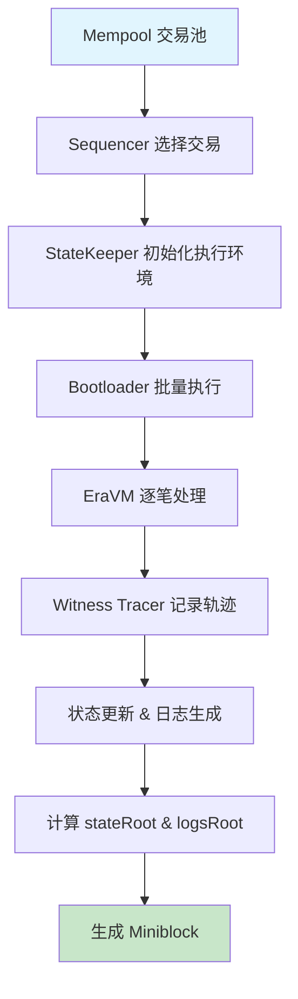

**详细步骤**：

1. **交易选择**：Sequencer 根据优先级、gas 价格、账户 nonce 等从 Mempool 选取交易
2. **执行环境初始化**：State Keeper 设置区块上下文（时间戳、区块号等）
3. **批量执行**：Bootloader 在受控环境下调用 EraVM 执行交易
4. **状态追踪**：Witness Tracer 记录每笔交易的状态变更和执行轨迹
5. **根计算**：基于状态变更计算新的 `stateRoot` 和 `logsRoot`
6. **区块封装**：将所有信息封装为完整的 Miniblock

> **注意**：通常没有交易时不会产生 Miniblock；出块策略可配置（时间心跳或按需）。

### 1.2 Batch（L1 批次）生成与提交

#### 📊 批次聚合机制

多个 Miniblocks 会被聚合成一个 **L1 Batch** 进行链上提交。Batch 包含的是状态差异（state diffs）而不是原始交易数据：

#### 🗂️ L1 Batch 结构

基于 zkSync Era 的 `CommitBatchInfo` 结构体，L1 Batch 包含以下完整字段：

| 字段 | 描述 | 示例值 |
|------|------|--------|
| `batchNumber` | L1 批次编号 | `42` |
| `timestamp` | 批次时间戳 | `1699123456` |
| `numberOfLayer1Txs` | L1→L2 交易数量 | `5` |
| `newStateRoot` | 新状态根 | `0xabcd...` |
| `indexRepeatedStorageChanges` | 重复存储变更索引 | `1024` |
| `priorityOperationsHash` | 优先操作哈希 | `0x1234...` |
| `bootloaderHeapInitialContentsHash` | Bootloader 堆初始内容哈希 | `0x5678...` |
| `eventsQueueStateHash` | 事件队列状态哈希 | `0x9abc...` |
| `systemLogs` | 系统日志数据 | `0xdef0...` |
| `totalL2ToL1Pubdata` | L2→L1 公共数据（状态差异） | `0x1234...` |

> **注意**：此结构基于 zkSync Era 最新实现，包含了完整的 `CommitBatchInfo` 字段。

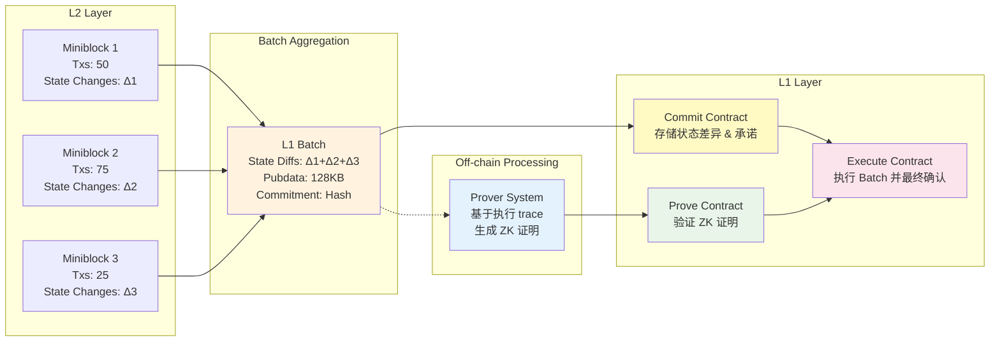

#### 🎯 封闭条件

Batch 在满足以下任一条件时封闭：

| 条件类型 | 阈值 | 说明 |
|----------|------|------|
| **时间限制** | ~1-10 分钟 | 确保及时性，避免用户等待过久 |
| **交易数量** | ~1000-5000 笔 | 平衡吞吐量与处理效率 |
| **Gas 消耗** | ~30-50M gas | 控制计算复杂度 |
| **Pubdata 大小** | ~128KB | 受 L1 数据可用性成本限制 |
| **优先队列** | 有待处理项 | 确保 L1→L2 交易及时处理 |

#### 🚀 L1 提交流程

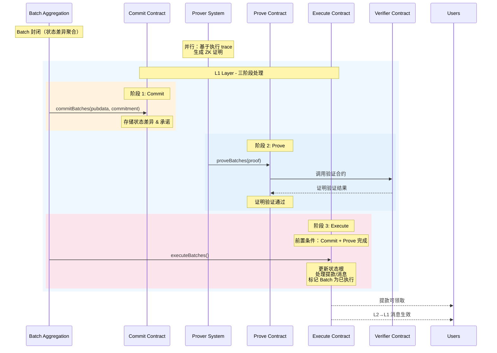

#### 🔄 三阶段详细说明

| 阶段 | 执行者 | 合约调用 | 主要功能 | 数据来源 | 状态变化 |
|------|--------|----------|----------|----------|----------|
| **Commit** | Batch Aggregation | `commitBatches()` | • 提交 `CommitBatchInfo` 到 L1<br/>• 存储 `newStateRoot` 和批次元数据<br/>• 记录 `totalL2ToL1Pubdata` | L2 状态差异和系统日志 | `Committed` |
| **Prove** | Prover System | `proveBatches()` | • 提交 ZK 证明<br/>• L1 验证计算正确性<br/>• 更新证明状态 | 基于执行 trace 生成的证明 | `Proven` |
| **Execute** | Batch Aggregation | `executeBatches()` | • 更新 L1 状态根<br/>• 处理提款请求<br/>• 执行跨层消息 | Commit + Prove 结果 | `Executed` |

---

## 🔄 2. 交易类型与生命周期

### 2.1 交易分类

#### 📋 交易类型概览

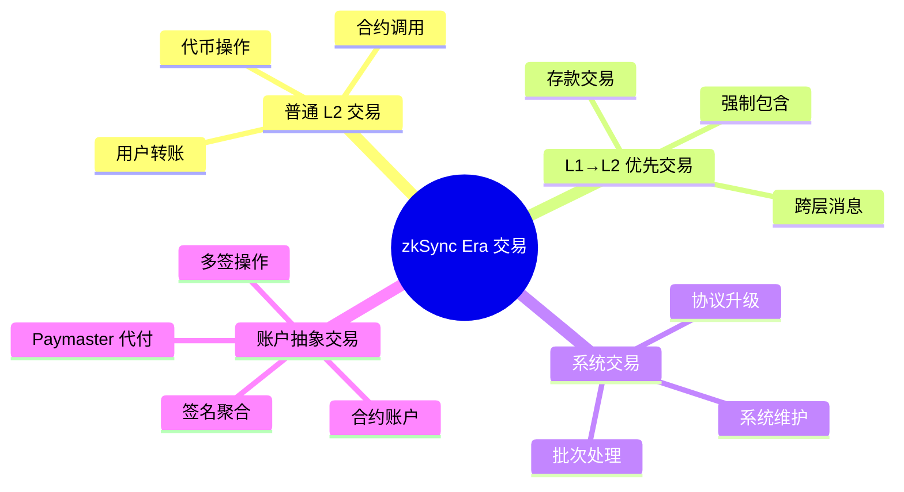

#### 🔍 详细说明

| 交易类型 | 来源 | 特点 | 示例 |
|----------|------|------|------|
| **普通 L2 交易** | 用户 RPC 提交 | 由 Sequencer 排序，可被重排 | ETH 转账、ERC20 操作、DeFi 交互 |
| **L1→L2 优先交易** | L1 合约触发 | 进入优先队列，增强抗审查性 | 存款、强制提款、跨链消息 |
| **系统交易** | 协议内部 | 维护系统状态，优先级最高 | 升级执行、费用收集、清理操作 |
| **账户抽象交易** | 合约账户 | 自定义验证逻辑，支持代付 | 社交恢复、批量操作、gasless 交易 |

### 2.2 交易生命周期详解

#### 🔄 状态转换图

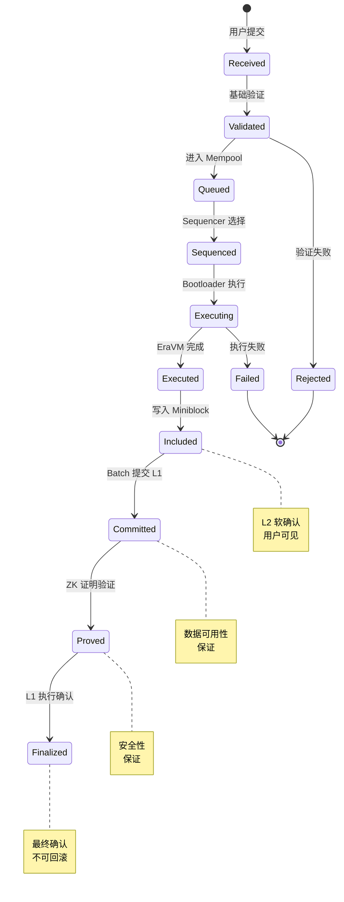

#### 📊 各阶段详细说明

| 阶段 | 状态 | 时间 | 说明 | 用户体验 |
|------|------|------|------|----------|
| **接收** | `Received` | 即时 | RPC 接收并初步验证格式 | 交易哈希返回 |
| **验证** | `Validated` | <1s | 签名、nonce、余额等验证 | 等待确认 |
| **排队** | `Queued` | 1-30s | 进入 Mempool 等待排序 | 待处理状态 |
| **排序** | `Sequenced` | 1-60s | Sequencer 选入 Miniblock | 即将执行 |
| **执行** | `Executing` | <1s | EraVM 执行交易逻辑 | 处理中 |
| **完成** | `Executed` | <1s | 执行完成，状态更新 | 执行结果 |
| **包含** | `Included` | 1-10s | 写入 Miniblock | **L2 确认** |
| **提交** | `Committed` | 1-10min | Batch 数据上链 | 数据安全 |
| **证明** | `Proved` | 1-24h | ZK 证明验证通过 | **安全确认** |
| **最终** | `Finalized` | 1-24h | L1 执行，不可回滚 | **最终确认** |

### 2.3 跨层交易处理

#### 💰 存款流程（L1→L2）

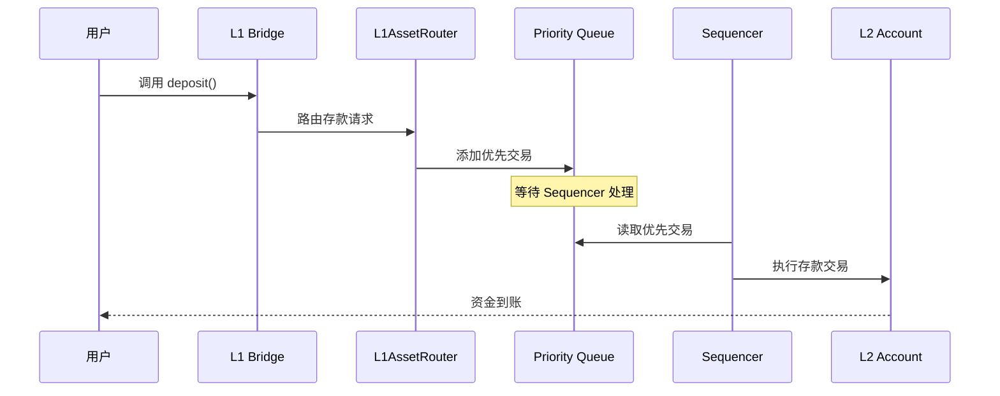

#### 💸 提款流程（L2→L1）

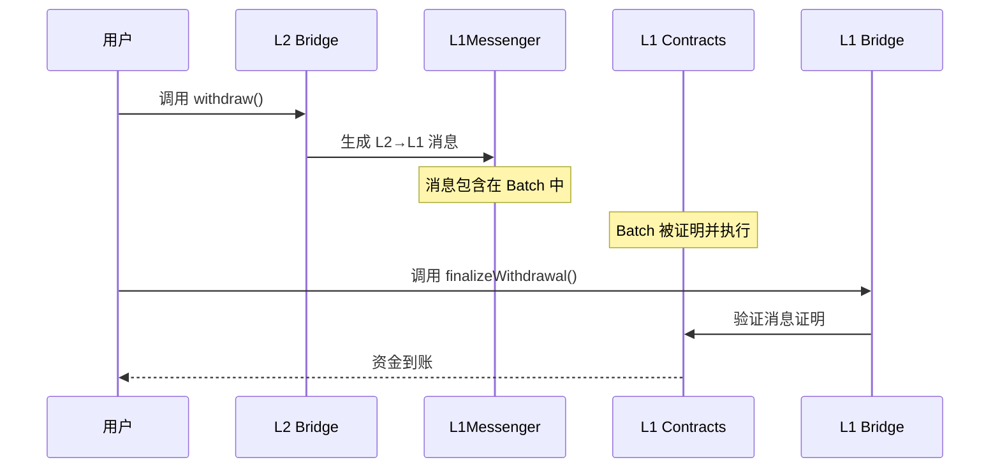

---

## 💰 3. 费用模型

### 3.1 费用组成结构

zkSync Era 采用双重费用模型，包含执行费用和数据费用：

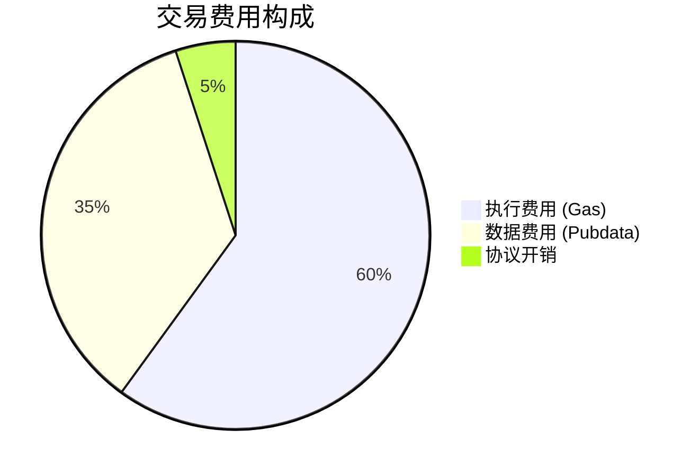

#### 🧮 费用计算公式

```text
TotalFee = ExecutionFee + PubdataFee + ProtocolOverhead

其中：
ExecutionFee = gasUsed × gasPrice
PubdataFee = pubdataBytes × pubdataPrice
ProtocolOverhead = baseFee + priorityFee
```

### 3.2 执行费用（Gas）

> **注意**：zkSync Era 使用标准的 Gas 计量单位，与以太坊兼容。早期版本曾使用 "Ergs" 术语，但现已统一为 Gas。

#### ⚡ zkSync Era Gas vs Ethereum Gas 对比

| 方面 | zkSync Era Gas | Ethereum Gas |
|------|----------------|--------------|
| **计量单位** | gas | gas |
| **操作成本** | 基于 EraVM 指令优化 | 基于 EVM 操作码 |
| **存储访问** | 优化的存储模型 | 传统 SSTORE/SLOAD |
| **预编译** | 原生 ZK 友好操作 | 标准以太坊预编译 |
| **Gas 限制** | 80,000,000 per tx | 30,000,000 per block |

#### 📊 常见操作的 Gas 消耗

| 操作类型 | Gas 消耗 | 说明 |
|----------|----------|------|
| **基础转账** | ~21,000 | ETH 转账 |
| **ERC20 转账** | ~45,000 | 代币转账 |
| **合约部署** | ~200,000+ | 取决于合约大小 |
| **存储写入** | ~20,000 | 每个存储槽 |
| **存储读取** | ~800 | 每次访问 |
| **日志生成** | ~375/topic | 每个日志主题 |

### 3.3 数据费用（Pubdata）

#### 📡 Pubdata 类型与成本

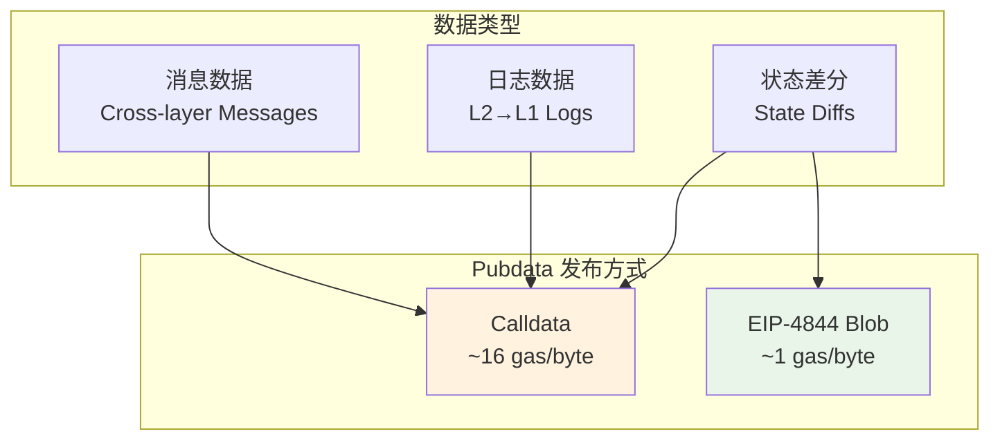

#### 💡 费用优化策略

| 策略 | 描述 | 节省幅度 |
|------|------|----------|
| **状态压缩** | 使用差分压缩减少 pubdata | 30-50% |
| **批量操作** | 聚合多个操作减少开销 | 20-40% |
| **EIP-4844 Blob** | 使用 blob 降低数据成本 | 90%+ |
| **存储优化** | 减少不必要的状态写入 | 10-30% |

### 3.4 动态定价机制

#### 📈 价格调整算法

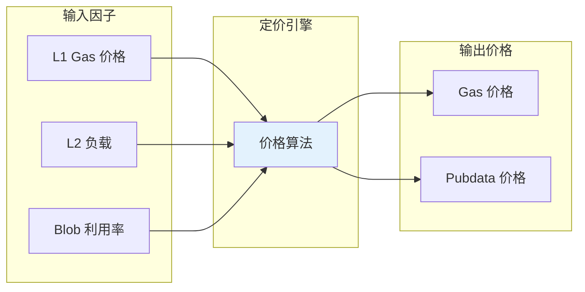

#### 🎯 Paymaster 代付机制

**支持的代付模式**：

1. **通用代付**：协议或 dApp 为用户支付所有费用
2. **代币代付**：用户用 ERC20 代币支付，Paymaster 转换为 ETH
3. **条件代付**：满足特定条件时提供代付服务
4. **批量代付**：为批量操作提供优化的代付方案

```solidity
// Paymaster 接口示例
interface IPaymaster {
    function validateAndPayForPaymasterTransaction(
        bytes32 _txHash,
        bytes32 _suggestedSignedHash,
        Transaction calldata _transaction
    ) external payable returns (bytes4 magic, bytes memory context);
    
    function postTransaction(
        bytes calldata _context,
        Transaction calldata _transaction,
        bytes32 _txHash,
        bytes32 _suggestedSignedHash,
        ExecutionResult _txResult,
        uint256 _maxRefundedGas
    ) external payable;
}
```

---

## 🔒 4. zkSync 链的最终性

### 4.1 最终性层级

zkSync Era 提供多层次的安全保证，满足不同应用场景的需求：

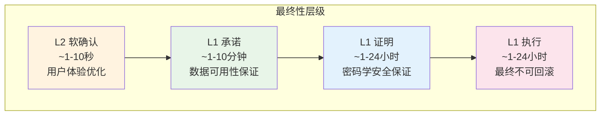

### 4.2 安全保证分析

#### 🛡️ 各层级安全特性

| 层级 | 安全假设 | 攻击成本 | 回滚风险 | 适用场景 |
|------|----------|----------|----------|----------|
| **L2 软确认** | Sequencer 诚实 | 低 | 中等 | 快速交互、游戏 |
| **L1 承诺** | L1 安全 + 数据可用 | 中等 | 低 | 一般 DeFi 操作 |
| **L1 证明** | 密码学假设 | 高 | 极低 | 大额转账 |
| **L1 执行** | L1 共识 | 极高 | 无 | 跨链桥接、提款 |

#### 🔍 风险评估

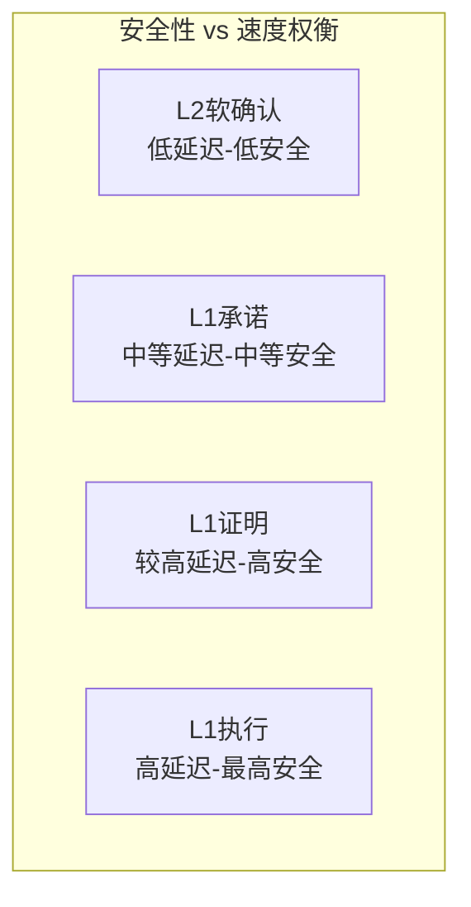

### 4.3 抗审查机制

#### 🚫 审查攻击防护

**L1 优先队列机制**：

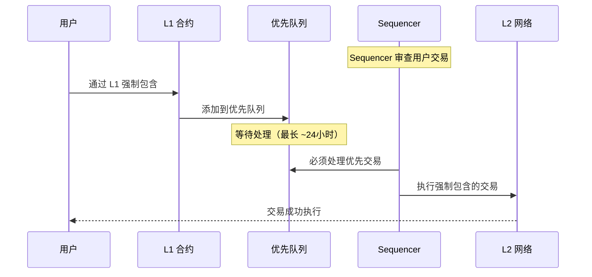

**关键特性**：

- ✅ **强制包含**：用户可通过 L1 强制 Sequencer 包含交易
- ✅ **时间保证**：优先队列交易必须在规定时间内处理
- ✅ **费用保护**：L1 费用确保经济激励对齐
- ⚠️ **处理延迟**：相比正常 L2 交易有额外延迟

### 4.4 数据可用性保证

#### 📊 状态重建机制

任何人都可以通过 L1 上的 pubdata 重建完整的 L2 状态：

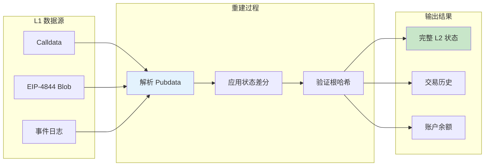

#### 🔧 实现细节

**Pubdata 格式**：

```text
Batch Pubdata = {
    stateUpdates: StateUpdate[],     // 状态变更
    l2ToL1Messages: Message[],       // L2→L1 消息
    deployedContracts: Contract[],   // 新部署合约
    usedL1ToL2Messages: Hash[]       // 已处理 L1→L2 消息
}
```

**验证流程**：

1. 解析 pubdata 获取状态变更
2. 按顺序应用所有变更
3. 计算新的状态根
4. 与链上承诺的状态根对比验证

---

## 📚 总结与最佳实践

### 🎯 关键要点

1. **双层架构**：Miniblock 提供快速确认，Batch 提供安全保证
2. **多重费用**：执行费用（gas）+ 数据费用（pubdata）的组合模型
3. **渐进安全**：从 L2 软确认到 L1 最终确认的多层次保证
4. **抗审查性**：L1 优先队列确保交易最终可被强制包含

### 💡 开发建议

| 应用类型 | 推荐确认级别 | 等待时间 | 安全级别 |
|----------|--------------|----------|----------|
| **游戏/社交** | L2 软确认 | 1-10秒 | 基础 |
| **DeFi 交易** | L1 承诺 | 1-10分钟 | 中等 |
| **大额转账** | L1 证明 | 1-24小时 | 高 |
| **跨链桥接** | L1 执行 | 1-24小时 | 最高 |

### 🔧 性能优化

- **批量操作**：聚合多个交易减少单笔开销
- **状态优化**：减少不必要的存储写入
- **Paymaster**：为用户提供更好的费用体验
- **EIP-4844**：利用 blob 降低数据发布成本

---

## 📚 技术实现细节

### 🔍 关键配置参数

基于 zkSync Era 实际实现的重要配置：

| 参数 | 数值 | 说明 |
|------|------|------|
| `MAX_L2_TX_GAS_LIMIT` | 80,000,000 | 单笔交易最大 Gas 限制 |
| `MAX_PUBDATA_PER_L1_BATCH` | 120,000 bytes | 每个 L1 批次最大 Pubdata |
| `transaction_slots` | 750 | 每个批次最大交易数量 |
| `miniblock_commit_deadline_ms` | 2,000 ms | Miniblock 创建间隔 |

### 🏗️ 核心数据结构

```solidity
// CommitBatchInfo 完整结构
struct CommitBatchInfo {
    uint64 batchNumber;
    uint64 timestamp;
    uint64 indexRepeatedStorageChanges;
    bytes32 newStateRoot;
    uint256 numberOfLayer1Txs;
    bytes32 priorityOperationsHash;
    bytes32 bootloaderHeapInitialContentsHash;
    bytes32 eventsQueueStateHash;
    bytes systemLogs;
    bytes totalL2ToL1Pubdata;
}
```

### 📖 参考资料

- [zkSync Era 官方文档](https://docs.zksync.io/)
- [zkSync Era GitHub](https://github.com/matter-labs/zksync-era)
- [ValidatorTimelock 合约](https://github.com/matter-labs/era-contracts)
- [EIP-4844 Blob 交易](https://eips.ethereum.org/EIPS/eip-4844)

---

> 💡 **下一步阅读**：[05_证明系统](./05_证明系统.md) - 深入了解 zkSync Era 的零知识证明生成与验证机制
