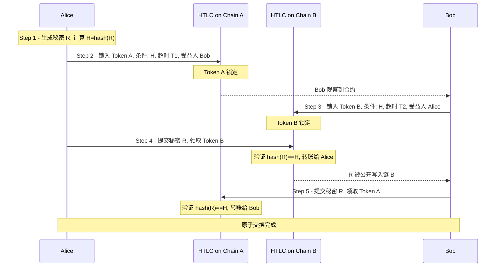

# HTLC 跨链解决方案详解

> HTLC（Hash Time Lock Contract，哈希时间锁定合约）是目前最成熟的无需信任第三方的跨链原子交换方案。它通过两个密码学机制保证交换的原子性——要么双方都成功，要么都失败。

---

## 交易流程图



> **超时退款（任意一方违约）**
> - T2 超时：Bob 在链 B 取回 Token B
> - T1 超时：Alice 在链 A 取回 Token A
> - 关键：**T2 < T1**，确保 Bob 有足够时间在看到 R 后去链 A 取款；双方资金始终安全。

---

## 一、核心机制

### 1. 哈希锁（Hash Lock）

用密码学哈希函数锁住资金，只有持有原像（preimage）的一方才能解锁。

- 发起方生成随机秘密数 `R`（preimage）
- 计算哈希值 `H = SHA256(R)`，将 H 写入合约
- 任何人都可以验证 `hash(R) == H`，但无法从 H 反推出 R

### 2. 时间锁（Time Lock）

交易设有超时期限，超时未完成则原路退款，避免资金永久锁死。

- 发起方设置较长的超时时间 T1（例如 48 小时）
- 响应方设置较短的超时时间 T2（例如 24 小时）
- **关键约束：T2 < T1**

---

## 二、参与者与前提

假设 Alice 持有链 A 上的代币（Token A），想与 Bob 换取链 B 上的代币（Token B），双方互不信任，也没有中间人。

| 角色  | 持有资产  | 目标资产  |
|-------|-----------|-----------|
| Alice | Token A（链 A） | Token B（链 B） |
| Bob   | Token B（链 B） | Token A（链 A） |

---

## 三、完整交易流程

### 第一步：生成秘密

Alice 在本地随机生成一个秘密数 `R`（preimage），并计算其哈希值：

```
H = SHA256(R)
```

- R 只有 Alice 知道
- H 是公开的，可以写入合约供任何人验证
- 从 H 无法反推出 R（单向性）

---

### 第二步：Alice 在链 A 创建 HTLC

Alice 在链 A 部署智能合约，将 Token A 锁入其中，合约条件如下：

| 参数     | 内容                          |
|----------|-------------------------------|
| 锁定资产 | Token A                       |
| 哈希值   | H                             |
| 超时时间 | T1（较长，例如 48 小时）      |
| 受益人   | Bob                           |
| 退款人   | Alice（超时后自动取回）       |

Bob 只要在 T1 之前提交满足 `hash(R) == H` 的 R，就能取走 Token A；否则超时后 Alice 自动取回。

---

### 第三步：Bob 在链 B 创建 HTLC

Bob 观察到链 A 上的合约，验证 Alice 确实锁入了约定数量的 Token A 后，在链 B 上创建镜像合约：

| 参数     | 内容                          |
|----------|-------------------------------|
| 锁定资产 | Token B                       |
| 哈希值   | **H（与链 A 相同）**          |
| 超时时间 | T2（较短，例如 24 小时）      |
| 受益人   | Alice                         |
| 退款人   | Bob（超时后自动取回）         |

> **关键设计**：Bob 使用与 Alice 相同的哈希 H，确保同一个 R 可以同时解锁两条链上的合约。

---

### 第四步：Alice 在链 B 领取 Token B

Alice 向链 B 的合约提交秘密 `R`：

1. 合约验证 `hash(R) == H` ✓
2. Token B 转给 Alice
3. **R 被永久写入链 B 的账本，全网公开可见**

---

### 第五步：Bob 在链 A 领取 Token A

Bob 监听链 B，发现 Alice 提交了 R，立即在链 A 的合约中提交同一个 R：

1. 合约验证 `hash(R) == H` ✓
2. Token A 转给 Bob
3. **原子交换完成**

```
Alice 得到 Token B ✓
Bob   得到 Token A ✓
```

---

## 四、超时退款路径（任意一方违约）

若交换中途中断，超时机制保证双方资金安全：

```
T2 超时：Bob 在链 B 取回 Token B
T1 超时：Alice 在链 A 取回 Token A
```

双方资金均可原路退回，无需信任对方。

---

## 五、为什么 T2 < T1？

这是 HTLC 安全性的核心设计，时间窗口必须满足：

```
T2（Bob 在链 B 的锁定时间）< T1（Alice 在链 A 的锁定时间）
```

**原因分析：**

假设 Alice 在 T2 即将到期时才在链 B 上提交 R，Bob 可能没有足够时间在 T1 之前去链 A 取走 Token A。T2 < T1 保证了：

- 只要 Alice 想要 Token B，就必须及早揭示 R
- Bob 就有充裕时间用 R 去领取 Token A

**若 Alice 一直不揭示 R：**

- T2 超时 → Bob 取回 Token B（链 B 资金安全）
- T1 超时 → Alice 取回 Token A（链 A 资金安全）

---

## 六、优势与局限

### 优势

- **无需信任第三方**：安全性由密码学和链上逻辑保证
- **原子性保证**：要么双方都成功，要么都退款，不存在单方面损失
- **抗恶意违约**：即使对方恶意不配合，资金也会原路退回，无跑路风险
- **去中心化**：不依赖任何中心化中介或托管机构

### 局限

- **链的兼容性要求**：双方链都必须支持智能合约或脚本能力（比特币脚本天然支持 HTLC）
- **双方需在线**：参与者需要持续监听各自的链，及时响应操作窗口
- **流动性要求高**：Bob 需要提前在链 B 上持有足额 Token B
- **汇率波动风险**：时间窗口内代币价格可能发生变化
- **手续费成本**：双链上均需支付交易手续费
- **工程复杂度**：实际部署中通常还需要中继节点（Relayer）辅助监控和传递信息，以降低用户的运营门槛

---

## 七、典型应用场景

- **跨链原子交换**：不同区块链之间直接兑换代币（如 BTC ↔ ETH）
- **闪电网络（Lightning Network）**：比特币二层网络的核心支付通道机制
- **跨链桥**：结合中继节点构建更友好的跨链资产转移协议
- **去中心化交易所（DEX）**：无需托管的点对点跨链交易

---