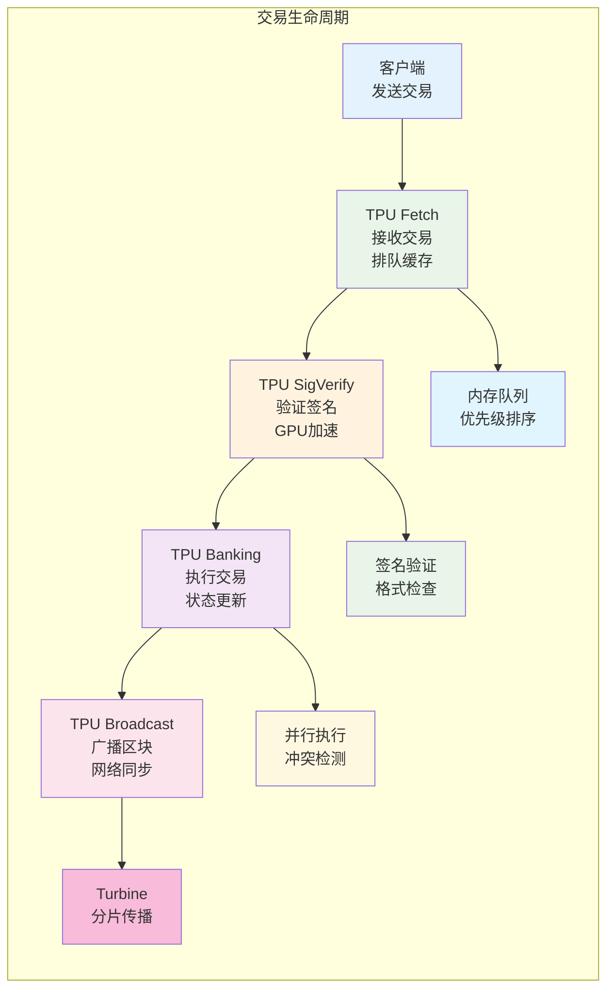
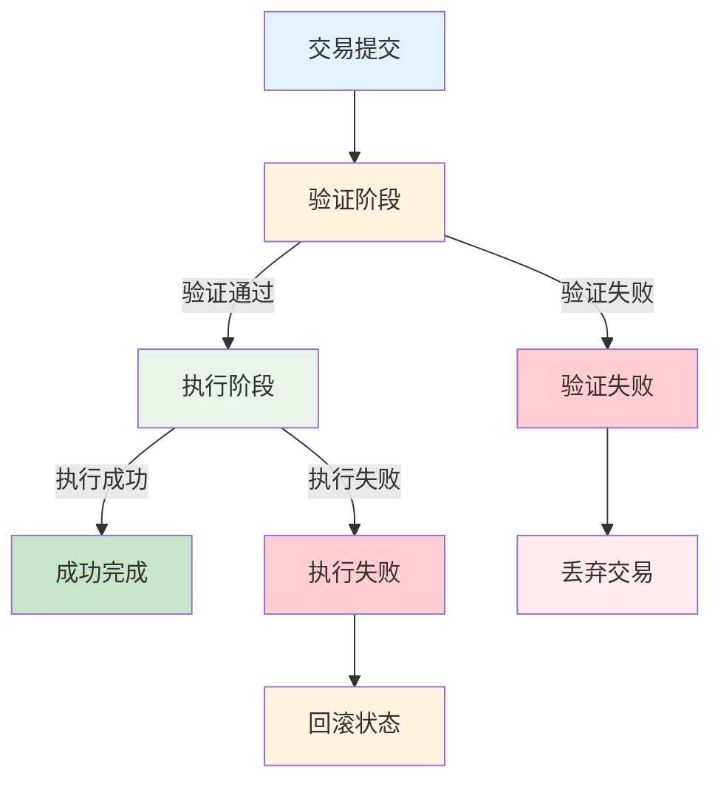
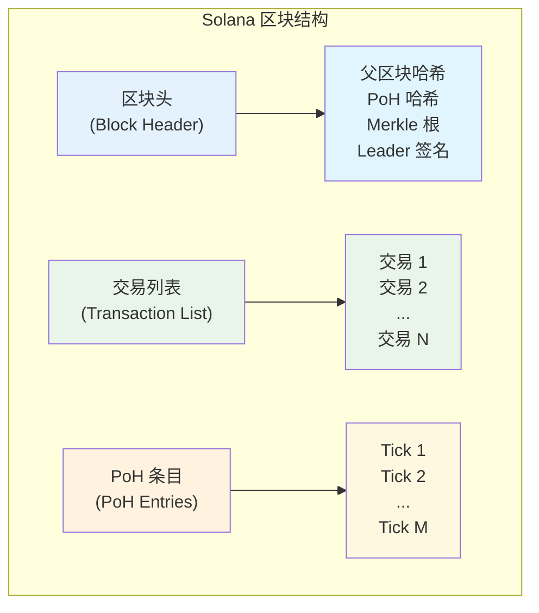

# Solana Block 构建与 TPU 机制详解

## 概述

Solana 的 Block 构建机制是其高性能架构的核心组成部分，主要通过 **TPU（Transaction Processing Unit，交易处理单元）** 实现。TPU 采用流水线架构，将交易处理分解为多个并行阶段，配合 **Gulf Stream** 和 **Turbine** 机制，实现了极高的交易吞吐量和快速的区块传播。

### 核心组件

1. **TPU（交易处理单元）**：负责交易处理和区块生成
2. **Gulf Stream**：交易前向缓存和预处理机制
3. **Turbine**：高效的区块传播协议
4. **Leader 调度**：确定性的区块生产者轮换

---

## 一、TPU（Transaction Processing Unit）架构

### 1.1 基本概念

**TPU 是什么？**

- TPU 是 Solana 的交易处理引擎
- 采用流水线架构，将交易处理分解为多个阶段
- 每个阶段可以并行处理，大幅提高吞吐量
- 类似于 CPU 的指令流水线，但专门针对区块链交易优化

**为什么需要 TPU？**
传统区块链的处理瓶颈：

- 串行处理交易，无法充分利用多核 CPU
- 交易验证和执行混合在一起，效率低下
- 网络通信和计算处理相互阻塞

### 1.2 TPU 流水线架构

**四阶段流水线设计：**

```text
TPU 流水线架构图：

┌─────────────┐    ┌─────────────┐    ┌─────────────┐    ┌─────────────┐
│   Fetch     │───▶│   SigVerify │───▶│   Banking   │───▶│  Broadcast  │
│  (获取阶段)  │    │  (签名验证)  │    │  (执行阶段)  │    │  (广播阶段)  │
└─────────────┘    └─────────────┘    └─────────────┘    └─────────────┘
       │                   │                   │                   │
       ▼                   ▼                   ▼                   ▼
┌─────────────┐    ┌─────────────┐    ┌─────────────┐    ┌─────────────┐
│接收网络交易   │    │验证交易签名  │     │执行交易逻辑   │    │广播区块数据  │
│缓存到内存     │    │检查格式     │     │更新账户状态   │    │同步到网络   │
│初步排序      │     │过滤无效交易  │     │生成执行结果  │    │确认传播     │
└─────────────┘    └─────────────┘    └─────────────┘    └─────────────┘
```

### 1.3 各阶段详细功能

**🔄 Fetch 阶段（获取阶段）**

- **功能**：接收来自网络的交易
- **处理**：将交易缓存到内存队列
- **优化**：使用高效的网络 I/O 和内存管理
- **并发**：支持多个网络连接同时接收

**✅ SigVerify 阶段（签名验证）**

- **功能**：验证交易的数字签名
- **处理**：使用 GPU 加速批量验证签名
- **过滤**：丢弃无效或格式错误的交易
- **并发**：利用 GPU 的并行计算能力

**💰 Banking 阶段（执行阶段）**

- **功能**：执行交易并更新账户状态
- **处理**：按照 PoH 时间戳顺序执行
- **优化**：并行执行非冲突交易
- **结果**：生成状态变更和执行证明

**📡 Broadcast 阶段（广播阶段）**

- **功能**：将区块广播到网络
- **处理**：使用 Turbine 协议高效传播
- **确认**：收集验证者的确认信息
- **同步**：确保网络状态一致性

### 1.4 流水线优势

**⚡ 并行处理**

- 四个阶段同时运行，提高整体吞吐量
- 每个阶段专注于特定任务，优化效率
- 减少了阶段间的等待时间

**🔧 硬件优化**

- Fetch 阶段优化网络 I/O
- SigVerify 阶段利用 GPU 加速
- Banking 阶段充分利用 CPU 多核
- Broadcast 阶段优化网络带宽使用

**📈 可扩展性**

- 每个阶段可以独立扩展资源
- 支持根据负载动态调整
- 硬件升级可以直接提升性能

---

## 二、交易处理流程详解

### 2.1 交易生命周期

**完整的交易处理流程：**



### 2.2 性能优化策略

**🚀 批处理优化**

- 将多个交易打包处理，减少单次处理开销
- 签名验证阶段批量验证，提高 GPU 利用率
- 状态更新批量提交，减少磁盘 I/O

**🔄 流水线平衡**

- 监控各阶段的处理速度
- 动态调整资源分配
- 避免某个阶段成为瓶颈

**💾 内存管理**

- 使用高效的内存池管理
- 减少内存分配和释放开销
- 优化数据结构的内存布局

### 2.3 错误处理机制

**交易失败处理：**



**错误类型及处理：**

- **签名错误**：在 SigVerify 阶段直接丢弃
- **格式错误**：在 Fetch 阶段过滤
- **执行错误**：在 Banking 阶段回滚状态
- **网络错误**：在 Broadcast 阶段重试传播

---

## 三、Leader 调度与区块生产

### 3.1 Leader 轮换机制

**Leader 选择过程：**

```mermaid
gantt
    title Leader 调度时间线
    dateFormat X
    axisFormat %s
    
    section Slot 1
    Leader A    :0, 400
    
    section Slot 2  
    Leader B    :400, 800
    
    section Slot 3
    Leader C    :800, 1200
    
    section Slot 4
    Leader A    :1200, 1600
    
    section Slot 5
    Leader D    :1600, 2000
```



**说明：**

- 每个 Slot = 400ms
- Leader 基于权重随机选择
- 可以提前预知未来的 Leader 序列

**选择算法特点：**

- **确定性**：基于 PoH 时间戳和质押权重
- **公平性**：权重越高，被选中概率越大
- **可预测性**：可以提前计算未来多个 Slot 的 Leader
- **防作弊**：无法操纵选择结果

### 3.2 区块生产流程

**Leader 的职责：**

1. **收集交易**
   - 从 mempool 收集待处理交易
   - 根据手续费和优先级排序
   - 过滤无效或重复交易

2. **执行交易**
   - 按照 PoH 时间戳顺序执行
   - 利用并行执行能力处理非冲突交易
   - 生成状态变更证明

3. **构建区块**
   - 将执行结果打包成区块
   - 嵌入 PoH 时间证明
   - 添加 Leader 签名

4. **广播区块**
   - 使用 Turbine 协议传播区块
   - 收集验证者投票
   - 确认区块被网络接受

### 3.3 区块结构

**Solana 区块的组成：**

```text
┌─────────────────────────────────────┐
│              区块头                  │
├─────────────────────────────────────┤
│ • 父区块哈希                          │
│ • PoH 哈希和时间戳                    │
│ • Merkle 根                         │
│ • Leader 公钥和签名                   │
└─────────────────────────────────────┘
┌─────────────────────────────────────┐
│            交易列表                  │
├─────────────────────────────────────┤
│ • 交易 1 (签名 + 指令)                │
│ • 交易 2 (签名 + 指令)                │
│ • ...                               │
│ • 交易 N (签名 + 指令)                │
└─────────────────────────────────────┘
┌─────────────────────────────────────┐
│            PoH 条目                  │
├─────────────────────────────────────┤
│ • Tick 1 (哈希值)                    │
│ • Tick 2 (哈希值)                    │
│ • ...                               │
│ • Tick M (哈希值)                    │
└─────────────────────────────────────┘
```



### 3.4 Solana 区块详细内容解析

#### 3.4.1 区块整体内容描述

**Solana 区块是一个复合数据结构，包含以下核心组成部分：**

**🏷️ 区块头（Block Header）**
区块头是区块的元数据部分，包含了区块的基本信息和验证数据。它是区块的"身份证"，用于标识和验证区块的合法性。

**📋 交易列表（Transaction List）**
交易列表包含了该区块中所有被执行的交易。每个交易都经过了完整的验证和执行过程，代表了区块链状态的实际变更。

**⏰ PoH 条目（Proof of History Entries）**
PoH 条目是 Solana 独有的时间证明机制，通过连续的哈希计算提供可验证的时间顺序，确保交易的时间顺序不可篡改。

**🔗 区块链接信息**
每个区块都通过哈希指针与前一个区块连接，形成不可篡改的链式结构。

**✅ 验证和签名数据**
包含 Leader 的数字签名和其他验证者的投票信息，确保区块的合法性和网络共识。

#### 3.4.2 区块头详细组成

**区块头包含以下关键字段：**

**1. 基础标识信息**

- **区块高度（Block Height）**：当前区块在区块链中的序号
- **区块哈希（Block Hash）**：当前区块的唯一标识符
- **父区块哈希（Parent Hash）**：前一个区块的哈希值，用于链接
- **时间戳（Timestamp）**：区块创建的时间

**2. PoH 相关信息**

- **PoH 哈希（PoH Hash）**：当前 PoH 序列的最新哈希值
- **PoH 计数（PoH Count）**：PoH 序列中的计数值
- **前一个 PoH 哈希（Previous PoH Hash）**：与前一个区块的 PoH 连接

**3. 交易相关信息**

- **交易根哈希（Transaction Root）**：所有交易的 Merkle 树根
- **交易数量（Transaction Count）**：区块中包含的交易总数
- **状态根哈希（State Root）**：执行所有交易后的账户状态根

**4. Leader 和验证信息**

- **Leader 公钥（Leader Pubkey）**：产生此区块的 Leader 节点公钥
- **Leader 签名（Leader Signature）**：Leader 对区块的数字签名
- **Slot 编号（Slot Number）**：当前区块对应的时间槽编号

**5. 网络和共识信息**

- **投票账户（Vote Accounts）**：参与投票的验证者账户信息
- **奖励信息（Rewards）**：区块奖励和手续费分配
- **程序执行结果（Program Results）**：智能合约执行的汇总结果

#### 3.4.3 交易列表详细结构

**每个交易包含以下组成部分：**

**1. 交易元数据**

- **交易签名（Signatures）**：一个或多个数字签名
- **消息（Message）**：交易的具体内容和指令
- **最近区块哈希（Recent Blockhash）**：防重放攻击的时间戳

**2. 账户信息**

- **签名者账户（Signer Accounts）**：需要签名的账户列表
- **只读账户（Read-only Accounts）**：只读访问的账户列表
- **可写账户（Writable Accounts）**：可修改的账户列表

**3. 指令列表**

- **程序 ID（Program ID）**：要执行的程序标识
- **账户索引（Account Indices）**：指令涉及的账户索引
- **指令数据（Instruction Data）**：传递给程序的参数

**4. 执行结果**

- **执行状态（Execution Status）**：成功或失败状态
- **日志信息（Logs）**：程序执行的日志输出
- **计算单元消耗（Compute Units Used）**：实际消耗的计算资源

#### 3.4.4 PoH 条目详细结构

**PoH 条目是 Solana 时间证明的核心，包含：**

**1. 哈希序列**

- **当前哈希（Current Hash）**：当前 PoH 步骤的哈希值
- **前一个哈希（Previous Hash）**：前一步的哈希值
- **哈希计数（Hash Count）**：从创世块开始的哈希计算次数

**2. 时间标记**

- **Tick 标记（Tick Markers）**：固定时间间隔的标记点
- **混合数据（Mixed Data）**：与交易数据混合的哈希
- **时间间隔（Time Intervals）**：每个 Tick 之间的时间间隔

**3. 验证信息**

- **可验证延迟函数（VDF）**：证明时间消耗的数学证明
- **并行证明（Parallel Proofs）**：支持并行验证的证明数据

### 3.5 区块组成部分的生成时机和方式

#### 3.5.1 区块头生成时机和方式

**🕐 生成时机：**
区块头在 Leader 开始构建区块时生成，具体时机如下：

1. **Slot 开始时刻**：当 Leader 的 Slot 时间窗口开始时
2. **交易收集完成后**：收集到足够的交易或达到时间限制后
3. **PoH 序列更新时**：PoH 生成器产生新的哈希值时
4. **状态计算完成后**：所有交易执行完毕，状态根计算完成后

**🔧 生成方式：**

**基础信息生成：**

- **区块高度**：从前一个区块高度 +1
- **父区块哈希**：直接引用前一个确认区块的哈希
- **时间戳**：使用系统时间和 PoH 时间的组合
- **Slot 编号**：根据 PoH 时钟和网络参数计算

**PoH 信息生成：**

- **PoH 哈希**：从 PoH 生成器获取当前最新哈希
- **PoH 计数**：累计从创世块开始的哈希计算次数
- **前一个 PoH 哈希**：从区块链状态中获取

**交易信息生成：**

- **交易根哈希**：对所有交易构建 Merkle 树并计算根哈希
- **状态根哈希**：执行所有交易后计算账户状态的 Merkle 根
- **交易数量**：统计当前区块包含的交易总数

**签名和验证信息生成：**

- **Leader 签名**：使用 Leader 私钥对区块头进行数字签名
- **投票信息**：收集验证者对前一个区块的投票
- **奖励计算**：根据网络参数和交易手续费计算奖励分配

#### 3.5.2 交易列表生成时机和方式

**🕐 生成时机：**

**1. 交易收集阶段（Slot 开始后 0-200ms）**

- Leader 从 mempool 收集待处理交易
- 从 Gulf Stream 缓存中获取预处理交易
- 接收网络中新提交的交易

**2. 交易排序阶段（Slot 开始后 50-250ms）**

- 根据手续费高低进行优先级排序
- 按照 PoH 时间戳确定执行顺序
- 检测和解决交易冲突

**3. 交易执行阶段（Slot 开始后 100-350ms）**

- 在 TPU Banking 阶段并行执行交易
- 生成交易执行结果和状态变更
- 记录执行日志和计算单元消耗

**🔧 生成方式：**

**交易选择策略：**

```text
交易选择优先级：
1. 手续费高的交易优先
2. 时间戳早的交易优先  
3. 无冲突的交易可并行处理
4. 系统交易（如投票）具有最高优先级
```

**交易验证过程：**

1. **签名验证**：使用 GPU 批量验证数字签名
2. **格式检查**：验证交易格式和字段完整性
3. **余额检查**：确认账户有足够余额支付手续费
4. **权限检查**：验证账户对资源的访问权限

**交易执行过程：**

1. **预执行检查**：检查账户状态和程序可用性
2. **并行执行**：利用账户依赖关系并行处理
3. **状态更新**：原子性地更新所有相关账户状态
4. **结果记录**：记录执行状态、日志和资源消耗

#### 3.5.3 PoH 条目生成时机和方式

**🕐 生成时机：**

**1. 连续生成**

- PoH 生成器持续运行，每秒产生约 12,800 个哈希
- 每个哈希计算大约需要 78 微秒
- 不依赖于交易或区块的存在

**2. Tick 标记生成（每 6.25ms）**

- 每 800 个哈希生成一个 Tick 标记
- Tick 用于标记固定的时间间隔
- 为网络提供统一的时间参考

**3. 交易混合时机**

- 当有交易需要处理时，将交易数据混合到 PoH 序列中
- 混合发生在交易执行的同时
- 确保交易的时间顺序不可篡改

**🔧 生成方式：**

**基础哈希生成：**

```text
PoH 哈希计算公式：
hash_n = SHA256(hash_{n-1})

其中：
- hash_0 是创世哈希
- 每个后续哈希都基于前一个哈希计算
- 计算过程无法并行化或跳跃
```

**交易数据混合：**

```text
混合哈希计算：
mixed_hash = SHA256(hash_n || transaction_data)

其中：
- hash_n 是当前 PoH 哈希
- transaction_data 是交易的序列化数据
- || 表示数据连接操作
```

**Tick 标记生成：**

- 每 800 个哈希后生成一个特殊的 Tick 标记
- Tick 不包含交易数据，只有纯哈希
- 用于网络时间同步和验证

**验证数据生成：**

- **VDF 证明**：生成可验证的延迟函数证明
- **并行证明**：支持验证者并行验证 PoH 序列
- **时间戳映射**：将 PoH 计数映射到实际时间

#### 3.5.4 区块链接信息生成

**🕐 生成时机：**

- 在区块头生成的最后阶段
- 确保所有区块内容都已确定后
- Leader 签名之前

**🔧 生成方式：**

- **哈希计算**：对整个区块内容计算 SHA-256 哈希
- **链接验证**：确认与前一个区块的正确链接
- **完整性检查**：验证所有组成部分的一致性

### 3.6 完整的区块创建过程详细描述

#### 3.6.1 区块创建的前置条件

**网络状态准备：**
在开始创建区块之前，网络必须满足以下条件：

1. **Leader 确定**：通过 PoS 权重和 PoH 时间戳确定当前 Slot 的 Leader
2. **PoH 运行**：PoH 生成器必须持续运行，提供时间证明
3. **网络同步**：Leader 节点与网络保持同步，了解最新的区块链状态
4. **资源准备**：TPU 各阶段准备就绪，具备足够的计算和网络资源

**交易池状态：**

- **Mempool 准备**：本地交易池包含待处理的交易
- **Gulf Stream 缓存**：前向缓存中有预处理的交易
- **网络交易流**：持续接收来自网络的新交易

#### 3.6.2 区块创建的完整时间线

**Slot 时间窗口：400ms 的详细分解**

**阶段 1：初始化和准备（0-50ms）**

**时间点 0ms - Slot 开始**

- Leader 接收到 Slot 开始信号
- 激活区块创建流程
- 初始化 TPU 各个阶段的处理队列
- 从 PoH 生成器获取当前时间戳和哈希值

**时间点 0-20ms - 状态同步**

- 确认前一个区块的最终状态
- 同步账户状态数据库
- 验证网络连接和节点状态
- 准备区块头的基础信息（区块高度、父区块哈希等）

**时间点 20-50ms - 交易收集启动**

- 启动 TPU Fetch 阶段，开始收集交易
- 从本地 mempool 获取高优先级交易
- 从 Gulf Stream 缓存获取预处理交易
- 接收网络中新提交的交易

**阶段 2：交易处理和验证（50-300ms）**

**时间点 50-100ms - 交易筛选和排序**

- 根据手续费进行交易优先级排序
- 检测交易之间的依赖关系和冲突
- 过滤无效、重复或过期的交易
- 估算交易执行所需的计算单元

**时间点 100-150ms - 签名验证（TPU SigVerify）**

- 使用 GPU 并行验证交易签名
- 批量处理签名验证以提高效率
- 丢弃签名无效的交易
- 验证交易格式和基本有效性

**时间点 150-280ms - 交易执行（TPU Banking）**

- 按照 PoH 时间戳顺序开始执行交易
- 利用账户依赖分析进行并行执行
- 实时更新账户状态
- 记录交易执行结果和日志
- 计算状态变更的 Merkle 根

**时间点 250-300ms - 执行结果整理**

- 收集所有交易的执行结果
- 计算最终的状态根哈希
- 统计成功和失败的交易数量
- 准备交易执行的汇总信息

**阶段 3：区块构建和签名（300-380ms）**

**时间点 300-320ms - 区块头构建**

- 计算所有交易的 Merkle 树根
- 从 PoH 生成器获取最新的哈希和计数
- 填充区块头的所有字段
- 计算区块的初步哈希值

**时间点 320-340ms - PoH 条目整理**

- 收集当前 Slot 期间生成的所有 PoH 条目
- 整理 Tick 标记和交易混合的哈希
- 验证 PoH 序列的连续性和正确性
- 生成 PoH 相关的验证数据

**时间点 340-360ms - 区块最终化**

- 将区块头、交易列表和 PoH 条目组合
- 计算完整区块的哈希值
- 验证区块的内部一致性
- 准备 Leader 签名所需的数据

**时间点 360-380ms - Leader 签名**

- 使用 Leader 私钥对区块进行数字签名
- 将签名添加到区块头
- 最终确定区块的所有内容
- 准备区块传播

**阶段 4：区块传播和确认（380-400ms+）**

**时间点 380-400ms - 区块广播（TPU Broadcast）**

- 启动 Turbine 协议进行区块传播
- 将区块分片发送给验证者网络
- 开始收集验证者的投票
- 监控区块传播的进度

**时间点 400ms+ - 网络确认**

- 验证者接收并验证区块
- 收集足够的投票以确认区块
- 更新网络的最新确认状态
- 为下一个 Slot 做准备

#### 3.6.3 区块创建过程中的关键决策点

**交易选择策略：**

**优先级决策（50-100ms）**

- **手续费权重**：手续费高的交易获得更高优先级
- **时间权重**：提交时间早的交易优先处理
- **系统交易**：投票和质押交易具有最高优先级
- **计算限制**：确保总计算单元不超过区块限制

**冲突解决策略（100-150ms）**

- **账户锁定**：识别访问相同账户的交易
- **依赖排序**：按照账户依赖关系确定执行顺序
- **并行分组**：将无冲突的交易分组并行执行
- **超时处理**：对执行时间过长的交易进行超时处理

**资源分配决策（150-280ms）**

- **CPU 分配**：在不同交易执行线程间分配 CPU 资源
- **内存管理**：动态分配和回收交易执行所需的内存
- **I/O 优化**：优化账户状态的读写操作
- **网络带宽**：为区块传播预留足够的网络带宽

#### 3.6.4 区块创建过程中的错误处理

**交易级错误处理：**

**验证失败处理**

- **签名错误**：立即丢弃，不影响其他交易
- **格式错误**：记录错误日志，继续处理其他交易
- **余额不足**：标记为失败，但仍包含在区块中
- **权限错误**：拒绝执行，记录失败原因

**执行失败处理**

- **程序错误**：回滚状态变更，记录错误信息
- **资源耗尽**：终止执行，标记为资源不足
- **超时错误**：强制终止，释放占用的资源
- **依赖失败**：跳过依赖的后续交易

**系统级错误处理：**

**网络错误**

- **连接中断**：尝试重新连接，延迟区块传播
- **带宽不足**：降低传播速度，确保数据完整性
- **节点故障**：切换到备用连接，维持网络通信

**硬件错误**

- **CPU 过载**：降低并行度，确保系统稳定
- **内存不足**：清理缓存，释放不必要的内存
- **存储错误**：使用备份数据，确保状态一致性

**共识错误**

- **分叉检测**：暂停区块创建，等待网络收敛
- **投票不足**：延长等待时间，收集更多投票
- **时间同步**：重新同步 PoH 时钟，确保时间一致性

#### 3.6.5 区块创建的性能优化策略

**并行处理优化：**

**交易并行执行**

- **依赖分析**：静态分析交易的账户依赖关系
- **分组执行**：将无冲突的交易分组并行处理
- **流水线优化**：在不同 CPU 核心上建立执行流水线
- **负载均衡**：动态调整各执行线程的工作负载

**硬件加速优化**

- **GPU 签名验证**：利用 GPU 的并行计算能力
- **SIMD 指令**：使用向量指令加速哈希计算
- **缓存优化**：优化数据结构以提高缓存命中率
- **内存预取**：预先加载可能需要的账户数据

**网络传播优化**

- **分片传播**：使用 Turbine 协议并行传播区块分片
- **压缩算法**：压缩区块数据以减少传输时间
- **路由优化**：选择最优的网络路径进行传播
- **缓存策略**：在验证者节点缓存常用数据

#### 3.6.6 区块创建的质量保证

**数据完整性验证：**

**哈希验证**

- **Merkle 树验证**：确保交易列表的完整性
- **状态根验证**：验证账户状态变更的正确性
- **PoH 序列验证**：确保时间证明的连续性
- **区块哈希验证**：验证整个区块的数据完整性

**逻辑一致性检查**

- **时间顺序检查**：确保交易按正确的时间顺序执行
- **状态一致性**：验证所有状态变更的逻辑正确性
- **余额守恒**：确保所有转账操作的余额守恒
- **权限验证**：验证所有操作的权限合法性

**网络共识验证**

- **投票收集**：收集足够数量的验证者投票
- **权重验证**：确保投票权重达到共识要求
- **分叉检测**：检测并处理可能的网络分叉
- **最终确认**：等待网络的最终确认信号

通过这个详细的区块创建过程，Solana 能够在 400ms 的时间窗口内完成从交易收集到区块确认的全部流程，实现了高吞吐量和低延迟的区块链性能。

---

## 四、Gulf Stream 前向缓存机制

### 4.1 基本概念

**Gulf Stream 是什么？**

- 一种交易前向缓存和预处理机制
- 在交易被正式处理前进行预验证
- 减少交易确认延迟，提高用户体验
- 类似于 CPU 的分支预测技术

**解决的问题：**

- 传统区块链需要等待区块确认才能处理下一批交易
- 网络延迟导致的交易处理延迟
- 交易池管理的复杂性

### 4.2 工作原理

**Gulf Stream 处理流程：**

```
Gulf Stream 工作流程：

客户端交易                预处理阶段              正式处理阶段
┌─────────┐              ┌─────────┐              ┌─────────┐
│提交交易  │─────────────▶│缓存交易  │─────────────▶│执行交易  │
│指定Leader│              │预验证   │              │状态更新  │
└─────────┘              │排序     │              │生成区块  │
                         └─────────┘              └─────────┘
                              │                        │
                              ▼                        ▼
                         ┌─────────┐              ┌─────────┐
                         │前向缓存  │              │最终确认  │
                         │冲突检测  │              │网络同步  │
                         │优先级   │              │状态提交  │
                         └─────────┘              └─────────┘
```

### 4.3 优势特性

**🚀 延迟优化**

- 交易在被正式处理前就开始预处理
- 减少了等待时间，提高响应速度
- 用户可以更快地看到交易状态

**🔍 智能预测**

- 基于历史数据预测交易成功概率
- 优先处理高成功率的交易
- 减少无效交易的处理开销

**⚖️ 负载均衡**

- 将交易分发到不同的 Leader
- 避免单个 Leader 过载
- 提高整体网络吞吐量

### 4.4 冲突处理

**交易冲突检测：**

```
冲突检测机制：

交易 A: 账户 X → 账户 Y (转账 100)
交易 B: 账户 X → 账户 Z (转账 50)

冲突分析：
┌─────────────────────────────────┐
│ 两个交易都要修改账户 X 的余额    │
│ 存在读写冲突                    │
│ 需要串行执行                    │
└─────────────────────────────────┘

处理策略：
1. 按时间戳顺序执行
2. 第一个交易成功后再执行第二个
3. 如果余额不足，第二个交易失败
```

---

## 五、Turbine 区块传播协议

### 5.1 基本概念

**Turbine 是什么？**

- Solana 的高效区块传播协议
- 将区块数据分片并并行传播
- 类似于 BitTorrent 的 P2P 传播机制
- 大幅减少区块传播延迟

**传统传播的问题：**

- Leader 需要向所有验证者发送完整区块
- 网络带宽成为瓶颈
- 传播延迟随验证者数量增加

### 5.2 分片传播机制

**Turbine 传播流程：**

```
Turbine 分片传播示意图：

Leader 节点                     验证者网络
┌─────────┐                   ┌─────────────────────────┐
│完整区块  │                   │         分片传播         │
│分解为    │                   │                        │
│多个分片  │                   │  V1 ←→ V2 ←→ V3 ←→ V4   │
└─────────┘                   │   ↕     ↕     ↕     ↕   │
     │                        │  V5 ←→ V6 ←→ V7 ←→ V8   │
     ▼                        │   ↕     ↕     ↕     ↕   │
┌─────────┐                   │  V9 ←→ V10←→ V11←→ V12  │
│分片1→V1  │                   └─────────────────────────┘
│分片2→V2  │                            │
│分片3→V3  │                            ▼
│...      │                   ┌─────────────────────────┐
│分片N→VN  │                   │      区块重组           │
└─────────┘                   │   各节点收集所有分片     │
                              │   重新组装完整区块       │
                              └─────────────────────────┘
```

### 5.3 网络拓扑优化

**分层传播结构：**

```
Turbine 网络拓扑：

第一层 (Leader)
┌─────────┐
│ Leader  │
└─────────┘
     │
     ▼
第二层 (主要验证者)
┌───┐ ┌───┐ ┌───┐ ┌───┐
│V1 │ │V2 │ │V3 │ │V4 │
└───┘ └───┘ └───┘ └───┘
  │     │     │     │
  ▼     ▼     ▼     ▼
第三层 (次级验证者)
┌───┐ ┌───┐ ┌───┐ ┌───┐
│V5 │ │V6 │ │V7 │ │V8 │
└───┘ └───┘ └───┘ └───┘
  │     │     │     │
  ▼     ▼     ▼     ▼
第四层 (其他验证者)
┌───┐ ┌───┐ ┌───┐ ┌───┐
│V9 │ │V10│ │V11│ │V12│
└───┘ └───┘ └───┘ └───┘
```

### 5.4 错误恢复机制

**分片丢失处理：**

1. **冗余编码**：使用纠错码增加冗余信息
2. **重传机制**：检测到分片丢失时请求重传
3. **多路径**：从多个节点获取相同分片
4. **超时处理**：设置合理的超时和重试策略

---

## 六、性能指标与优化

### 6.1 关键性能指标

**吞吐量指标：**

- **理论 TPS**：65,000+ 交易/秒
- **实际 TPS**：2,000-5,000 交易/秒（当前网络条件）
- **区块时间**：400ms（目标）
- **确认时间**：1-2 秒

**延迟指标：**

- **交易接收延迟**：< 100ms
- **签名验证延迟**：< 50ms
- **执行延迟**：< 200ms
- **广播延迟**：< 500ms

### 6.2 性能瓶颈分析

**主要瓶颈：**

```
性能瓶颈分析：

网络带宽 ████████████████████████ 80%
CPU 计算  ████████████████ 60%
内存访问  ████████████ 45%
磁盘 I/O  ████████ 30%
GPU 利用  ██████ 25%

优化重点：
1. 网络协议优化 (Turbine)
2. 并行计算优化 (TPU)
3. 内存管理优化
4. 存储系统优化
```

### 6.3 优化策略

**硬件优化：**

- **网络**：使用高带宽、低延迟的网络连接
- **CPU**：多核处理器，支持高频率计算
- **GPU**：用于签名验证加速
- **内存**：大容量、高速内存
- **存储**：NVMe SSD 用于状态存储

**软件优化：**

- **算法优化**：改进排序和搜索算法
- **数据结构**：使用缓存友好的数据结构
- **并发控制**：减少锁竞争，提高并发度
- **内存管理**：减少内存分配和垃圾回收

---

## 七、故障处理与容错机制

### 7.1 常见故障类型

**网络故障：**

- 网络分区导致节点无法通信
- 网络延迟过高影响性能
- 数据包丢失导致传播失败

**节点故障：**

- Leader 节点宕机或离线
- 验证者节点硬件故障
- 软件 bug 导致的异常

**数据故障：**

- 区块数据损坏
- 状态不一致
- 交易执行错误

### 7.2 容错机制

**Leader 故障处理：**

```
Leader 故障恢复流程：

正常状态：
┌─────────┐
│Leader A │ ──── 正常出块
└─────────┘

故障检测：
┌─────────┐
│Leader A │ ──── 超时未出块
└─────────┘
     │
     ▼
┌─────────┐
│检测故障  │ ──── 网络监控
└─────────┘
     │
     ▼
┌─────────┐
│切换Leader│ ──── 下一个 Slot 的 Leader 接管
└─────────┘
     │
     ▼
┌─────────┐
│Leader B │ ──── 恢复正常出块
└─────────┘
```

**数据恢复机制：**

- **检查点**：定期创建状态检查点
- **重放**：从检查点重放交易历史
- **同步**：从其他节点同步缺失数据
- **验证**：验证恢复数据的完整性

### 7.3 监控与告警

**监控指标：**

- 交易处理延迟
- 区块传播时间
- 节点在线状态
- 网络连接质量
- 资源使用情况

**告警机制：**

- 性能指标异常告警
- 节点故障自动通知
- 网络分区检测
- 数据一致性检查

---

## 总结

Solana 的 Block 构建机制通过以下创新实现了高性能区块链：

### 核心创新

1. **TPU 流水线架构**：
   - 将交易处理分解为并行阶段
   - 充分利用现代硬件能力
   - 实现高吞吐量和低延迟

2. **Gulf Stream 前向缓存**：
   - 交易预处理和智能缓存
   - 减少确认延迟
   - 提高用户体验

3. **Turbine 传播协议**：
   - 分片并行传播区块
   - 优化网络带宽使用
   - 快速达成网络一致性

4. **确定性 Leader 调度**：
   - 可预测的区块生产者
   - 公平的权重分配
   - 防止操纵和作弊

### 技术优势

- **高吞吐量**：理论 TPS 超过 65,000
- **低延迟**：亚秒级交易确认
- **可扩展性**：随硬件性能线性扩展
- **容错性**：强大的故障恢复机制

### 应用价值

Solana 的 Block 构建机制为以下应用提供了强大支持：

- **高频交易**：支持大量并发交易
- **实时应用**：快速响应用户操作
- **大规模 DApp**：处理复杂的智能合约逻辑
- **企业应用**：满足企业级性能要求

通过 TPU、Gulf Stream 和 Turbine 的协同工作，Solana 成功构建了一个高性能、低延迟、可扩展的区块链基础设施，为下一代去中心化应用奠定了坚实基础。

---

*本文档基于 Solana 官方技术文档和开源代码分析编写，详细实现请参考 [Solana GitHub 仓库](https://github.com/solana-labs/solana)*
