# Solana 账户模型与程序架构详解

## 概述

Solana 采用了独特的账户模型，这是其高性能和并行执行能力的基础。与以太坊等基于账户余额的模型不同，Solana 的账户模型实现了状态与程序的完全分离，为并行处理和高吞吐量奠定了基础。

### 核心优势

1. **状态与程序分离**：程序（智能合约）和数据（状态）存储在不同的账户中
2. **并行执行友好**：通过明确的账户依赖关系，支持高效的并行处理
3. **灵活的权限管理**：基于公钥密码学的细粒度权限控制
4. **可升级性**：程序可以安全地升级而不影响现有状态

### 传统模型 vs Solana 模型

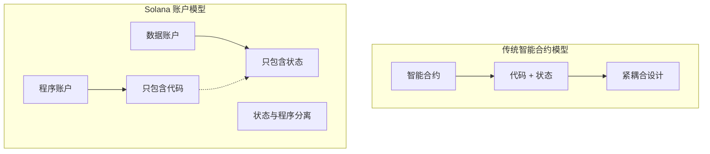

## 1. 账户结构与类型

### 1.1 基本账户结构

每个 Solana 账户都包含以下核心字段：

| 字段       | 类型    | 描述                                                |
| ---------- | ------- | --------------------------------------------------- |
| lamports   | u64     | 账户中存储的 lamports 数量（1 SOL = 10^9 lamports） |
| data       | Vec<u8> | 账户数据的字节数组                                  |
| owner      | Pubkey  | 拥有此账户的程序 ID                                 |
| executable | bool    | 账户是否可执行（是否为程序账户）                    |
| rent_epoch | Epoch   | 下次必须支付租金的 epoch                            |

### 1.2 账户类型详解

#### 1.2.1 系统账户（System Accounts）

- **用途**：存储 SOL 代币余额，是最基础的账户类型
- **所有者**：System Program
- **特点**：主要用于转账操作，数据字段通常为空
- **创建方式**：通过系统程序自动创建

#### 1.2.2 程序账户（Program Accounts）

- **用途**：存储可执行的程序代码（智能合约）
- **所有者**：BPF Loader 或 Native Loader
- **特点**：executable 字段为 true，包含编译后的字节码
- **部署过程**：通过特殊的部署交易将编译后的程序上传到链上

#### 1.2.3 数据账户（Data Accounts）

- **用途**：存储程序状态和用户数据
- **所有者**：创建它们的程序
- **特点**：由程序管理其数据结构和访问权限
- **灵活性**：可以存储任意结构的数据，支持复杂的业务逻辑

#### 1.2.4 SPL Token 账户

- **用途**：存储代币余额和元数据
- **所有者**：SPL Token Program
- **特点**：标准化的代币账户格式
- **兼容性**：与以太坊的 ERC-20 标准类似，但更加高效

### 1.3 账户生命周期

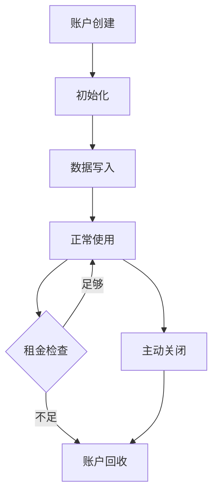

**生命周期阶段说明**：

1. **创建阶段**：分配账户地址和基本结构，设置初始 lamports
2. **初始化阶段**：设置初始数据和权限，确定账户用途
3. **使用阶段**：正常的读写操作，执行业务逻辑
4. **维护阶段**：租金支付和状态更新，保持账户活跃
5. **回收阶段**：账户被删除，空间被释放给网络

## 2. 程序模型

### 2.1 程序架构

Solana 的程序是无状态的，所有状态都存储在独立的数据账户中。这种设计带来了以下优势：

#### 架构特点

1. **无状态设计**：程序本身不存储状态，只包含业务逻辑
2. **数据分离**：状态数据存储在专门的数据账户中
3. **可重用性**：同一个程序可以被多个数据账户使用
4. **并行友好**：不同数据账户可以并行处理

#### 程序与传统智能合约的对比

| 特性     | Solana 程序      | 以太坊智能合约 |
| -------- | ---------------- | -------------- |
| 状态存储 | 分离在数据账户中 | 内置在合约中   |
| 并行性   | 天然支持         | 需要特殊设计   |
| 升级性   | 支持热升级       | 通常不可变     |
| 资源消耗 | 按使用付费       | Gas 模型       |
| 代码重用 | 高度可重用       | 重用困难       |

### 2.2 程序部署与升级

#### 部署流程

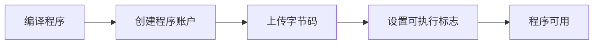

**部署步骤详解**：

1. **编译阶段**：将 Rust 代码编译为 BPF 字节码
2. **账户创建**：在链上创建程序账户并分配足够空间
3. **代码上传**：将字节码分批上传到程序账户
4. **标记可执行**：设置 executable 标志使程序可调用
5. **验证部署**：确认程序正确部署并可以接受调用

#### 升级机制

- **可升级程序**：通过 Upgrade Authority 控制，允许更新程序逻辑
- **不可变程序**：部署后无法修改，提供最高安全性
- **升级过程**：替换程序账户中的字节码，保持程序 ID 不变
- **向后兼容**：升级时需要考虑现有数据账户的兼容性

### 2.3 程序调用机制

程序调用遵循严格的接口规范，确保安全性和一致性：

**入口点规范**：

- 每个程序必须实现标准的入口点函数
- 接收程序 ID、账户列表和指令数据作为参数
- 返回执行结果或错误信息

**参数传递**：

- **program_id**：当前被调用程序的唯一标识符
- **accounts**：交易中涉及的所有账户信息
- **instruction_data**：包含具体操作指令的字节数组

## 3. PDA（Program Derived Address）机制

### 3.1 PDA 基本原理

PDA 是 Solana 独有的创新机制，它允许程序以确定性的方式生成和控制账户地址，而无需对应的私钥。

#### 核心特点

1. **确定性生成**：基于种子（seeds）和程序 ID 生成
2. **程序控制**：只有生成 PDA 的程序才能修改其数据
3. **无私钥**：PDA 地址不在椭圆曲线上，没有对应的私钥
4. **安全性**：防止外部恶意访问和修改

#### PDA 与传统地址的区别

| 特性     | PDA        | 传统地址       |
| -------- | ---------- | -------------- |
| 生成方式 | 确定性算法 | 随机生成       |
| 私钥     | 无私钥     | 有对应私钥     |
| 控制权   | 程序控制   | 私钥持有者控制 |
| 安全性   | 程序级安全 | 密钥级安全     |
| 可预测性 | 完全可预测 | 不可预测       |

### 3.2 PDA 生成算法

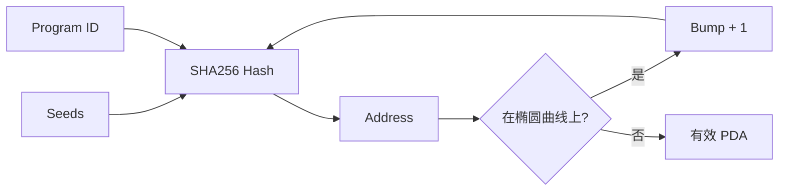

**生成过程详解**：

1. **种子组合**：将用户提供的种子和程序 ID 组合
2. **哈希计算**：使用 SHA256 算法计算哈希值
3. **曲线检查**：检查结果是否在 Ed25519 椭圆曲线上
4. **Bump 调整**：如果在曲线上，增加 bump 值重新计算
5. **重复验证**：重复直到找到不在曲线上的有效地址

**Bump 机制**：

- Bump 是一个 0-255 的字节值
- 通常从 255 开始递减查找
- 第一个有效的 bump 值被称为 "canonical bump"
- 确保生成的地址不在椭圆曲线上

### 3.3 PDA 应用场景

#### 3.3.1 用户状态管理

- **场景描述**：为每个用户创建独立的状态账户
- **种子设计**：用户公钥 + 程序标识符
- **优势分析**：确保每个用户只有一个状态账户，避免冲突
- **实际应用**：用户配置、游戏状态、个人资产管理

#### 3.3.2 资源池管理

- **场景描述**：管理流动性池、质押池等共享资源
- **种子设计**：池类型 + 配置参数
- **优势分析**：程序完全控制资源分配和访问权限
- **实际应用**：DeFi 协议、资产管理、收益农场

#### 3.3.3 跨程序调用

- **场景描述**：程序间安全的数据共享和调用
- **种子设计**：调用方程序 ID + 特定标识符
- **优势分析**：建立可信的程序间通信机制
- **实际应用**：组合协议、中间件服务、数据聚合

## 4. 状态与程序分离

### 4.1 设计理念

状态与程序分离是 Solana 架构的核心设计理念，它带来了以下优势：

#### 4.1.1 并行执行优化

- **依赖明确**：每个交易明确声明需要访问的账户
- **冲突检测**：运行时可以快速检测账户访问冲突
- **并行调度**：无冲突的交易可以并行执行
- **性能提升**：大幅提高网络整体吞吐量

#### 4.1.2 状态管理灵活性

- **独立存储**：每个状态账户独立存储和管理
- **细粒度控制**：可以对不同状态账户设置不同的权限
- **扩展性**：状态账户可以动态创建和销毁
- **维护简化**：状态和逻辑的独立维护

### 4.2 实现机制

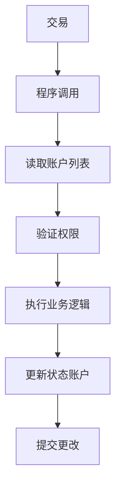

**执行流程说明**：

1. **交易解析**：解析交易中的程序调用和参数
2. **账户加载**：根据账户列表加载相关账户数据
3. **权限验证**：检查签名和账户访问权限
4. **逻辑执行**：在程序中执行具体的业务逻辑
5. **状态更新**：将计算结果写入相应的状态账户
6. **原子提交**：确保所有更改原子性地提交

### 4.3 并行执行优势

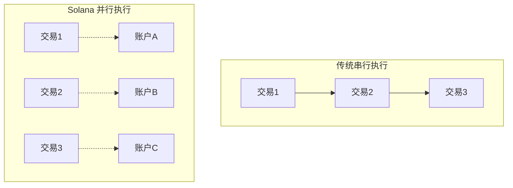

## 5. 账户权限管理

### 5.1 权限模型

Solana 的账户权限基于以下原则：

#### 5.1.1 所有权原则

- **账户所有者**：只有账户的所有者程序才能修改账户数据
- **系统程序**：System Program 拥有系统账户
- **自定义程序**：自定义程序拥有其创建的数据账户
- **权限继承**：子账户继承父程序的权限设置

#### 5.1.2 签名验证

- **私钥签名**：账户持有者必须提供有效的数字签名
- **多重签名**：支持多个签名者的复杂权限结构
- **程序签名**：PDA 由程序代为签名
- **时间限制**：签名具有时效性，防止重放攻击

### 5.2 权限检查流程

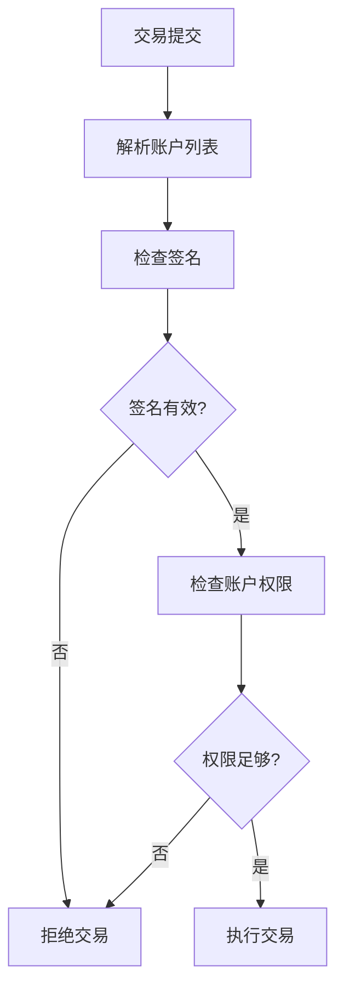

**权限验证层次**：

1. **签名层**：验证交易签名的有效性
2. **账户层**：检查账户访问权限
3. **程序层**：验证程序调用权限
4. **数据层**：确认数据修改权限

### 5.3 权限委托机制

Solana 支持灵活的权限委托：

- **代理授权**：账户所有者可以授权其他地址代为操作
- **时间限制**：委托可以设置有效期限
- **操作范围**：可以限制委托的操作类型和范围
- **撤销机制**：所有者可以随时撤销委托权限

## 6. 租金机制

### 6.1 租金设计目的

租金机制旨在：

1. **防止状态膨胀**：避免区块链状态无限增长
2. **资源优化**：鼓励及时清理不需要的账户
3. **经济激励**：为验证者提供额外收入来源
4. **网络健康**：维护网络的长期可持续性

### 6.2 租金计算

租金费用基于以下因素：

- **账户大小**：数据存储的字节数
- **租金费率**：网络设定的每字节每 epoch 费用
- **免租金余额**：足够的 SOL 余额可以免除租金
- **时间因子**：基于 epoch 的时间计算

**租金计算公式**：

```
租金 = 账户大小 × 租金费率 × epoch 数量
免租金阈值 = 账户大小 × 免租金倍数
```

### 6.3 免租金机制

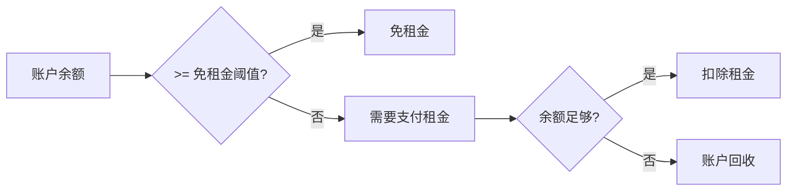

**免租金策略**：

- **一次性存款**：存入足够的 SOL 永久免租
- **定期充值**：定期为账户充值维持余额
- **自动管理**：程序自动管理账户租金
- **批量优化**：批量处理多个账户的租金

## 7. 跨程序调用（CPI）

### 7.1 CPI 机制

跨程序调用允许一个程序调用另一个程序，实现复杂的组合功能。

#### 7.1.1 调用类型

- **直接调用**：程序直接调用另一个程序
- **间接调用**：通过中间程序进行调用
- **递归调用**：程序调用自身（有深度限制）
- **批量调用**：一次调用中包含多个子调用

#### 7.1.2 权限传递

- **签名传递**：调用者的签名权限可以传递给被调用程序
- **PDA 签名**：程序可以代表其 PDA 进行签名
- **权限限制**：被调用程序只能访问明确传递的账户
- **安全边界**：严格的权限边界防止越权访问

### 7.2 CPI 调用流程

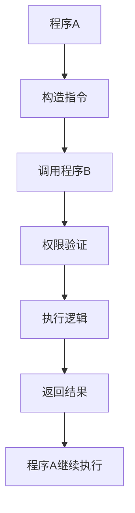

### 7.3 CPI 安全考虑

**安全机制**：

1. **权限验证**：严格验证调用权限
2. **参数检查**：验证传递参数的有效性
3. **状态一致性**：确保调用前后状态一致
4. **错误处理**：正确处理调用失败情况

**最佳实践**：

- 最小权限原则：只传递必要的权限
- 输入验证：严格验证所有输入参数
- 错误恢复：实现完善的错误恢复机制
- 审计跟踪：记录重要的调用操作

## 8. 实际应用示例

### 8.1 去中心化交易所（DEX）

#### 架构设计

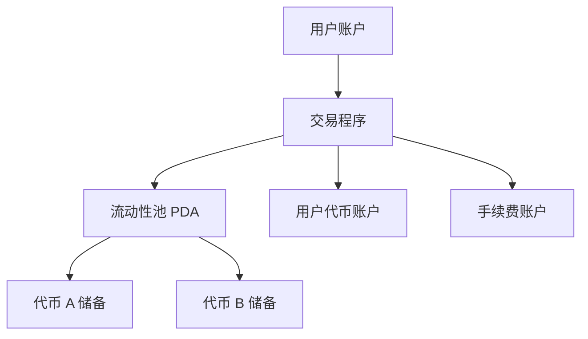

#### 账户结构

1. **流动性池账户**：使用 PDA 存储池状态和储备金
   - 存储两种代币的储备量
   - 记录流动性提供者信息
   - 管理交易手续费设置

2. **用户代币账户**：SPL Token 账户存储用户代币余额
   - 支持多种代币类型
   - 自动处理余额更新
   - 集成转账功能

3. **LP 代币账户**：流动性提供者的份额代币
   - 代表在池中的份额
   - 支持转让和交易
   - 自动计算收益

### 8.2 NFT 市场

#### 核心组件

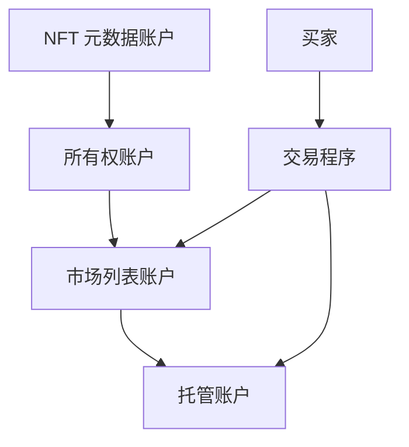

**组件说明**：

1. **NFT 元数据账户**：存储 NFT 的元数据信息
2. **所有权账户**：跟踪 NFT 的当前所有者
3. **市场列表账户**：存储待售 NFT 的信息
4. **托管账户**：在交易过程中临时持有 NFT

### 8.3 质押协议

#### 状态管理

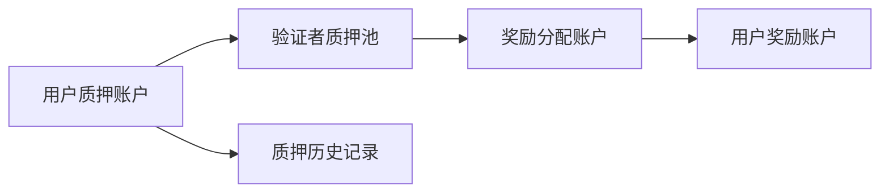

**质押流程**：

1. **质押存入**：用户将代币存入质押池
2. **验证参与**：代币参与网络验证过程
3. **奖励计算**：根据质押量和时间计算奖励
4. **奖励分发**：自动分发奖励到用户账户
5. **解质押**：用户可以申请解除质押

## 9. 最佳实践

### 9.1 账户设计原则

#### 9.1.1 数据结构优化

- **紧凑布局**：使用紧凑的数据结构减少存储成本
- **版本控制**：为账户数据添加版本字段支持升级
- **边界检查**：严格验证数据边界防止溢出
- **对齐优化**：考虑内存对齐提高访问效率

#### 9.1.2 权限管理

- **最小权限原则**：只授予必要的最小权限
- **权限验证**：在每次操作前验证权限
- **多重签名**：对重要操作使用多重签名
- **权限审计**：定期审计权限设置

### 9.2 性能优化

#### 9.2.1 账户访问优化

- **预分配账户**：提前创建和初始化账户
- **批量操作**：将多个相关操作合并到一个交易中
- **缓存策略**：合理使用账户数据缓存
- **访问模式**：优化账户访问模式减少冲突

#### 9.2.2 租金优化

- **大小规划**：合理规划账户大小避免浪费
- **生命周期管理**：及时关闭不需要的账户
- **免租金设计**：为长期账户维持免租金余额
- **成本分析**：定期分析和优化租金成本

### 9.3 安全考虑

#### 9.3.1 输入验证

**验证检查清单**：

- 账户所有者验证
- 账户可写性检查
- 签名验证
- 数据格式验证
- 边界条件检查

#### 9.3.2 状态一致性

- **原子操作**：确保相关状态更新的原子性
- **回滚机制**：在错误情况下正确回滚状态
- **并发控制**：处理并发访问可能导致的竞态条件
- **数据完整性**：维护数据的完整性和一致性

#### 9.3.3 错误处理

- **异常捕获**：完善的异常捕获和处理机制
- **错误恢复**：设计合理的错误恢复策略
- **日志记录**：详细记录错误信息用于调试
- **用户反馈**：提供清晰的错误信息给用户

## 10. 总结

Solana 的账户模型通过状态与程序分离、PDA 机制、细粒度权限管理等创新设计，为高性能区块链应用提供了强大的基础设施。这种模型不仅支持高效的并行执行，还提供了灵活的状态管理和安全的权限控制。

### 核心创新点

1. **状态程序分离**：实现了真正的无状态程序设计，提高了系统的模块化和可维护性
2. **PDA 机制**：提供了安全可控的地址生成方案，解决了传统区块链的地址管理问题
3. **租金机制**：有效控制了区块链状态膨胀，维护了网络的长期健康
4. **并行友好**：天然支持高效的并行处理，大幅提升了网络性能

### 技术优势

- **高性能**：支持大规模并行交易处理，TPS 可达数万级别
- **低成本**：优化的存储和计算成本，降低了用户使用门槛
- **高安全性**：基于密码学的强安全保证，多层次的权限控制
- **可扩展性**：灵活的架构支持复杂应用，易于扩展和升级

### 应用价值

Solana 的账户模型为构建高性能 DeFi、NFT、游戏等应用提供了理想的技术基础。其创新的设计理念不仅解决了传统区块链的性能瓶颈，还为开发者提供了更加灵活和强大的开发工具。这种模型的成功实践也为其他区块链项目提供了重要的参考价值，推动了整个区块链技术的发展。

通过深入理解和正确应用这些概念，开发者可以构建出更加高效、安全和用户友好的区块链应用，充分发挥 Solana 平台的技术优势。
