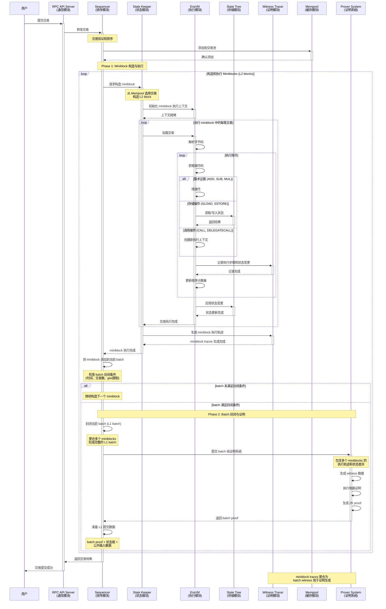
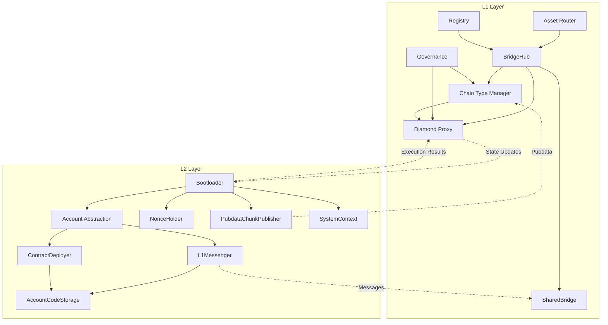

# zkSync Era 核心组件

> 本文档是 zkSync Era Core 技术分享报告的第三部分，深入讲解各个核心组件的技术实现细节。
> 
> **前置阅读**: 
> - [总体架构](./02_总体架构.md) - 了解整体设计理念
> - [核心模块分析](./01_核心模块分析.md) - 掌握模块关联关系
> 
> **后续阅读**: [Prividium 企业级隐私区块链](./04_Prividium.md) - 企业应用案例

## 1. 组件概览

zkSync Era 的核心组件构成了整个系统的技术基础，每个组件都承担着特定的职责，协同工作以实现高性能、安全的 Layer 2 解决方案。

本文档将详细介绍：
- **EraVM 虚拟机**: 执行引擎和零知识证明生成
- **Prover 系统**: 证明生成和验证机制
- **Node/Server 架构**: 分布式节点服务
- **数据可用性**: DA 策略和实现方案

```text
┌─────────────────────────────────────────────────────────┐
│                zkSync Era Core Components               │
├─────────────────────────────────────────────────────────┤
│  ┌─────────────┐  ┌─────────────┐  ┌─────────────┐      │
│  │             │  │   Prover    │  │ Node/Server │      │
│  │    EraVM    │  │   System    │  │ Architecture│      │
│  │             │  │             │  │             │      │
│  └─────────────┘  └─────────────┘  └─────────────┘      │
│         │                 │                 │           │
│         └─────────────────┼─────────────────┘           │
│                           │                             │
│                  ┌─────────────┐                        │
│                  │    Data     │                        │
│                  │ Availability│                        │
│                  │             │                        │
│                  └─────────────┘                        │
└─────────────────────────────────────────────────────────┘
```

## 2. EraVM 虚拟机

### 2.1 EraVM 概述

EraVM (Zero-Knowledge Ethereum Virtual Machine) 是 zkSync Era 的执行引擎，它在保持完全 EVM 兼容性的同时，生成零知识证明来验证执行的正确性。

#### A. 设计目标

- **完全 EVM 兼容**: 支持所有 EVM 操作码和预编译合约
- **高效证明生成**: 优化电路设计以提高证明效率
- **状态管理**: 高效的状态存储和访问机制
- **系统集成**: 与 zkSync Era 系统无缝集成

#### B. 架构层次

```text
┌─────────────────────────────────────────┐
│           Application Layer             │
│  Smart Contracts, DApps, Wallets       │
└─────────────────────────────────────────┘
                    │
┌─────────────────────────────────────────┐
│            EVM Interface                │
│  JSON-RPC, Web3 APIs, Solidity ABI     │
└─────────────────────────────────────────┘
                    │
┌─────────────────────────────────────────┐
│             EraVM Core                  │
│  Execution Engine, State Manager       │
└─────────────────────────────────────────┘
                    │
┌─────────────────────────────────────────┐
│           Circuit Layer                 │
│  VM Circuits, Proof Generation         │
└─────────────────────────────────────────┘
```

### 2.2 执行环境

#### A. 指令集支持

EraVM 支持完整的 EVM 指令集，包括：

**算术运算**:

```assembly
ADD, SUB, MUL, DIV, SDIV, MOD, SMOD
ADDMOD, MULMOD, EXP, SIGNEXTEND
```

**比较运算**:

```assembly
LT, GT, SLT, SGT, EQ, ISZERO
```

**位运算**:

```assembly
AND, OR, XOR, NOT, BYTE, SHL, SHR, SAR
```

**环境信息**:

```text
ADDRESS, BALANCE, ORIGIN, CALLER, CALLVALUE
CALLDATALOAD, CALLDATASIZE, CALLDATACOPY
CODESIZE, CODECOPY, GASPRICE, EXTCODESIZE
EXTCODECOPY, RETURNDATASIZE, RETURNDATACOPY
EXTCODEHASH, BLOCKHASH, COINBASE, TIMESTAMP
NUMBER, DIFFICULTY, GASLIMIT, CHAINID, SELFBALANCE
```

#### B. 内存和存储

- **内存管理**: 支持动态内存分配和访问
- **存储操作**: 高效的状态存储读写
- **调用栈**: 支持函数调用和返回

#### C. 执行流程

EraVM 的交易执行流程涉及多个模块的协作，以下时序图展示了完整的执行过程：



**执行流程说明**：

**阶段一：交易接收与验证**：

1. **用户提交**: 用户通过 RPC API 提交交易
2. **初步验证**: RPC 服务器验证交易格式和签名
3. **交易排序**: Sequencer 对交易进行排序和优先级处理
4. **池化管理**: 交易被添加到 Mempool 等待执行

**阶段二：Miniblock 构造与执行**：

5. **Miniblock 构造**: Sequencer 从 Mempool 选择交易构造 L2 blocks (miniblocks)
6. **执行上下文初始化**: State Keeper 为 miniblock 初始化执行环境
7. **交易执行**: EraVM 逐笔执行 miniblock 中的交易
   - 解析字节码并执行 EVM 指令
   - 处理算术运算、存储操作、合约调用等
   - 通过 State Tree 管理状态读写
8. **执行轨迹记录**: Witness Tracer 记录每个执行步骤和状态变更
9. **Miniblock 完成**: 生成 miniblock 的执行轨迹和状态差异

**阶段三：Batch 聚合与封闭**：

10. **Batch 聚合**: Sequencer 将多个 miniblocks 添加到当前 L1 batch
11. **封闭条件检查**: 检查是否满足 batch 封闭条件
    - 时间限制（例如：每 X 分钟封闭一次）
    - 交易数量限制（例如：达到 Y 笔交易）
    - Gas 使用限制（例如：达到 Z gas）
12. **Batch 封闭**: 满足条件时封闭当前 batch，聚合所有 miniblocks

**阶段四：证明生成与提交**：

13. **证明请求**: Sequencer 将封闭的 batch 提交给 Prover System
14. **Witness 生成**: Prover 基于 batch 中所有 miniblocks 的轨迹生成 witness 数据
15. **电路证明**: 执行零知识证明电路，生成 ZK proof
16. **L1 提交准备**: 准备 L1 提交数据（batch proof + 状态根 + 公共输入）

**关键概念区分**：

- **L2 Blocks (Miniblocks)**: 
  - Sequencer 构造的基本执行单元
  - 包含一组交易，立即执行并生成状态变更
  - 用户可以快速看到交易确认
  
- **L1 Batches**: 
  - 多个 miniblocks 的聚合
  - 作为证明生成和 L1 提交的单位
  - 提供最终的安全性保证

**模块职责划分**：

- **通信模块**: RPC API Server - 处理外部接口和用户交互
- **排序模块**: Sequencer - 交易排序、miniblock 构造、batch 管理
- **状态模块**: State Keeper - 执行协调和状态管理
- **执行模块**: EraVM - 字节码执行引擎
- **存储模块**: State Tree - 状态存储和访问
- **证明模块**: Witness Tracer - 执行轨迹记录
- **缓存模块**: Mempool - 交易池管理
- **证明系统**: Prover System - ZK proof 生成
  

***注意***

在生成proof以及提交proof给L1时，是以Batch为单位的，整个流程如下：

1. 块执行阶段 / trace 收集阶段
   - Sequencer 在 L2 上按块 (miniblock) 执行交易，更新状态、生成日志 /存储写入 /状态差异 / trace 输入（witness input 的原料）。
   - 每个块执行完成后，其状态差异 /变更 /trace 输入会被缓存／暂存起来（可能保存在本地文件 /数据库 /内存 /临时存储）。
   - 这些块还没有立即被证明。
2. 批次封闭 / batch “seal”
   - 系统有一个“批次封闭 (seal)”逻辑（conditional_sealer）监控：当达到一定交易数 /pubdata 大小 /时间 /gas 限制 /其他约束时，就把当前 batch 封闭。
   - 在封闭时刻，批次号、批次时间戳、要提交的 pubdata /状态变更差异 /trace 输入集合就确定下来。
   - 在封闭之后，这个 batch 内所有块的 traces、状态差异、日志等就作为这个 batch 的输入集合固定下来，不能再增减。
3. 提交 batch 数据 /状态差异 /commitment
   - sequencer 或辅助组件把这个 batch 的必要数据提交到 L1（commitBatches / 批次提交），包含状态差异 (state diffs)、pubdata、日志、commitment 等。这个是“commit”阶段（commit 到 L1）。在这个阶段，proof 还未生成或验证。
   - L1 合约记录这个 commit，但并不立即验证 proof
4. 批次 proof 生成阶段
   - Prover 子系统拿到这个 batch 的所有 trace 输入 /状态差异 /变更 /metadata，进行 witness generation、constraint 电路证明、proof 聚合 /压缩等一系列工作。
   - 只有在这个 batch 所包含的所有块的输入都就绪后，prover 才能真正开始这一计算。这一步通常是耗时的。
   - 生成最终的 ZK proof（一个证明，覆盖整个 batch），证明批次内所有块 /交易的正确性。
5. proof 提交 & L1 验证阶段
   - ETH Sender 模块（或统一 operator）将这个批次的 proof 提交给 L1 的 verifier 合约（调用 proveBatches 等函数）。
   - L1 验证器合约验证 proof 与 commit 数据的匹配：检查提交的状态根 /commitment /状态差异是否与 proof 相一致。
   - 如果验证通过，批次即被标记为 “verified / finalized” 状态，并且批次内的所有交易被最终确认。
6. 执行 / finalization / cross-chain /状态更新
   - 在 proof 验证后，如果有执行阶段（有些架构里还要 “execute” 批次更新状态 /日志 /跨链消息等），会在 L1 合约 /链上执行这些结算 /状态更新步骤（executeBatches 等）
   - 批次被标记为 “finalized”，这之后该批次内的交易就不可更改 /不可回滚。

### 2.3 兼容性特性

#### A. Solidity 兼容性

- **编译器支持**: 支持所有版本的 Solidity 编译器
- **ABI 兼容**: 完全兼容以太坊 ABI 标准
- **库支持**: 支持 OpenZeppelin 等标准库

#### B. 工具链兼容性

- **Hardhat**: 完全支持 Hardhat 开发框架
- **Foundry**: 支持 Foundry 测试和部署
- **Remix**: 兼容 Remix IDE

#### C. 协议兼容性

- **EIP 支持**: 支持主要的 EIP 提案
- **预编译合约**: 支持标准预编译合约
- **Gas 计量**: 兼容以太坊 Gas 计量模型

### 2.4 系统合约

zkSync Era 的系统合约分为 L1 合约和 L2 合约两个层面，它们共同构成了完整的 zkEVM 生态系统。

#### L1 合约架构

L1 合约负责管理 zkSync Era 的核心基础设施，包括链管理、桥接、治理和证明验证等功能。

##### A. Diamond Proxy

**主要功能**: Diamond Proxy 实现了模块化的合约架构，支持多个 Facet 合约的组合和升级。

**数据来源 (上游系统)**:
- **Chain Type Manager**: 提供 Facet 配置和升级指令
- **Governance**: 提供升级授权和参数配置
- **BridgeHub**: 提供链注册和初始化数据

**核心组件**:
- **Base Facet**: 基础功能实现，包括基本的代理逻辑
- **Executor Facet**: 执行批次验证和状态更新操作
- **Getters Facet**: 提供状态查询接口和只读操作
- **Admin Facet**: 管理员功能，包括升级和配置管理
- **Mailbox Facet**: 处理 L1-L2 通信和消息传递

**主要处理流程**:
1. **请求路由**: 根据函数选择器路由到相应的 Facet
2. **权限验证**: 验证调用者权限和操作合法性
3. **状态管理**: 维护链的状态和配置信息
4. **升级处理**: 支持 Facet 的添加、删除和替换

**输出数据 (下游系统)**:
- **State Updates**: 链状态更新和批次确认
- **Event Logs**: 操作事件和状态变更日志
- **Verification Results**: 批次验证结果和证明确认

##### B. Chain Type Manager (CTM)

**主要功能**: CTM 管理多个 zkSync 链的证明验证和标准 Rollup 数据可用性。

**数据来源 (上游系统)**:
- **Registry**: 提供链注册信息和 CTM 配置
- **Prover System**: 提供批次证明和验证数据
- **Governance**: 提供升级指令和系统参数

**核心职责**:
- **链注册**: 在 BridgeHub 注册时部署和初始化 Diamond Proxy
- **证明验证**: 使用共享 Verifier 合约验证多链证明
- **升级管理**: 强制所有链更新到最新实现版本
- **Facet 管理**: 为不同链类型配置相应的 Facet 组合

**升级机制流程**:
1. **发布升级**: 发布新的 Bootloader 和系统合约
2. **存储提案**: 存储 ProposedUpgrade 信息和升级参数
3. **时间窗口**: 给各链提供升级时间窗口
4. **强制执行**: 超时未升级的链将被冻结
5. **解冻机制**: 冻结链可通过升级解冻

**输出数据 (下游系统)**:
- **Diamond Proxy**: 部署的链合约实例
- **Verification Keys**: 更新的验证密钥
- **Upgrade Status**: 链升级状态和冻结信息

##### C. BridgeHub

**主要功能**: BridgeHub 作为 L1 上的中央桥接枢纽，管理所有 zkSync 链的注册和路由。

**数据来源 (上游系统)**:
- **Registry**: 提供链 ID 分配和注册验证
- **Asset Router**: 提供跨链资产转移请求
- **Chain Type Manager**: 提供链类型配置和验证

**核心功能实现**:
```solidity
function createNewChain(
    uint256 _chainId,
    address _chainTypeManager,
    bytes32 _baseTokenAssetId,
    uint256 _salt,
    address _admin,
    bytes calldata _initData,
    bytes[] calldata _factoryDeps
) external
```

**主要处理流程**:
1. **白名单验证**: 验证 CTM 和基础代币是否在白名单中
2. **链注册**: 调用 Registry 注册新链并分配 ID
3. **代理部署**: 通过 CTM 部署 Diamond Proxy 实例
4. **初始化配置**: 设置链的基础配置和管理员权限
5. **路由管理**: 维护 chainId 到 hyperchainAddress 的映射

**输出数据 (下游系统)**:
- **Chain Registry**: 新注册的链信息和地址映射
- **Proxy Contracts**: 部署的 Diamond Proxy 实例
- **Bridge Routes**: 跨链路由配置和资产映射

##### D. SharedBridge & Asset Router

**SharedBridge 功能**:
- **资产管理**: 管理多链间的资产桥接和余额追踪
- **存取款处理**: 处理用户存款和提款操作
- **资产映射**: 维护 L1-L2 资产映射关系

**L1AssetRouter 功能**:
- **跨链发起**: 唯一能够通过 BridgeHub 发起跨链交易的基础代币桥
- **失败恢复**: 提供失败存款的链上恢复机制
- **多代币支持**: 支持多种代币类型的桥接操作

**安全机制**:
- **白名单验证**: 验证代币和操作的合法性
- **失败交易恢复**: 提供 `bridgeRecoverFailedTransfer` 功能
- **多重签名保护**: 关键操作需要多重签名确认

##### E. Governance

**主要功能**: Governance 合约管理所有 L1 和 L2 治理合约的调用，支持系统升级和参数变更。

**升级类型**:
- **透明升级**: 公开的升级提案，有最小延迟保护
- **影子升级**: 紧急升级，用于安全修复

**升级流程**:
1. **计划升级**: 提交升级提案，设置最小延迟
2. **审核期**: 社区和安全委员会审核期
3. **执行升级**: 安全委员会或所有者执行升级
4. **取消机制**: 升级前可以取消不当提案

#### L2 系统合约

L2 系统合约是 EraVM 的核心组成部分，负责处理 L2 特定的功能：

#### A. Bootloader 

**主要功能**: Bootloader 是 zkSync Era 的核心执行协调器，负责管理和执行所有类型的交易并生成proof。

**数据来源 (上游系统)**:

- **Sequencer**: 接收已排序的交易批次
- **ETH Watcher**: 接收来自 L1 的优先交易和存款交易
- **State Keeper**: 接收批次执行指令和上下文信息

**主要处理流程**:

1. **批次初始化**: 接收 Sequencer 提供的交易批次，设置执行环境
2. **交易分类处理**: 区分普通 L2 交易和 L1→L2 优先交易
3. **顺序执行**: 按照预定顺序逐个执行批次中的所有交易
4. **状态协调**: 协调各个交易的状态变更，确保一致性
5. **Gas 管理**: 统计和管理整个批次的 Gas 消耗
6. **异常处理**: 处理交易执行失败的情况，进行回滚操作

**输出数据 (下游系统)**:

- **State Tree**: 更新后的账户状态和存储状态
- **Witness Tracer**: 完整的执行轨迹和状态变更记录
- **Event Log System**: 交易执行产生的事件和日志
- **Gas Accounting**: 详细的 Gas 使用统计信息

**注意**:

- Bootloader 是一个程序，接受一组事务并执行整个 ZKsync batch。
- 在传统以太坊中，块内交易是一个个被顺序执行；但在 zkSync 中，如果对每笔交易分别执行 proof 等操作效率很差。因此 Bootloader 让整个 batch 一次性、批量地执行多个事务，以提高效率。
- Bootloader 的代码本身不存储在 L2，而是其哈希存储在 L1，Bootloader 的版本更新须通过系统升级。
- Bootloader 在 batch 启动时会被初始化，其 memory 里会预填参数（即该 batch 要处理的事务、输入等），然后它从 memory 读取事务，对它们做校验、ABI 解码、验证格式、执行、写入结果等操作。
- 它与 “交易在打包成块时执行”不同，“在打包成块时执行” 是指在 sequencer 上做状态更新，那是生产阶段的执行。
- “在 Bootloader 中执行批次的交易” 是指受控的标准化执行环境重演批次内的所有交易，以确保一致性和正确性，并同时生成可验证的proof。

#### B. Account Abstraction

**主要功能**: Account Abstraction 系统实现了灵活的账户模型，允许智能合约账户自定义交易验证和执行逻辑。

**数据来源 (上游系统)**:

- **用户钱包/DApp**: 用户发起的交易请求
- **Bootloader**: 交易执行调度和上下文
- **Paymaster 服务**: Gas 费用代付信息
- **Signature Aggregator**: 聚合签名数据

**主要处理流程**:

1. **交易预验证**: 检查交易格式和基本有效性
2. **账户类型识别**: 区分 EOA (外部账户) 和 Contract Account (合约账户)
3. **自定义验证逻辑**: 对于智能合约账户，执行自定义的签名验证逻辑
4. **Gas 费用处理**: 支持 Paymaster 代付 Gas 费用的机制
5. **权限检查**: 验证交易发起者的权限和授权
6. **执行准备**: 为交易执行准备必要的上下文和参数

**输出数据 (下游系统)**:

- **EraVM**: 验证通过的交易和执行参数
- **Gas Accounting**: Gas 费用分配和消耗记录
- **Event System**: 账户操作相关的事件
- **State Updates**: 账户状态的更新信息

#### C. L1Messenger

**主要功能**: L1Messenger 负责处理从 L2 到 L1 的消息传递，确保跨层通信的安全性和可靠性。

**数据来源 (上游系统)**:

- **用户智能合约**: 需要发送到 L1 的消息和数据
- **系统合约**: 系统级别的 L1 通信需求
- **Bridge 合约**: 跨链资产转移相关的消息
- **Withdrawal 系统**: 用户提取资金的请求

**主要处理流程**:

1. **消息接收**: 接收来自 L2 合约的 L1 消息发送请求
2. **消息验证**: 验证消息格式、发送者权限和内容有效性
3. **消息编码**: 将消息内容编码为标准格式
4. **哈希计算**: 计算消息的唯一哈希标识
5. **事件记录**: 生成 L1MessageSent 事件，记录消息详情
6. **状态更新**: 更新消息发送状态和计数器

**输出数据 (下游系统)**:

- **Event Log System**: L1MessageSent 事件，包含消息哈希和内容
- **Merkle Tree Builder**: 消息哈希用于构建 Merkle 树证明
- **L1 Contracts**: 通过批次提交将消息传递到 L1
- **Proof System**: 消息相关的证明数据

#### D. 其他重要系统合约

**ContractDeployer**:

- **功能**: 管理智能合约的部署和初始化
- **上游**: 用户部署请求、字节码数据
- **处理**: 验证字节码、分配地址、初始化存储
- **下游**: 新合约地址、部署事件、状态更新

**NonceHolder**:

- **功能**: 管理账户的 nonce 值，防止重放攻击
- **上游**: 交易 nonce、账户信息
- **处理**: 验证 nonce 顺序、更新 nonce 值
- **下游**: 更新后的 nonce 状态、验证结果

**SystemContext**:

- **功能**: 提供区块信息和系统级上下文数据
- **上游**: 区块元数据、时间戳、区块号
- **处理**: 维护当前区块信息、提供系统参数
- **下游**: 区块信息查询结果、系统状态

#### 合约交互架构



#### 关键设计原则

**1. 模块化架构**
- **Diamond Proxy 模式**: 支持功能分离和独立升级，突破单个合约大小限制
- **Facet 组合**: 不同功能模块可以独立开发和部署
- **接口标准化**: 统一的接口设计确保模块间的兼容性

**2. 多链支持**
- **CTM 统一管理**: Chain Type Manager 统一管理多个 zkSync 链
- **共享基础设施**: 证明验证、升级机制等基础设施在多链间共享
- **独立配置**: 每个链可以有独立的配置和管理员

**3. 安全升级机制**
- **强制升级**: 确保所有链保持最新状态，防止安全漏洞
- **时间窗口**: 给链管理员充足时间进行升级
- **冻结保护**: 未及时升级的链将被冻结，保护整体安全

**4. 跨层通信**
- **L1Messenger**: 实现安全的 L2 到 L1 消息传递
- **系统日志**: 通过系统日志机制传递关键状态信息
- **证明验证**: 所有跨层操作都有相应的零知识证明保护

**5. 账户抽象**
- **原生支持**: L2 原生支持自定义账户逻辑
- **Paymaster 机制**: 支持第三方代付 Gas 费用
- **兼容性**: 保持与以太坊 EOA 的完全兼容

**6. 资产桥接安全**
- **白名单机制**: 只有经过验证的代币和操作者可以参与桥接
- **失败恢复**: 提供完善的失败交易恢复机制
- **多重验证**: 关键操作需要多重签名和时间锁保护

这些系统合约通过精心设计的接口和数据流，确保了 zkSync Era 的各项功能能够安全、高效地运行，同时保持与以太坊生态的完全兼容性。

## 3. Prover 系统

### 3.1 Prover 架构

Prover 系统是 zkSync Era 的核心，负责生成零知识证明来验证 L2 状态转换的正确性。

```text
┌─────────────────────────────────────────────────────────┐
│                  Prover System                          │
├─────────────────────────────────────────────────────────┤
│  ┌─────────────┐  ┌─────────────┐  ┌─────────────┐      │
│  │   Witness   │  │   Circuit   │  │    Proof    │      │
│  │ Generation  │  │   Proving   │  │ Aggregation │      │
│  └─────────────┘  └─────────────┘  └─────────────┘      │
│         │                 │                 │           │
│         ▼                 ▼                 ▼           │
│  ┌─────────────┐  ┌─────────────┐  ┌─────────────┐      │
│  │ Execution   │  │   Boojum    │  │    FRI      │      │
│  │   Trace     │  │  Circuits   │  │ Compression │      │
│  └─────────────┘  └─────────────┘  └─────────────┘      │
└─────────────────────────────────────────────────────────┘
```

### 3.2 Circuits (电路)

Circuits 是 Prover 系统的核心组件，负责将计算过程转换为可验证的数学约束。

#### A. VM Main Circuit

**主要功能**: VM Main Circuit 是最核心的电路，负责验证 EraVM 的执行正确性。

**数据来源 (上游系统)**:

- **Witness Tracer**: 提供完整的执行轨迹数据 (VmInstanceWitness)
- **State Keeper**: 提供初始状态和最终状态信息
- **Circuit Configuration**: 提供电路配置参数和约束设置
- **Round Function**: 提供哈希函数和密码学原语

**主要处理过程**:

1. **见证数据加载**: 接收并验证执行轨迹的完整性和格式
2. **公共输入分配**: 将公共可见的输入数据分配到约束系统中
3. **虚拟机状态综合**: 根据初始状态创建虚拟机的电路表示
4. **指令逐步执行验证**: 对执行轨迹中的每条指令进行约束验证
5. **最终状态验证**: 确认执行结果与预期的最终状态一致
6. **约束系统构建**: 生成完整的数学约束系统

**输出数据 (下游系统)**:

- **Constraint System**: 完整的约束系统，用于证明生成
- **Circuit Witness**: 电路见证数据，包含所有中间计算结果
- **Public Inputs**: 验证所需的公共输入数据
- **Verification Key**: 用于后续验证的密钥信息

#### B. Storage Circuit

**主要功能**: Storage Circuit 专门验证状态存储操作的正确性，确保所有存储访问都有有效的 Merkle 证明。

**数据来源 (上游系统)**:

- **State Tree**: 提供存储查询请求和状态访问记录
- **Merkle Proof Generator**: 提供对应的 Merkle 树证明
- **Storage Manager**: 提供存储操作的元数据和验证信息

**主要处理过程**:

1. **存储查询验证**: 验证每个存储访问请求的合法性
2. **Merkle 证明检查**: 对每个存储操作验证对应的 Merkle 证明
3. **状态一致性验证**: 确保存储操作前后的状态转换正确
4. **约束生成**: 为每个存储操作生成相应的数学约束

**输出数据 (下游系统)**:

- **Storage Constraints**: 存储相关的约束集合
- **Merkle Verification Results**: Merkle 证明验证结果
- **State Transition Proofs**: 状态转换的证明数据

#### C. Keccak Circuit

**主要功能**: Keccak Circuit 负责验证所有 Keccak256 哈希计算的正确性，这是以太坊生态中最重要的哈希函数。

**数据来源 (上游系统)**:

- **Hash Request Queue**: 来自 EraVM 执行过程中的哈希计算请求
- **Expected Hash Values**: 预期的哈希计算结果
- **Input Data**: 需要进行哈希计算的原始数据

**主要处理过程**:

1. **哈希请求处理**: 接收并分类处理各种哈希计算请求
2. **Keccak256 电路实现**: 在约束系统中实现 Keccak256 算法
3. **结果验证**: 将电路计算结果与预期结果进行比较
4. **约束强制**: 为每个哈希操作生成强制性约束条件

**输出数据 (下游系统)**:

- **Hash Constraints**: 哈希计算相关的约束
- **Verification Results**: 哈希验证的结果
- **Cryptographic Proofs**: 密码学计算的证明数据

### 3.3 Witness Generation

Witness Generation 是 Prover 系统的关键环节，负责收集和整理执行过程中的所有必要数据，为后续的证明生成提供完整的见证信息。

#### A. Execution Tracer

**主要功能**: 执行轨迹记录器负责详细记录交易执行过程中的每一个步骤，为零知识证明提供完整的执行见证。

**数据来源 (上游系统)**:

- **EraVM**: 提供虚拟机状态和执行上下文
- **Transaction Pool**: 提供需要执行的交易数据
- **State Tree**: 提供初始状态信息
- **Memory Manager**: 提供内存访问记录

**主要处理过程**:

1. **虚拟机状态初始化**: 为每笔交易设置初始的虚拟机执行环境
2. **逐步执行记录**: 记录每条指令执行前后的完整状态信息
3. **状态快照捕获**: 在每个执行步骤捕获栈、内存、存储的状态快照
4. **操作分类记录**: 分别记录存储访问、哈希操作等特殊操作
5. **执行轨迹构建**: 将所有执行步骤组织成完整的执行轨迹
6. **数据完整性验证**: 确保记录的轨迹数据完整且一致

**输出数据 (下游系统)**:

- **Execution Trace**: 完整的执行轨迹，包含每个执行步骤的详细信息
- **Storage Access Records**: 所有存储访问操作的记录
- **Hash Operation Records**: 所有哈希计算操作的记录
- **VM State Snapshots**: 虚拟机状态的快照序列

#### B. State Transition Witness

**主要功能**: 状态转换见证生成器负责记录和验证整个批次执行过程中的状态变化，提供状态转换的完整证明数据。

**数据来源 (上游系统)**:

- **State Tree**: 提供初始状态树和状态访问接口
- **Transaction Batch**: 提供需要执行的交易批次
- **Merkle Proof Generator**: 提供状态变更的 Merkle 证明
- **State Manager**: 提供状态管理和验证服务

**主要处理过程**:

1. **初始状态记录**: 记录批次执行前的完整状态根
2. **逐笔交易处理**: 按顺序处理批次中的每笔交易
3. **状态差异计算**: 计算每笔交易引起的状态变化
4. **Merkle 证明生成**: 为每个状态变更生成对应的 Merkle 证明
5. **最终状态确认**: 记录批次执行后的最终状态根
6. **见证数据整合**: 将所有状态转换信息整合成见证数据

**输出数据 (下游系统)**:

- **State Transition Witness**: 完整的状态转换见证数据
- **State Diffs**: 详细的状态变化差异记录
- **Merkle Proofs**: 状态变更的 Merkle 树证明
- **Root Hash Transitions**: 状态根的变化记录

### 3.4 Boojum 证明系统

Boojum 是 zkSync Era 使用的高效证明系统，基于 FRI (Fast Reed-Solomon Interactive Oracle Proofs) 技术，专门为大规模零知识证明生成和验证而设计。

#### A. 证明生成流程 (Boojum Prover)

**主要功能**: Boojum Prover 是整个证明系统的核心引擎，负责将电路约束和见证数据转换为可验证的零知识证明。

**数据来源 (上游系统)**:

- **Circuit System**: 提供各种类型的电路约束（VM、Storage、Keccak 等）
- **Witness Generator**: 提供完整的见证数据和执行轨迹
- **Prover Setup**: 提供证明密钥和系统参数
- **Configuration Manager**: 提供证明生成的配置参数

**主要处理流程**:

1. **设置阶段**: 加载预计算的证明密钥和系统参数
2. **见证承诺**: 对输入的见证数据进行密码学承诺，确保数据完整性
3. **电路评估**: 在有限域上评估所有电路约束，生成多项式表示
4. **FRI 证明生成**: 使用 FRI 协议生成简洁的证明，包含多轮交互式证明
5. **证明组合**: 将见证承诺、FRI 证明和公共输入组合成最终证明
6. **验证预检**: 在提交前进行本地验证确保证明正确性

**输出数据 (下游系统)**:

- **Zero-Knowledge Proof**: 完整的零知识证明数据
- **Public Inputs**: 验证所需的公共输入信息
- **Proof Metadata**: 证明的元数据和验证参数
- **Verification Key**: 对应的验证密钥信息

#### B. FRI 压缩技术 (FRI Compressor)

**主要功能**: FRI 压缩器负责将大型证明数据压缩为更小的表示形式，同时保持相同的安全保证，显著降低存储和传输成本。

**数据来源 (上游系统)**:

- **Raw Proofs**: 来自 Boojum Prover 的原始证明数据
- **Polynomial Commitments**: 多项式承诺数据
- **Opening Proofs**: 多项式开启证明
- **Compression Parameters**: 压缩比例和安全级别配置

**主要处理流程**:

1. **承诺提取**: 从原始证明中提取多项式承诺数据
2. **FRI 折叠**: 应用 FRI 折叠技术递归压缩承诺数据
3. **层次化压缩**: 通过多层折叠将数据大小逐步减小
4. **最终多项式计算**: 计算压缩后的最终多项式表示
5. **压缩验证**: 确保压缩过程保持数学正确性
6. **格式优化**: 生成最优的压缩数据格式

**输出数据 (下游系统)**:

- **Compressed Proof**: 压缩后的证明数据
- **Folded Commitments**: 折叠后的承诺数据
- **Final Polynomial**: 最终的多项式表示
- **Compression Metadata**: 解压缩所需的元数据

### 3.5 Proof Verifier

Proof Verifier 是 zkSync Era 安全架构的最后一环，负责在 L1 上验证从 L2 提交的零知识证明，确保所有状态转换的正确性。

#### A. 验证架构概述

**核心合约组件**:
- **Verifier 合约**: 实际执行零知识证明验证的核心合约
- **ExecutorFacet**: Diamond Proxy 的执行器 Facet，调用 Verifier 合约进行证明验证
- **ChainTypeManager**: 管理多链的证明验证和验证器共享
- **DiamondProxy**: 使用 Diamond 模式的代理合约，包含多个 Facet

#### B. L1 证明验证实现

**主要功能**: L1 验证合约部署在以太坊主网上，通过 Diamond Proxy 架构实现模块化的证明验证。

**数据来源 (上游系统)**:
- **Validator**: 提交批次证明和相关数据的验证者
- **Batch Commitment**: 批次承诺和状态根数据
- **Public Inputs**: 证明的公共输入参数
- **Verification Key**: 预存储在 ChainTypeManager 中的验证密钥

**核心处理流程**:

1. **批次提交验证**: ExecutorFacet 接收 Validator 提交的批次数据
2. **优先交易验证**: 验证优先队列中交易的滚动哈希匹配性
3. **证明数据解析**: 解析零知识证明的结构和公共输入
4. **Verifier 合约调用**: ExecutorFacet 调用 Verifier 合约执行密码学验证
5. **状态根确认**: 验证新的状态根并更新链状态
6. **事件发布**: 发布验证结果和状态更新事件

**输出数据 (下游系统)**:
- **Verification Result**: 证明验证的成功或失败状态
- **State Root Update**: 确认的新状态根哈希
- **L2 Logs Root**: L2 到 L1 消息的根哈希
- **Batch Execution Events**: 批次执行和验证的事件日志

#### C. 验证器与验证者的关系

**概念区分**:
- **Validator (验证者)**: 负责提交批次证明的实体，通常是 EOA 账户或授权合约
- **Verifier (验证器)**: 部署在 L1 上的智能合约，负责验证证明的密码学正确性
- **ValidatorTimelock**: 在 Alpha 阶段使用的中间合约，对批次执行施加时间延迟

**交互流程**:
1. Validator 通过 ValidatorTimelock 提交批次证明
2. ValidatorTimelock 在延迟期后将调用转发给 DiamondProxy
3. ExecutorFacet 处理批次数据并调用 Verifier 合约
4. Verifier 合约执行零知识证明验证
5. 验证成功后更新链状态并发布事件

#### D. 多链验证管理

**ChainTypeManager 功能**:
- **共享验证器**: 同一链类型的多条链共享相同的 Verifier 合约
- **升级管理**: 统一管理所有链的验证器升级
- **冻结机制**: 未及时升级的链将被冻结，无法提交新证明
- **解冻流程**: 冻结的链可通过升级证明系统来解冻

## 4. Node/Server 架构

### 4.1 节点架构概览

zkSync Era 节点采用模块化架构，每个组件负责特定的功能。

```text
┌─────────────────────────────────────────────────────────┐
│                zkSync Era Node                          │
├─────────────────────────────────────────────────────────┤
│  ┌─────────────┐  ┌─────────────┐  ┌─────────────┐      │
│  │ Sequencer   │  │ State       │  │ ETH         │      │
│  │             │  │ Keeper      │  │ Watcher     │      │
│  └─────────────┘  └─────────────┘  └─────────────┘      │
│  ┌─────────────┐  ┌─────────────┐  ┌─────────────┐      │
│  │ Aggregator  │  │ RPC API     │  │ Consensus   │      │
│  │             │  │ Server      │  │ Module      │      │
│  └─────────────┘  └─────────────┘  └─────────────┘      │
├─────────────────────────────────────────────────────────┤
│                 Shared Services                         │
│  ┌─────────────┐  ┌─────────────┐  ┌─────────────┐      │
│  │ Database    │  │ Mempool     │  │ Monitoring  │      │
│  │ Layer       │  │             │  │             │      │
│  └─────────────┘  └─────────────┘  └─────────────┘      │
└─────────────────────────────────────────────────────────┘
```

### 4.2 Sequencer

Sequencer 是 zkSync Era 节点的核心组件之一，负责交易的接收、验证、排序和批处理，是整个系统吞吐量和公平性的关键。

#### Transaction Processing

**主要功能**: Sequencer 作为交易处理的入口点，负责管理从接收到批次构建的整个交易生命周期。

**数据来源 (上游系统)**:

- **RPC API Server**: 提供用户提交的交易请求
- **ETH Watcher**: 提供来自 L1 的优先交易
- **Mempool**: 提供待处理的交易池
- **Configuration Manager**: 提供排序策略和参数配置

**主要处理流程**:

1. **交易验证**: 检查交易格式、签名、nonce 和余额的有效性
2. **MEV 检测**: 运行 MEV 保护算法，识别和阻止恶意交易
3. **交易入池**: 将验证通过的交易添加到内存池中
4. **批次触发**: 根据时间、交易数量或 Gas 限制触发批次构建
5. **交易排序**: 按照 Gas 价格和 nonce 对交易进行最优排序
6. **批次构建**: 将排序后的交易组装成执行批次
7. **状态协调**: 将构建好的批次发送给 State Keeper 执行

**输出数据 (下游系统)**:

- **Transaction Batches**: 构建好的交易批次
- **Batch Metadata**: 批次的元数据和统计信息
- **Ordering Information**: 交易排序的相关信息
- **MEV Protection Reports**: MEV 检测和保护的报告

### 4.3 State Keeper

State Keeper 是 zkSync Era 节点的状态管理核心，负责维护整个 L2 网络的状态一致性和完整性。

#### A. State Management

**主要功能**: State Keeper 负责协调和管理所有状态变更，确保从批次执行到状态更新的整个过程的原子性和一致性。

**数据来源 (上游系统)**:

- **Sequencer**: 提供构建好的交易批次
- **EraVM**: 提供交易执行结果和状态变更
- **State Tree**: 提供当前的状态树结构
- **Rollback Manager**: 提供状态回滚和恢复机制

**主要处理流程**:

1. **批次接收**: 接收来自 Sequencer 的交易批次
2. **状态快照**: 创建执行前的状态快照作为回滚点
3. **逐笔执行**: 按顺序执行批次中的每笔交易
4. **状态验证**: 验证每笔交易的状态变更合法性
5. **错误处理**: 在执行失败时进行状态回滚
6. **状态差异生成**: 计算执行前后的状态差异
7. **批次状态管理**: 管理待处理和已完成批次的状态

**输出数据 (下游系统)**:

- **Batch Results**: 批次执行的完整结果
- **State Diffs**: 详细的状态变更差异
- **Execution Results**: 每笔交易的执行结果
- **Updated State Tree**: 更新后的状态树

#### B. State Synchronization

**主要功能**: 状态同步机制确保 L2 节点的状态与 L1 上确认的状态保持一致，处理网络分叉和状态分歧。

**数据来源 (上游系统)**:

- **L1 Client**: 提供 L1 上的最新状态信息
- **L1 Contracts**: 提供已确认的批次和状态根
- **Local State Tree**: 提供本地维护的状态
- **Batch Storage**: 提供历史批次数据

**主要处理流程**:

1. **状态比较**: 定期比较本地状态与 L1 确认状态
2. **分歧检测**: 检测本地状态与 L1 状态的不一致
3. **缺失批次下载**: 从 L1 下载缺失的批次数据
4. **状态重建**: 通过重放批次重建正确的状态
5. **一致性验证**: 验证重建后的状态与 L1 状态匹配
6. **状态更新**: 更新本地状态树到正确状态

**输出数据 (下游系统)**:

- **Synchronized State**: 与 L1 同步的状态
- **Sync Status Reports**: 同步状态和进度报告
- **Reorg Notifications**: 状态重组的通知
- **Consistency Proofs**: 状态一致性的证明

### 4.4 ETH Watcher

ETH Watcher 是 zkSync Era 与以太坊主网之间的重要桥梁，负责监听和处理所有来自 L1 的相关事件。

#### A. L1 Event Monitoring

**主要功能**: ETH Watcher 持续监听以太坊主网上的区块和事件，识别与 zkSync Era 相关的操作并进行相应处理。

**数据来源 (上游系统)**:

- **L1 Client**: 提供以太坊主网的区块流和事件数据
- **zkSync L1 Contracts**: 提供 zkSync 相关的智能合约事件
- **Event Filter**: 提供事件过滤和分类规则
- **Block Stream**: 提供实时的区块数据流

**主要处理流程**:

1. **区块订阅**: 订阅以太坊主网的实时区块流
2. **事件提取**: 从每个区块中提取 zkSync 相关的事件
3. **事件分类**: 将事件按类型分类（存款、优先操作、批次提交等）
4. **存款处理**: 处理用户从 L1 到 L2 的资金存款
5. **优先操作处理**: 处理需要优先执行的 L1 操作
6. **批次状态跟踪**: 跟踪批次在 L1 上的提交和执行状态
7. **事件转发**: 将处理后的事件转发给相应的下游组件

**输出数据 (下游系统)**:

- **Deposit Transactions**: 转换后的 L2 存款交易
- **Priority Operations**: 优先执行的操作队列
- **Batch Status Updates**: 批次状态更新信息
- **L1 Event Notifications**: L1 事件通知

#### B. Priority Queue Management

**主要功能**: 优先队列管理器负责维护和调度来自 L1 的优先交易，确保这些交易能够按照正确的顺序和优先级被处理。

**数据来源 (上游系统)**:

- **Deposit Handler**: 提供处理后的存款交易
- **L1 Priority Operations**: 提供来自 L1 的优先操作
- **Priority Rules**: 提供优先级计算规则
- **Queue Configuration**: 提供队列管理配置

**主要处理流程**:

1. **优先级计算**: 根据交易类型和参数计算优先级
2. **队列插入**: 按优先级顺序将交易插入队列
3. **队列维护**: 维护队列的有序性和完整性
4. **批次提取**: 按需提取指定数量的优先交易
5. **处理计数**: 跟踪已处理的优先交易数量
6. **队列监控**: 监控队列状态和性能指标

**输出数据 (下游系统)**:

- **Priority Transaction Batches**: 优先交易批次
- **Queue Status**: 队列状态和统计信息
- **Processing Metrics**: 处理性能指标
- **Priority Notifications**: 优先级相关的通知

### 4.5 RPC API Server

RPC API Server 是 zkSync Era 对外提供服务的主要接口，为用户、钱包和 DApp 提供标准的以太坊 JSON-RPC API。

#### A. JSON-RPC 接口 (JSON-RPC Interface)

**主要功能**: RPC API Server 提供完全兼容以太坊的 JSON-RPC 接口，同时扩展了 zkSync 特有的功能。

**数据来源 (上游系统)**:

- **State Keeper**: 提供当前状态和历史状态查询
- **Mempool**: 提供交易池状态和待处理交易
- **Block Explorer**: 提供区块和交易的详细信息
- **Proof Storage**: 提供零知识证明数据

**主要处理流程**:

1. **请求接收**: 接收来自客户端的 JSON-RPC 请求
2. **方法路由**: 根据方法名将请求路由到相应的处理器
3. **参数验证**: 验证请求参数的格式和有效性
4. **数据查询**: 从相应的后端服务查询所需数据
5. **响应格式化**: 将查询结果格式化为标准 JSON-RPC 响应
6. **错误处理**: 处理各种错误情况并返回适当的错误响应

**输出数据 (下游系统)**:

- **JSON-RPC Responses**: 标准格式的 RPC 响应
- **Transaction Receipts**: 交易执行收据
- **Block Information**: 区块详细信息
- **zkSync Proofs**: zkSync 特有的证明数据

**支持的主要 API 方法**:

- **标准以太坊方法**: eth_getBalance, eth_sendTransaction, eth_getTransactionReceipt 等
- **zkSync 扩展方法**: zks_getProof, zks_getL2ToL1LogProof 等
- **状态查询方法**: 账户余额、合约状态、区块信息查询
- **交易相关方法**: 交易提交、状态查询、收据获取

## 5. 数据可用性 (Data Availability)

zkSync Era 支持多种数据可用性策略，允许运营者根据需求在安全性和成本之间做出权衡。

### 5.1 Rollup 模式

**数据存储**: 所有交易数据发布到以太坊主网（L1 calldata 或 EIP-4844 Blob）
**安全性**: 最高 - 继承以太坊的安全性
**成本**: 较高 - 需要支付 L1 数据发布费用
**数据可用性**: 永久可用 - 任何人都可以从 L1 重建 L2 状态

### 5.2 Validium 模式

**数据存储**: 数据存储在链下委员会中，仅在 L1 发布数据承诺
**安全性**: 中等 - 依赖于 DA 委员会的诚实性
**成本**: 较低 - 无需在 L1 发布完整数据
**数据可用性**: 依赖委员会 - 需要委员会成员配合才能重建状态

### 5.3 混合模式

**数据存储**: 根据交易类型动态选择 Rollup 或 Validium
**安全性**: 可配置 - 重要交易使用 Rollup，普通交易使用 Validium
**成本**: 平衡 - 在安全性和成本之间找到最优平衡
**数据可用性**: 分层保证 - 不同类型交易享有不同级别的数据可用性保证

### 5.4 模式对比

| 特性 | Rollup | Validium | 混合模式 |
|------|--------|----------|----------|
| **数据位置** | L1 链上 | 链下委员会 | 动态选择 |
| **安全级别** | 最高 | 中等 | 可配置 |
| **运营成本** | 高 | 低 | 中等 |
| **吞吐量** | 受 L1 限制 | 高 | 高 |
| **去中心化** | 完全去中心化 | 依赖委员会 | 部分去中心化 |
| **适用场景** | 高价值 DeFi | 游戏、社交 | 通用应用 |

## 6. 总结

zkSync Era 的核心组件通过精心设计的架构协同工作，实现了高性能、安全的 Layer 2 解决方案：

**关键特性**:

- **EraVM**: 完全 EVM 兼容的执行环境
- **Prover**: 高效的零知识证明系统
- **Node架构**: 模块化的服务器组件
- **DA策略**: 灵活的数据可用性选择

**技术优势**:

- 高吞吐量和低延迟
- 强安全保证
- 优秀的开发者体验
- 灵活的配置选项
