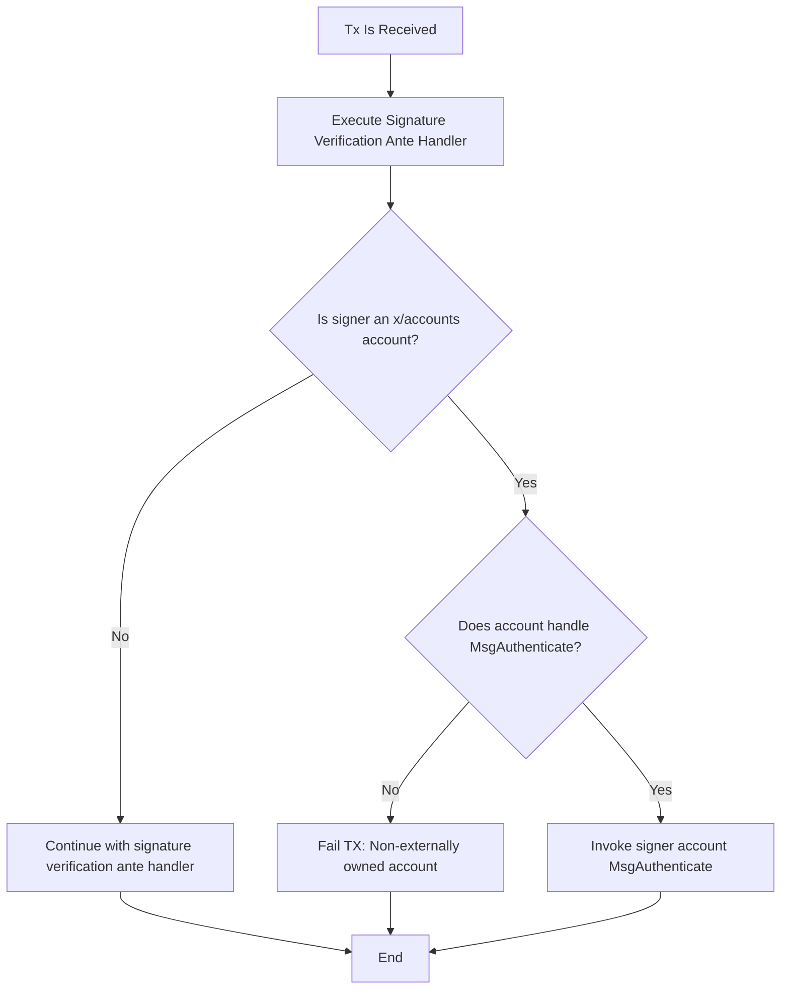
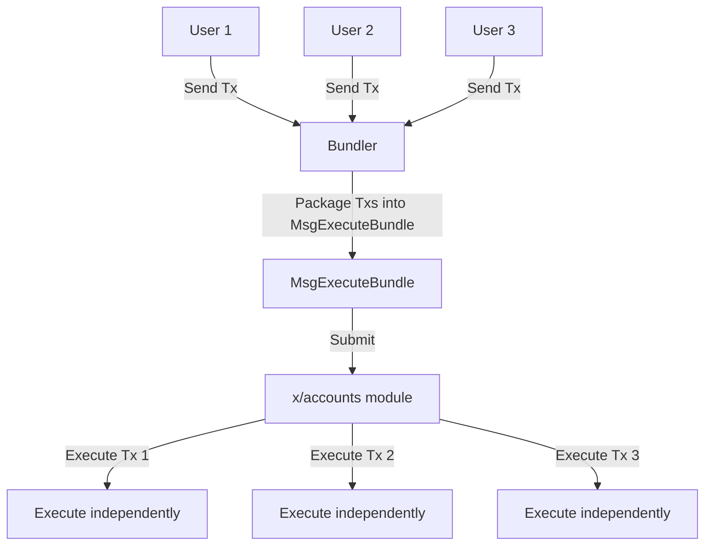

# x/account

## 简介

Cosmos SDK 生态系统中 x/accounts 模块的诞生，源于一系列技术和架构挑战和创新，这些挑战凸显了现有帐户模型的局限性。本节主要描述了其创建背后的理由，以及其实现原理。

### 当前账户模型的局限性

**账户接口不足**

最初，Cosmos SDK 是围绕严重依赖序列和公钥的账户接口构建的。这种设计虽然在区块链开发的早期阶段是有效的，但逐渐成为一种限制，无法适应区块链技术中身份验证机制的不断发展。接口的僵化阻碍了更高级或更多样化的身份验证协议的实现，这表明迫切需要一个更具适应性的解决方案。

**可扩展性和效率问题**

一个重大的技术挑战是帐户信息的存储和访问方式。事实证明，使用“google.protobuf.Any”进行帐户数据封装效率低下，并且从长远来看不可持续。这种方法需要对帐户的整个状态进行解包，即使是最简单的操作也是如此，从而导致效率低下。例如，从归属帐户中检索身份验证序列需要处理不相关且广泛的分布状态信息，这表明帐户管理与运营效率之间存在明显的脱节。

**接口抽象困难**

现有框架使得围绕接口有效地抽象帐户变得极其困难。将帐户封装在接口中的愿望遇到了重大障碍，主要是由于现有帐户结构固有的局限性。这种抽象困难强调了对更灵活、更动态的帐户管理方法的需求，这种方法可以让开发人员自由地以最适合其特定需求的方式定义和实现帐户。

x/account 的目标是超越预定义帐户界面的限制，力求实现一种不仅能满足当前需求，而且具有足够的弹性，可以与区块链技术堆栈一起发展。愿景是打造一个提供最大灵活性的帐户模块，允许创新的身份验证机制、多样化的帐户功能，以及无缝集成未来发展的能力，而不受静态界面的束缚。

## 原理

### 基础知识

帐户可以被视为支持多个部署的cosmos-sdk 模块。这意味着：

1. 单个帐户实现可以部署到多个地址，类似于 CosmWasm 允许从一个 WASM 上传中创建多个合约实例的方式。

2. 每个帐户地址都映射到其对应的帐户代码。

3. 帐户维护自己的状态分区，类似于模块。

4. 帐户可以定义消息和查询处理程序。

这种设计允许在生态系统中实现灵活且可重复使用的帐户结构。

### 账户接口

```go
// Account defines a smart account interface.
type Account interface {
	// RegisterInitHandler allows the smart account to register an initialisation handler, using
	// the provided InitBuilder. The handler will be called when the smart account is initialized
	// (deployed).
	RegisterInitHandler(builder *InitBuilder)

	// RegisterExecuteHandlers allows the smart account to register execution handlers.
	// The smart account might also decide to not register any execution handler.
	RegisterExecuteHandlers(builder *ExecuteBuilder)

	// RegisterQueryHandlers allows the smart account to register query handlers. The smart account
	// might also decide to not register any query handler.
	RegisterQueryHandlers(builder *QueryBuilder)
}
```

### 内置函数

accountstd 包提供了用于帐户初始化、执行或查询处理程序的实用函数。主要函数包括：

- Whoami()：检索当前帐户的地址。
- Sender()：获取交易发送者的地址（查询中不可用）。
- Funds()：检索发送者在初始化或执行期间提供的资金。
- ExecModule()：允许帐户执行模块消息。注意：禁止冒充。帐户不能代表他人发送消息。
- QueryModule()：启用查询模块。

这些函数以及其他函数促进了系统内的帐户操作和交互。有关可用实用程序的完整列表，请参阅 Go 文档。

### 身份验证

x/accounts 引入了 `Authentication` 接口，允许在传统公钥加密之外进行灵活的交易 (TX) 身份验证。

链开发人员可以为他们的帐户实现量身定制的身份验证方法。任何实现 `Authentication` 接口的帐户都可以在交易中进行身份验证。

要在 x/accounts 中实现 `Authentication` 接口，帐户必须公开能够处理特定消息类型的执行处理程序。身份验证的关键消息类型是 `MsgAuthenticate`，定义如下：

```protobuf
// MsgAuthenticate is a message that an x/account account abstraction implementer
// must handle to authenticate a transaction. Always ensure the caller is the Accounts module.
message MsgAuthenticate {
  // bundler defines the address of the bundler that sent the operation.
  // NOTE: in case the operation was sent directly by the user, this field will reflect
  // the user address.
  string bundler = 1;
  // raw_tx defines the raw version of the tx, this is useful to compute the signature quickly.
  cosmos.tx.v1beta1.TxRaw raw_tx = 2;
  // tx defines the decoded version of the tx, coming from raw_tx.
  cosmos.tx.v1beta1.Tx tx = 3;
  // signer_index defines the index of the signer in the tx.
  // Specifically this can be used to extract the signature at the correct
  // index.
  uint32 signer_index = 4;
}
```

Cosmos SDK 使用 `AnteHandler` 来验证交易 (TX) 的完整性。其主要功能是确保交易中的消息由声称的发送者正确签名。`x/accounts` 模块的身份验证也不例外，

当 `AnteHandler` 识别出消息发送者（和交易签名者）属于` x/accounts `模块时，它会将身份验证过程委托给该模块，流程如下：



### 在 x/auth gRPC 服务器中支持自定义账户

x/auth 模块提供了一种通过其 Account 和 AccountInfo gRPC 查询公开自定义帐户类型的机制。此功能对于确保与尚未与 x/accounts 集成但仍需要在迁移后解析帐户信息的现有钱包的兼容性特别有用。

要支持此功能，您的自定义帐户类型需要实现 auth.QueryLegacyAccount 处理程序。以下是一些需要考虑的重要事项：

- 选择性实现：并非每种帐户类型都需要此实现。只有您想要通过 x/auth gRPC Account 和 AccountInfo 方法公开的帐户才需要。
- 灵活响应：QueryLegacyAccountResponse 中的信息字段是可选的。如果您的自定义帐户无法表示为 BaseAccount，则可以将此字段留空。

### 交易捆绑

交易捆绑允许指定账户代表多个用户提交交易。这种方法有几个优点：

1. 费用抽象：捆绑者承担交易费用的责任，简化最终用户的流程。
2. 灵活的费用安排：用户和捆绑商可以链下协商费用结构，从而实现定制的支付模式。
3. 改善用户体验：通过抽象费用复杂性，捆绑可以使区块链交互更容易被更广泛的受众所接受。
4. 优化潜力：捆绑器可以优化 gas 的使用并降低总体交易成本。



对于要由`bundler`处理的交易，它必须包含 TxExtension。此扩展在 [interface.proto](https://github.com/cosmos/cosmos-sdk/blob/main/x/accounts/proto/cosmos/accounts/interfaces/account_abstraction/v1/interface.proto) 文件中定义。

**兼容性**

`bundling`引入了绕过 ante 处理程序检查的机制。这对于依赖 ante 处理程序的区块链具有重大影响：

- 消息验证
- 准入控制逻辑

如果您的链严重依赖这些前置处理程序功能，则启用捆绑可能会损害您链的安全性或操作逻辑。那么可以通过以下代码来禁用`bundling`功能

```go
// add keepers
func NewApp(...) {
    ...
    accountsKeeper, err := accounts.NewKeeper(...)
    if err != nil {
        panic(err)
    }
    accountsKeeper.DisableTxBundling() <-- // add this line
    app.AccountsKeeper = accountsKeeper
	...
}
```

### 迁移

加载 `x/accounts`模块后，基本可以替代`x/auth`中的账号管理功能，用户可以将现有的账户迁移到指定的`x/accounts`类型中。需要注意的是，从`x/auth`中迁移的数据仅包含 `BaseAccount`信息，所以其他信息会全部丢失。以下是`x/accounts` migrate函数的实现：

```go
// MigrateLegacyAccount is used to migrate a legacy account to x/accounts.
// Concretely speaking this works like Init, but with a custom account number provided,
// Where the creator is the account itself. This can be used by the x/auth module to
// gradually migrate base accounts to x/accounts.
// NOTE: this assumes the calling module checks for account overrides.
func (k Keeper) MigrateLegacyAccount(
	ctx context.Context,
	addr []byte, // The current address of the account
	accNum uint64, // The current account number
	accType string, // The account type to migrate to
	msg transaction.Msg, // The init msg of the account type we're migrating to
) (transaction.Msg, error) {
	return k.init(ctx, accType, addr, accNum, addr, msg, nil)
}
```

迁移的入口在`x/auth`中：

```go
func (ms msgServer) MigrateAccount(
  ctx context.Context, 
  msg *types.MsgMigrateAccount) (*types.MsgMigrateAccountResponse, error) {
  ...
  initResp, err := ms.ak.AccountsModKeeper.MigrateLegacyAccount(ctx, signer, acc.GetAccountNumber(), msg.AccountType, initMsg)
  ...
}
```

### 用户接口

`x/accounts`模块面向用户的接口主要包含以下定义：

- 交易接口

```protobuf
service Msg {
  option (cosmos.msg.v1.service) = true;

  // Init creates a new account in the chain.
  rpc Init(MsgInit) returns (MsgInitResponse);

  // Execute executes a message to the target account.
  rpc Execute(MsgExecute) returns (MsgExecuteResponse);

  // ExecuteBundle pertains account abstraction, it is used by the bundler
  // to execute multiple UserOperations in a single transaction message.
  rpc ExecuteBundle(MsgExecuteBundle) returns (MsgExecuteBundleResponse);
}
```

- 查询接口

```protobuf

service Query {
  // AccountQuery runs an account query.
  rpc AccountQuery(AccountQueryRequest) returns (AccountQueryResponse) {};
  // Schema returns an x/account schema. Unstable.
  rpc Schema(SchemaRequest) returns (SchemaResponse) {};
  // AccountType returns the account type for an address.
  rpc AccountType(AccountTypeRequest) returns (AccountTypeResponse) {};
  // AccountNumber returns the account number given the account address.
  rpc AccountNumber(AccountNumberRequest) returns (AccountNumberResponse) {};
}
```

## 账户实现

目前`x/accounts`中默认实现了以下几种账户类型：

- base
- lockup
- multisig

下面对以上几种账户类型简单介绍。

### base

该账户的作用可以取代`x/auth`中的账户管理功能，同时又赋予了用户可以替换账户公钥的功能，是对 `BaseAccount`功能的升级。

### lockup

在 Cosmos SDK v0.52以后，废弃了从`x/auth`创建 `vesting`账户的功能，而取代之的是使用 `x/accounts` 中的 `lockup` 。在`lockup`中存在以下几种账户类型：

- [ContinuousVestingAccount](https://github.com/cosmos/cosmos-sdk/blob/main/x/auth/vesting/README.md#continuousvestingaccount)
- [PeriodicVestingAccount](https://github.com/cosmos/cosmos-sdk/blob/main/x/auth/vesting/README.md#periodicvestingaccount)
- [DelayedVestingAccount](https://github.com/cosmos/cosmos-sdk/blob/main/x/auth/vesting/README.md#delayedvestingaccount)
- [PermanentLockedAccount](https://github.com/cosmos/cosmos-sdk/blob/main/x/auth/vesting/README.md#permanentlockedaccount)

功能和原`x/auth/vesting`基本一致。

### multisig

该账户的作用类似于 Gnosis Safe 的多签功能，只是该多签账户中的组员都存在一个权重值，执行最后的提案时是按照同意票权重判断是否执行，而不是同意的组员数量。功能上和x/group的多签重复。
