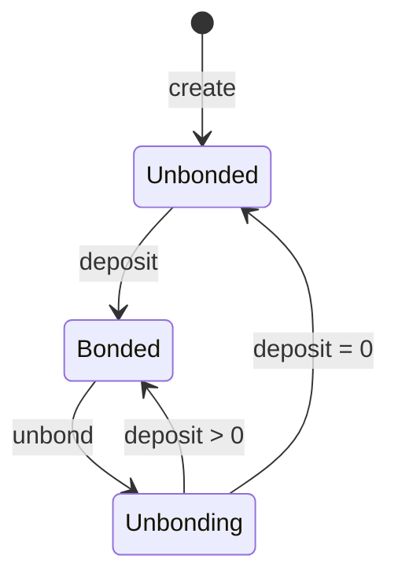

## Deposit & Withdraw Spec  
### 需求/功能描述

为了更好的管理和提高miner、orchestrator的服务质量，需要在注册miner、orchestrator的时候，质押指定数量的保证金，该保证金可通过治理模块已进行动态调整。当miner、orchestrator因挑战失败后，会被削减一定比例的保证金。

miner、orchestrator 有三种状态：
- Bonded: Deposit > 0 且没有 Unbond 操作。
- Unbonding: Deposit > 0 且有 Unbond 操作（这种情况会记录 Unbond Amount, Unbond EffectiveTime 并可查询）。
- Unbonded: Deposit = 0。

当miner、orchestrator处于Bonded状态时，可以执行Unbond来解质押保证金。对所有状态的miner、orchestrator都可执行 AddDeposit 操作，只要满足：`新增质押+当前质押 >= 最低质押限额`。miner和orchestrator的状态转化图如下：



### 决策

- miner和orchestrator的最小保证金取两个不同的治理参数。
- miner和orchestrator数据结构增加质押的状态字段。
- 当赎回保证金时，可以指定赎回的数量以及到账账户。
- 新增一个托管账户，同时托管miner和orchestrator质押的资金。
### 详细设计

#### 数据结构

##### 治理参数
```protobuf
message Params {
  option (amino.name) = "nesachain/x/dht/Params";
  option (gogoproto.equal) = true;

  google.protobuf.Duration orchestrator_valid_time = 1 [
    (gogoproto.nullable)    = false,
    (gogoproto.stdduration) = true
  ];

  google.protobuf.Duration miner_valid_time = 2 [
    (gogoproto.nullable)    = false,
    (gogoproto.stdduration) = true
  ];

  string admin_account = 3 [ (cosmos_proto.scalar) = "cosmos.AddressString" ];

  cosmos.base.v1beta1.Coin orchestrator_min_deposit = 4 [ (gogoproto.nullable) = false ];
  cosmos.base.v1beta1.Coin miner_min_deposit = 5 [ (gogoproto.nullable) = false ];
  google.protobuf.Duration orchestrator_unbonding_period = 6 [
       (gogoproto.nullable) = false,     
       (gogoproto.stdduration) = true
   ];
   google.protobuf.Duration miner_unbonding_period = 7 [
       (gogoproto.nullable) = false,     
       (gogoproto.stdduration) = true
   ];
}
```
##### 质押状态
```protobuf
enum BondStatus {

  option (gogoproto.goproto_enum_prefix) = false;

  // UNSPECIFIED defines an invalid validator status.
  BOND_STATUS_UNSPECIFIED = 0 [(gogoproto.enumvalue_customname) = "Unspecified"];

  // UNBONDED defines a validator that is not bonded.
  BOND_STATUS_UNBONDED = 1 [(gogoproto.enumvalue_customname) = "Unbonded"];

  // UNBONDING defines a validator that is unbonding.
  BOND_STATUS_UNBONDING = 2 [(gogoproto.enumvalue_customname) = "Unbonding"];

  // BONDED defines a validator that is bonded.
  BOND_STATUS_BONDED = 3 [(gogoproto.enumvalue_customname) = "Bonded"];
}

message UnbondingEntry {
   string node_id = 1;
   cosmos.base.v1beta1.Coin amount = 2 [ (gogoproto.nullable) = false ];
   google.protobuf.Duration completion_time = 3 [
     (gogoproto.nullable) = false,
     (gogoproto.stdduration) = true
   ];
   string receiver = 4 [ (cosmos_proto.scalar) = "cosmos.AddressString" ];
}
```
##### Miner
```protobuf
message Miner {
  string node_id = 1;
  uint64 start_block = 2;
  uint64 end_block = 3;
  string torch_dtype = 4;
  string quant_type = 5;
  uint64 cache_tokens_left = 6;
  double inference_rps = 7;
  string model_id = 8;
  google.protobuf.Timestamp valid_until = 9
      [ (gogoproto.stdtime) = true, (gogoproto.nullable) = false ];
  BondStatus bond_status = 10
  cosmos.base.v1beta1.Coin deposit = 11 [ (gogoproto.nullable) = false ]; 
}
```
##### Orchestrator
```protobuf
message Orchestrator {
  string node_id = 1;
  string model_id = 2;
  InferenceType inference_type = 3;
  Availability status = 4;   // ?
  repeated uint64 block_count = 5;
  google.protobuf.Timestamp valid_until = 6
      [ (gogoproto.stdtime) = true, (gogoproto.nullable) = false ];
  BondStatus bond_status = 7   // add
  cosmos.base.v1beta1.Coin deposit = 8 [ (gogoproto.nullable) = false ];   // add
}
```

##### 质押、赎回miner
```protobuf
service Msg {
  option (cosmos.msg.v1.service) = true;

  rpc AddMinerDeposit(MsgAddMinerDeposit) returns (MsgAddMinerDepositResponse);
  rpc WithdrawMiner(MsgWithdrawMiner) returns (MsgWithdrawMinerResponse);
}


message MsgAddMinerDeposit {
  option (cosmos.msg.v1.signer) = "depositor";

  string depositor = 1 [ (cosmos_proto.scalar) = "cosmos.AddressString" ];
  string node_id = 2;
  cosmos.base.v1beta1.Coin amount = 3 [ (gogoproto.nullable) = false ];
}

message MsgAddMinerDepositResponse{}


message MsgWithdrawMiner {
  option (cosmos.msg.v1.signer) = "depositor";

  string depositor = 1 [ (cosmos_proto.scalar) = "cosmos.AddressString" ];
  string node_id = 2;
  cosmos.base.v1beta1.Coin amount = 3 [ (gogoproto.nullable) = false ];
  string receiver = 4 [ (cosmos_proto.scalar) = "cosmos.AddressString" ];
}

message MsgWithdrawMinerResponse{}
```
##### 质押、赎回Orchestrator
```protobuf
service Msg {
  option (cosmos.msg.v1.service) = true;

  rpc AddOrchestratorDeposit(MsgAddOrchestratorDeposit) returns (MsgAddOrchestratorDepositResponse);
  rpc WithdrawOrchestrator(MsgWithdrawOrchestrator) returns (MsgWithdrawOrchestratorResponse);
}


message MsgAddOrchestratorDeposit {
  option (cosmos.msg.v1.signer) = "depositor";

  string depositor = 1 [ (cosmos_proto.scalar) = "cosmos.AddressString" ];
  string node_id = 2;
  cosmos.base.v1beta1.Coin amount = 3 [ (gogoproto.nullable) = false ];
}

message MsgAddOrchestratorDepositResponse{}


message MsgWithdrawOrchestrator {
  option (cosmos.msg.v1.signer) = "depositor";

  string depositor = 1 [ (cosmos_proto.scalar) = "cosmos.AddressString" ];
  string node_id = 2;
  cosmos.base.v1beta1.Coin amount = 3 [ (gogoproto.nullable) = false ];
  string receiver = 4 [ (cosmos_proto.scalar) = "cosmos.AddressString" ];
}

message MsgWithdrawOrchestratorResponse{}
```

#### 命令行
##### 质押、赎回miner
```bash
nesad tx dht deposit-miner [node-id] [amount] 
nesad tx dht withdraw-miner [node-id] [amount] --receiver=<receiver>
```
##### 质押、赎回Orchestrator
```bash
nesad tx dht deposit-orchestrator [node-id] [amount] 
nesad tx dht withdraw-orchestrator  [node-id] [amount] --receiver=<receiver>
```

#### 交易流程

##### miner 质押
- MsgAddMinerDeposit 参数校验
	1. `depositor` 不能为空并且为合法地址。
	2. `node_id`  不能为空。
	3. `amount` 不能为空并且为合法的Coin
- 质押流程
	1. `node_id`  必须存在。
	2. `depositor` 必须是node的创建者
	3. Miner的`剩余Deposit+amount >= 最小质押金额 `。
	4. 将 `amount` 从`depositor`账户转入指定的模块账户
	5. 将 `miner`的质押金额累加。
	6. 更新 `miner`信息。
##### miner 解绑
- MsgWithdrawMiner 参数校验
	1. `depositor` 不能为空并且为合法地址。
	2. `node_id`  不能为空。
	3. `amount` 为合法的coin。
	4. `receiver` 如果不为空，必须为合法地址。
- 解绑流程
	1. `node_id`  必须存在。
	2. `depositor` 必须是node的创建者。
	3. Miner的状态必须为 `Bonded`。
	4. amount <= Miner的剩余质押金额。
	5. 将miner的状态设置为 `Unbonding`。
	6. 计算解绑完成时间，保存解绑记录。
	7. 更新 `miner`信息（状态，deposit）。
- EndBlock
	1. 按照当前区块时间过滤unbond记录。
	2. 将记录中的amount从模块账户转移到指定的账户地址
	3. 如果当前miner剩余deposit大于0，状态置为 `Bonded`；如果等于0，状态置为 `Unbonded`。
##### orchestrator 质押
- MsgAddOrchestratorDeposit 参数校验
	1. `depositor` 不能为空并且为合法地址。
	2. `node_id`  不能为空。
	3. `amount` 不能为空并且为合法的Coin
- 质押流程
	1. `node_id`  必须存在。
	2. `depositor` 必须是node的创建者
	3. Miner的`剩余Deposit+amount >= 最小质押金额 `。
	4. 将 `amount` 从`depositor`账户转入指定的模块账户
	5. 将 `miner`的质押金额累加。
	6. 更新 `miner`信息。
##### orchestrator 解绑
- MsgWithdrawOrchestrator 参数校验
	1. `depositor` 不能为空并且为合法地址。
	2. `node_id`  不能为空。
	3. `amount` 为合法的coin。
	4. `receiver` 如果不为空，必须为合法地址。
- 解绑流程
	1. `node_id`  必须存在。
	2. `depositor` 必须是node的创建者。
	3. Orchestrator 的状态必须为 `Bonded`。
	4. amount <= Orchestrator 的剩余质押金额。
	5. 将 Orchestrator 的状态设置为 `Unbonding`。
	6. 计算解绑完成时间，保存解绑记录。
	7. 更新 Orchestrator信息（状态，deposit）。
- EndBlock
	1. 按照当前区块时间过滤unbond记录。
	2. 将记录中的amount从模块账户转移到指定的账户地址
	3. 如果当前 Orchestrator 剩余deposit大于0，状态置为 `Bonded`；如果等于0，状态置为 `Unbonded`。